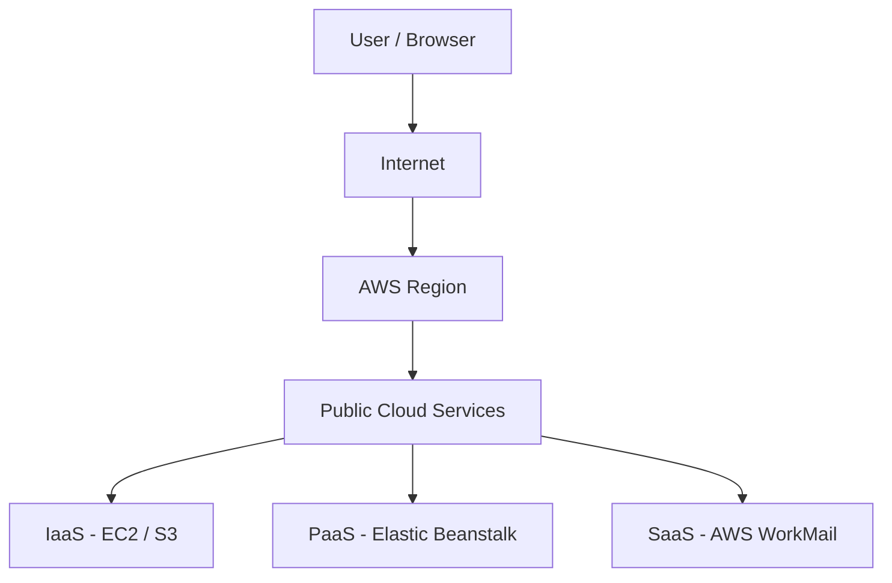

# What is Cloud Computing?

## Overview — what it is and why it matters

Cloud computing means accessing computing resources — servers, storage, databases, networking — over the internet, on-demand, instead of owning and managing physical hardware.

The shift matters because it changes how organisations spend money on technology (from large upfront investments to pay-as-you-go costs) and how fast they can scale.

---

## Simple explanation

Think of cloud computing like electricity. You do not build a power plant to light your home — you plug in and pay for what you use. Cloud computing applies the same idea to IT infrastructure.

---

## Key concepts

### IaaS — Infrastructure as a Service
The cloud provider gives you raw infrastructure: virtual machines, storage, and networking. You are responsible for everything above the hardware — operating systems, runtime, middleware, and applications.

**Example:** AWS EC2. You get a virtual server. You decide what runs on it.

### PaaS — Platform as a Service
The provider manages the infrastructure AND the platform (OS, runtime, middleware). You focus only on writing and deploying your application.

**Example:** AWS Elastic Beanstalk. Push your code; the platform handles the rest.

### SaaS — Software as a Service
Fully managed software delivered over the internet. You just log in and use it. No installation, no updates to manage.

**Example:** Gmail, Salesforce, Zoom.

---

### CAPEX vs OPEX

| Term | Stands for | Meaning |
|------|-----------|---------|
| CAPEX | Capital Expenditure | Large upfront spend on hardware/infrastructure. Fixed asset. |
| OPEX | Operational Expenditure | Ongoing, predictable monthly costs. Cloud billing model. |

Cloud computing converts IT spending from CAPEX to OPEX — reducing risk and improving cash flow predictability.

---

### Deployment models

**Public Cloud**
Infrastructure shared across many customers, managed by a provider (AWS, Azure, GCP). Highly scalable and cost-efficient. Best for most workloads.

**Private Cloud**
Dedicated infrastructure for a single organisation. More control and customisation. Higher cost. Common in regulated industries (banking, healthcare).

**Hybrid Cloud**
A mix of public and private. Sensitive workloads stay on private; scalable workloads run on public. Adds architectural complexity but maximises flexibility.

---

## Lab — AWS Free Tier setup + root user MFA

### Goal
Create a secure AWS starting point using the Free Tier and protect the root account with multi-factor authentication.

### Steps

1. Go to https://aws.amazon.com and click "Create a Free Account"
2. Complete sign-up (email, password, billing info — Free Tier has no cost for covered services)
3. Log in to the AWS Management Console as root user
4. In the top-right, click your account name → "Security credentials"
5. Under "Multi-factor authentication (MFA)", click "Assign MFA device"
6. Choose "Authenticator app", scan the QR code with Google Authenticator or Authy
7. Enter two consecutive MFA codes to confirm and activate

### CLI commands (for reference after setup)

```bash
# Install AWS CLI (macOS example)
brew install awscli

# Verify installation
aws --version

# Configure a named profile (use an IAM user, not root)
aws configure --profile devlearn
# You will be prompted for: Access Key ID, Secret Access Key, region, output format
```

> Root user has no restrictions. Treat it like a master key — lock it away and use IAM users for daily access.

---

## Architecture flow



A user connects through the internet to an AWS region. Inside the region, requests route to the appropriate service layer — raw infrastructure (IaaS), managed platforms (PaaS), or fully abstracted applications (SaaS). Each layer removes more management burden from the user.

---

## Common mistakes

- **Using the root account for daily work.** The root user bypasses all permission restrictions. Create an IAM user immediately after account setup.
- **Assuming Free Tier means zero cost always.** Some services have usage limits. Exceeding them incurs charges. Set a billing alarm on Day 1.
- **Conflating IaaS/PaaS/SaaS.** The distinction matters when choosing services — getting it wrong means managing more than necessary.

---

## Real-world use

A startup can deploy a production application globally in under an hour using AWS. No hardware procurement, no data centre lease. They pay only for what runs.

An enterprise bank keeps sensitive transaction data on a private cloud while running analytics workloads on AWS public infrastructure — a classic hybrid setup.

---

## Key takeaways

- Cloud = on-demand IT resources over the internet, billed like a utility
- IaaS → PaaS → SaaS represents decreasing management responsibility
- CAPEX to OPEX is the financial model shift cloud enables
- Public, private, and hybrid are deployment choices — not quality tiers
- The root AWS account must be secured and rarely used
- Free Tier is a safe sandbox — use it to build, break, and learn

---

## Next steps

- [ ] Create an IAM user with admin permissions and use it for all future logins
- [ ] Explore the AWS Free Tier service list
- [ ] Set a billing alarm at $1 to catch accidental charges early
- [ ] Learn IAM basics: users, groups, roles, and policies
- [ ] Try launching your first EC2 instance