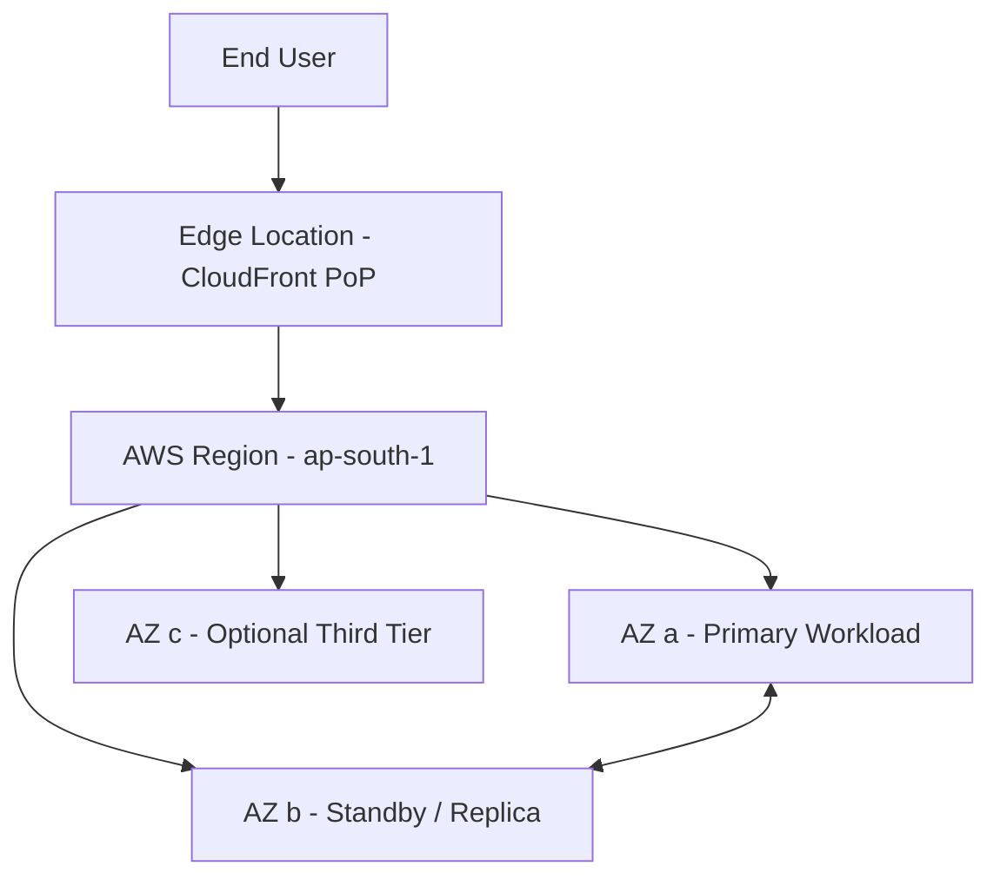

# AWS Global Infrastructure

## Overview — what it is and why it matters

AWS does not run on a single server in a single location. It operates a global network of physical data centers, grouped into logical units that give you control over where your workloads run, how resilient they are, and how fast content reaches end users.

Understanding this infrastructure is not optional — every AWS service you configure is tied to a specific layer of it.

---

## Simple explanation

Imagine AWS as a global courier company.

- **Regions** are the country offices — major operational hubs, each independent.
- **Availability Zones** are the separate warehouses within that office — isolated so one fire does not take down the whole operation.
- **Edge Locations** are the local delivery vans — not where the work happens, but where it gets delivered fast.

---

## Key concepts

### Region
A Region is a **geographic cluster of data centers** in a specific part of the world. Each Region is completely independent — it has its own power, networking, and connectivity.

When you create an AWS resource (an EC2 instance, an S3 bucket), you choose a Region. That resource lives there.

**Why it matters:** Region choice affects latency (closer = faster), data residency compliance (GDPR, data sovereignty laws), and pricing (costs vary by region).

**Examples:** `ap-south-1` (Mumbai), `us-east-1` (N. Virginia), `eu-west-1` (Ireland)

As of 2024, AWS has **33 launched Regions** globally, with more announced.

---

### Availability Zone (AZ)
An Availability Zone is an **isolated fault domain within a Region**. Each AZ is one or more physical data centers with independent power, cooling, and networking.

A Region contains a minimum of 3 AZs. They are close enough to each other for low-latency communication (typically under 2ms) but physically separated enough that a flood, fire, or power failure in one does not affect another.

**Why it matters:** Deploying across multiple AZs is the foundation of high availability on AWS. A single-AZ deployment is a single point of failure.

**Example:** `ap-south-1a`, `ap-south-1b`, `ap-south-1c` — three AZs inside the Mumbai Region.

---

### Edge Location
Edge Locations are **content delivery endpoints** distributed globally — over 450 locations across 90+ cities. They are not general-purpose compute; they exist to cache and deliver content close to end users.

Services that use Edge Locations: **CloudFront** (CDN), **Route 53** (DNS), **AWS Shield** (DDoS protection), **Lambda@Edge** (lightweight edge compute).

**Why it matters:** A user in São Paulo accessing an app hosted in Mumbai would experience high latency without Edge Locations. CloudFront caches the content in the nearest Edge Location — the user gets it in milliseconds.

---

### Comparison at a glance

| Layer | Scope | Primary purpose | Example |
|-------|-------|----------------|---------|
| Region | Geographic area | Data residency, compliance, latency | ap-south-1 (Mumbai) |
| Availability Zone | Isolated data center cluster | Fault isolation, high availability | ap-south-1b |
| Edge Location | Global PoP | Content delivery, low-latency caching | CloudFront PoP in Chennai |

---

## Lab — Explore the Console and locate the Region selector

### Goal
Build awareness of how AWS organises resources by Region, and understand why the Region selector is the first thing to check before doing anything in the Console.

### Steps

1. Go to [https://console.aws.amazon.com](https://console.aws.amazon.com) and sign in with your IAM user (not root).
2. Look at the **top-right corner** of the Console — you will see a Region name (e.g., "N. Virginia" or "Mumbai").
3. Click the Region name to open the Region selector dropdown.
4. Switch to `ap-south-1` (Asia Pacific — Mumbai). Notice the URL changes.
5. Navigate to **EC2 → Instances**. If you have no instances in this region, the list is empty — even if you created instances elsewhere.
6. Switch back to your original region. Your instances reappear. Resources are region-scoped.
7. Navigate to **S3**. Notice S3 shows all buckets regardless of region — it is a global service with region-specific storage.
8. Navigate to **IAM**. It shows no region selector — IAM is a global service, not region-bound.

### CLI commands

```bash
# List all available AWS regions
aws ec2 describe-regions --output table

# List Availability Zones in a specific region
aws ec2 describe-availability-zones --region ap-south-1 --output table

# Check which region your current CLI profile targets
aws configure get region
```

> Run `aws configure` first if you have not set up the CLI yet. Always verify your target region before running destructive commands.

---

## Architecture flow



A user request first hits the nearest Edge Location, which serves cached content instantly. If the request requires compute or fresh data, it routes to the Region. Inside the Region, workloads are distributed across multiple Availability Zones — if AZ-a fails, AZ-b absorbs traffic. This three-layer model is the backbone of every resilient AWS architecture.

---

## Common mistakes

- **Deploying everything in one AZ.** It works until it does not. Multi-AZ deployment should be the default, not an afterthought.
- **Picking a Region for the wrong reason.** "us-east-1 is the default" is not a strategy. Choose based on where your users are, what compliance rules apply, and what services are available (not all services launch in all regions simultaneously).
- **Confusing Edge Locations with Regions.** Edge Locations do not run your EC2 instances or RDS databases. They are delivery infrastructure, not general compute.
- **Ignoring the Region selector in the Console.** A common support question: "My instance disappeared." It did not — you are in the wrong region.

---

## Real-world use

A fintech startup based in India must comply with RBI data localisation guidelines — customer data must stay in India. They deploy all workloads in `ap-south-1` (Mumbai). For global users accessing their marketing site, CloudFront Edge Locations in 15+ countries serve cached assets with sub-50ms latency — without moving any sensitive data outside India.

An e-commerce platform deploys its application servers across all three Mumbai AZs. During a maintenance window affecting AZ-a, traffic automatically shifts to AZ-b and AZ-c. Users experience no downtime.

---

## Key takeaways

- A **Region** is a geographic cluster of data centers — your primary deployment decision
- An **Availability Zone** is an isolated fault domain inside a Region — deploy across 2-3 AZs for resilience
- An **Edge Location** is a content delivery outpost — not for compute, for low-latency delivery
- The Console Region selector scopes what resources you see — always check it first
- Not all AWS services are regional: IAM and Route 53 are global; EC2 and RDS are regional
- High availability on AWS starts with multi-AZ architecture, not multi-Region

---

## Next steps

- [ ] Launch an EC2 instance in `ap-south-1` and note which AZ it lands in
- [ ] Explore the [AWS Global Infrastructure map](https://aws.amazon.com/about-aws/global-infrastructure/)
- [ ] Learn about **Elastic Load Balancing** — the service that distributes traffic across AZs
- [ ] Understand **S3 Cross-Region Replication** for disaster recovery use cases
- [ ] Study the difference between **Multi-AZ** (high availability) and **Multi-Region** (disaster recovery)