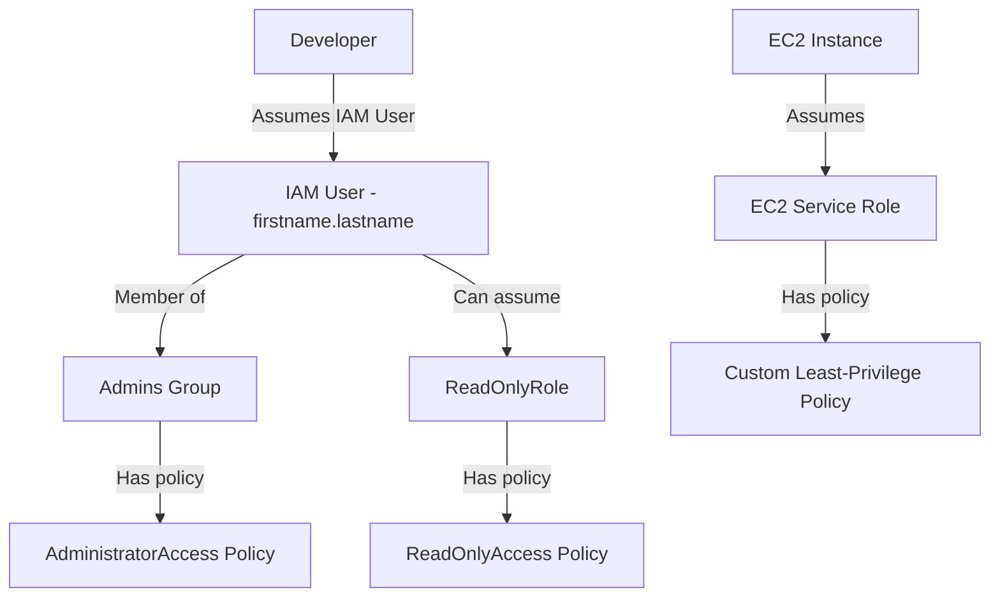

# AWS IAM — Users, Groups & Roles

## Overview — what it is and why it matters

IAM (Identity and Access Management) is AWS's permission system. It controls who can authenticate to your AWS account and what they are authorised to do once inside.

Before IAM, every action in your account happens as the root user — an identity with unrestricted access to everything. IAM replaces that dangerous default with a structured, auditable permission model.

---

## Simple explanation

Think of IAM like an office building.

The **root user** is the building owner — master key, every room, every floor. You do not hand that key to employees.

**IAM Users** are keycards issued to named people. Each card opens only the doors you configure.

**IAM Groups** are departments. Give the Developers group access to EC2 and CodeBuild — every developer gets that access automatically, and loses it when they leave the group.

**IAM Roles** are visitor badges with an expiry time. A service (EC2, Lambda) or a person from another account assumes a role temporarily to perform a specific task — then the badge expires.

---

## Key concepts

### Root User vs IAM User

The root user is created automatically when you open an AWS account. It has unconditional access to every service and billing function — it cannot be restricted by IAM policies.

An IAM user is a named identity you create. It has no permissions by default. You attach policies to grant exactly what it needs.

| | Root User | IAM User |
|---|---|---|
| Created by | AWS account signup | You, via IAM |
| Permissions | Unrestricted | Policy-defined |
| Recommended for | Initial setup only | All daily work |
| Can be restricted | No | Yes |
| MFA supported | Yes — mandatory | Yes — strongly recommended |

**Rule:** Enable MFA on root, create an IAM admin user on Day 1, and use root only for tasks that explicitly require it (billing root tasks, closing the account).

---

### Principle of Least Privilege

Every identity — user, group, role, or service — should have exactly the permissions needed to perform its function. Nothing more.

This is not a suggestion. It is the foundational security principle that limits blast radius when credentials are compromised.

**Practical application:**
- A developer who only reads logs needs `logs:GetLogEvents` — not `AdministratorAccess`
- An EC2 instance serving a web app that reads from S3 needs `s3:GetObject` on a specific bucket — not `s3:*` on all buckets
- Start restrictive and expand when you hit a genuine access need — not the reverse

---

### IAM Policy — JSON structure

A policy is a JSON document that defines permissions. Every policy contains one or more **statements**. Each statement has three required fields:

```json
{
  "Version": "2012-10-17",
  "Statement": [
    {
      "Effect": "Allow",
      "Action": [
        "s3:GetObject",
        "s3:ListBucket"
      ],
      "Resource": [
        "arn:aws:s3:::my-app-bucket",
        "arn:aws:s3:::my-app-bucket/*"
      ]
    }
  ]
}
```

**Effect** — `Allow` or `Deny`. Explicit Deny always wins over any Allow.

**Action** — the AWS API operation being permitted or denied. Format: `service:Operation`. Wildcards are supported (`s3:*`) but should be avoided in production.

**Resource** — the ARN (Amazon Resource Name) identifying which specific AWS resource the action applies to. Using `"*"` means all resources of that type — use only when necessary.

> An IAM identity with no attached policy cannot perform any action. Permissions are deny-by-default.

---

### IAM Groups

A group is a collection of IAM users. Policies attached to a group apply to all members. Groups cannot be nested inside other groups.

Use groups to manage permissions at scale:
- `Admins` group → `AdministratorAccess` policy
- `Developers` group → EC2, CodeBuild, CloudWatch access
- `ReadOnly` group → `ReadOnlyAccess` policy

Adding or removing a user from a group immediately grants or revokes all of that group's permissions.

---

### IAM Roles

A role is an identity that can be assumed temporarily. Unlike a user, a role has no long-term credentials (no username/password, no permanent access keys).

**Why roles over credentials:**
Embedding AWS access keys inside an EC2 instance is a well-known anti-pattern. If someone reads the instance's metadata or source code, the keys are exposed. A role attached to the instance automatically provides short-lived, rotating credentials — nothing to steal.

**Common role use cases:**
- EC2 instance reading from S3 or writing to DynamoDB
- Lambda function publishing to SNS
- A developer in Account A assuming a role in Account B (cross-account access)
- CI/CD pipeline deploying infrastructure via CodePipeline

---

## Lab — Admin Group, IAM User with MFA, Read-Only Role

### Goal
Build a properly structured IAM foundation: an Admin Group for privileged access, a personal IAM user protected by MFA, and a Read-Only Role that a service or user can assume.

### Steps

**Part 1 — Admin Group**

1. In the AWS Console, navigate to **IAM → User groups → Create group**
2. Name the group `Admins`
3. Under "Attach permissions policies", search for and select `AdministratorAccess`
4. Click **Create group**

**Part 2 — Personal IAM User with MFA**

5. Navigate to **IAM → Users → Create user**
6. Set username (e.g., `firstname.lastname`)
7. Select **AWS Management Console access**, choose **Custom password**, uncheck "require password reset"
8. Click **Next**, choose **Add user to group**, select `Admins`, click through to **Create user**
9. Download or copy the sign-in credentials
10. Sign in as the new IAM user at your account's sign-in URL
11. Navigate to **IAM → Users → your username → Security credentials → Assign MFA device**
12. Choose **Authenticator app**, scan QR code with Google Authenticator or Authy, confirm with two consecutive codes

**Part 3 — Read-Only Role**

13. Navigate to **IAM → Roles → Create role**
14. Trusted entity type: **AWS account** → This account
15. Attach policy: search and select `ReadOnlyAccess`
16. Name the role `ReadOnlyRole`, click **Create role**
17. Note the Role ARN — any IAM user with `sts:AssumeRole` permission can now assume this role

### CLI commands

```bash
# Create the Admins group
aws iam create-group --group-name Admins

# Attach AdministratorAccess policy to the group
aws iam attach-group-policy \
  --group-name Admins \
  --policy-arn arn:aws:iam::aws:policy/AdministratorAccess

# Create an IAM user
aws iam create-user --user-name firstname.lastname

# Add the user to the Admins group
aws iam add-user-to-group \
  --user-name firstname.lastname \
  --group-name Admins

# Create the ReadOnly role (requires a trust policy JSON file)
# trust-policy.json content:
# { "Version":"2012-10-17","Statement":[{"Effect":"Allow","Principal":{"AWS":"arn:aws:iam::ACCOUNT_ID:root"},"Action":"sts:AssumeRole"}] }
aws iam create-role \
  --role-name ReadOnlyRole \
  --assume-role-policy-document file://trust-policy.json

# Attach ReadOnlyAccess to the role
aws iam attach-role-policy \
  --role-name ReadOnlyRole \
  --policy-arn arn:aws:iam::aws:policy/ReadOnlyAccess

# Verify: list users in the Admins group
aws iam get-group --group-name Admins
```

---

## Architecture flow



A developer authenticates as a named IAM user, which inherits permissions from the Admins group. When read-only access is needed (auditing, review), the user assumes the ReadOnlyRole temporarily. EC2 instances use a separate service role — no credentials embedded anywhere in the instance.

---

## Common mistakes

- **Using root for daily work.** The root account has no permission boundaries. A mistake or a compromise here affects everything: instances, data, billing, and account closure.
- **Attaching `AdministratorAccess` to every user.** "Just for now" becomes a permanent security gap. Grant admin access only to the `Admins` group, not to individual users.
- **Storing access keys inside EC2 instances.** Instance metadata is accessible without authentication from inside the instance. Use IAM Roles instead — credentials rotate automatically.
- **Writing overly broad policies.** `"Action": "s3:*"` on `"Resource": "*"` means any S3 operation on any bucket in your account. Scope both fields as tightly as possible.
- **Skipping MFA on IAM users.** Console access without MFA means a stolen password is all an attacker needs.

---

## Real-world use

A team of five engineers at a SaaS company each have IAM users in a `Developers` group with access to EC2, RDS (read-only), and CloudWatch. The Lead DevOps engineer is also in the `Admins` group. The production deployment pipeline (CodePipeline) assumes a `DeployRole` with permission to push to S3 and update ECS — nothing more. No developer has long-term access keys; all CLI access uses short-lived session tokens via AWS SSO.

---

## Key takeaways

- Root user = unrestricted master key. Enable MFA, store credentials safely, use almost never
- IAM Users are deny-by-default identities — permissions must be explicitly granted
- Groups manage permissions at scale — assign to group, not to individual users
- Roles provide temporary credentials — the correct pattern for services and cross-account access
- Every policy is Effect + Action + Resource — understand all three before writing or attaching one
- Least privilege is not a best practice, it is the default posture

---

## Next steps

- [ ] Enable a Service Control Policy (SCP) in AWS Organizations to enforce guardrails across accounts
- [ ] Explore **AWS IAM Identity Center** (formerly SSO) for team access management
- [ ] Learn **IAM Permission Boundaries** — capping what a user or role can do even with a permissive policy
- [ ] Study **CloudTrail** — the audit log for every IAM action taken in your account
- [ ] Practice writing custom least-privilege policies using the **IAM Policy Simulator**