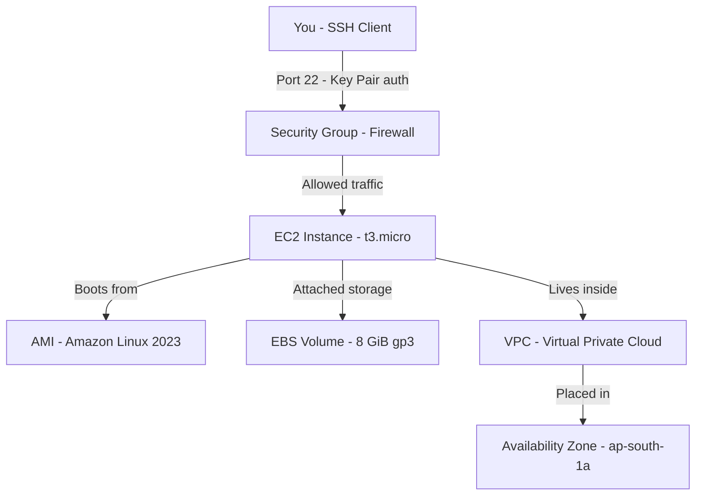

# Amazon EC2 Fundamentals

## Overview — what it is and why it matters

EC2 (Elastic Compute Cloud) is AWS's virtual server service. It lets you rent compute capacity — CPU, memory, storage, and networking — on-demand, without owning any physical hardware.

EC2 is not one product. It is a composable service: you choose the operating system image, the hardware profile, the network configuration, the storage type, and the pricing model independently. Understanding each dimension before launch is what separates a well-designed environment from an expensive, fragile one.

---

## Simple explanation

EC2 is a virtual machine running in an AWS data center.

You decide what it looks like (AMI), how powerful it is (instance type), how it connects to the internet (VPC, security groups), and how you pay for it (purchasing option). AWS handles the physical hardware, hypervisor, and data center operations.

The two-minute version: pick an AMI, pick an instance type, click Launch. The hour-long version: understand each choice so you don't rebuild the environment next week.

---

## Key concepts

### AMI — Amazon Machine Image

An AMI is the blueprint your EC2 instance boots from. It is a pre-configured snapshot containing:

- The **operating system** (Amazon Linux, Ubuntu, Windows Server, RHEL, etc.)
- **Pre-installed software** (a LAMP stack AMI, a Deep Learning AMI, a custom company image)
- **Boot configuration** and storage volume mappings

Every EC2 instance launches from exactly one AMI. You can use AWS-provided AMIs, Marketplace AMIs (third-party, some paid), or your own custom AMIs created from a running instance.

**Choosing an AMI for beginners:**

| AMI | Use case | Free Tier eligible |
|---|---|---|
| Amazon Linux 2023 | Default for AWS workloads | Yes |
| Ubuntu 22.04 LTS | Familiar for Linux users | Yes |
| Windows Server 2022 | .NET workloads, Windows tooling | Yes (t3.micro only) |
| Deep Learning AMI | ML/AI — pre-installed frameworks | No |

> AMIs are region-specific. An AMI in ap-south-1 is not automatically available in us-east-1. Copy it explicitly if you need it elsewhere.

---

### Instance Types

An instance type defines the hardware profile: virtual CPUs (vCPUs), memory (GiB), network bandwidth, and storage throughput. AWS offers hundreds of instance types across purpose-built families.

**Naming convention:** `[family][generation].[size]`

Example: `t3.micro` → t-family (burstable), generation 3, micro size.

**The three families every beginner needs:**

| Family | Optimised for | Common use cases | Example |
|---|---|---|---|
| T (t3, t4g) | Burstable general purpose | Dev/test, low-traffic web apps, microservices | t3.micro (Free Tier) |
| M (m5, m6i) | Balanced CPU + memory | Production web servers, app servers, small DBs | m5.large |
| C (c5, c6i) | Compute — high CPU | ML inference, batch processing, game servers | c5.xlarge |

**Other families worth knowing:**

- **R** (r5, r6i) — Memory optimised. In-memory databases, real-time analytics.
- **P / G** — GPU instances. Model training, video rendering, HPC.
- **I** (i3, i4i) — Storage optimised. High IOPS databases, NoSQL at scale.
- **T4g / M6g / C6g** — Graviton (ARM) instances. Up to 40% better price-performance than equivalent x86.

**Size suffixes:** nano → micro → small → medium → large → xlarge → 2xlarge → ... → 48xlarge

> For Free Tier: `t2.micro` or `t3.micro` (region-dependent). 750 hours per month free for 12 months.

---

### Purchasing Options

Purchasing option is the most cost-impactful EC2 decision. The same instance type can cost three very different amounts depending on how you buy it.

| Option | How it works | Savings vs On-Demand | Best for |
|---|---|---|---|
| On-Demand | Pay per hour or second, no commitment | Baseline | Unpredictable workloads, short-lived tasks |
| Reserved Instances | Commit to 1 or 3 years, pay upfront or monthly | Up to 72% | Stable, always-on production workloads |
| Spot Instances | Bid on unused AWS capacity, price fluctuates, 2-min reclaim notice | Up to 90% | Fault-tolerant batch jobs, ML training, CI runners |
| Savings Plans | Commit to $/hour of compute spend, flexible across instance types | Up to 66% | Mixed workloads combining EC2, Fargate, Lambda |
| Dedicated Hosts | Physical server reserved entirely for your account | Varies | Compliance requirements, Bring Your Own License |

**Decision framework:**
- Unknown usage pattern → On-Demand
- Running 24/7 for 12+ months → Reserved Instances or Savings Plans
- Interruptible batch or ML workload → Spot
- Strict compliance or BYOL software → Dedicated Host

> The most common beginner mistake: leaving dev environments running On-Demand 24/7 for months. A t3.medium running continuously On-Demand costs ~$30/month. Reserved (1-year, no upfront): ~$14/month.

---

## Lab — Launch a Free Tier Linux EC2 Instance

### Goal

Launch a `t3.micro` EC2 instance running Amazon Linux 2023, connect via SSH, and understand the relationship between instance state, EBS storage, and billing.

### Steps

**Part 1 — Launch via Console**

1. Navigate to **EC2 → Instances → Launch instances**
2. Name: `my-first-ec2`
3. AMI: **Amazon Linux 2023 AMI** (look for "Free tier eligible" label)
4. Instance type: `t3.micro` (Free tier eligible)
5. Key pair: **Create new key pair**
   - Name: `my-ec2-key`
   - Type: RSA — format: .pem (macOS/Linux) or .ppk (Windows/PuTTY)
   - Download and save the .pem file — AWS does not store a copy
6. Network settings: leave default VPC and subnet; confirm **Auto-assign public IP** is enabled
7. Security group: Create new — allow SSH (port 22) from **My IP** only, not `0.0.0.0/0`
8. Storage: 8 GiB gp3 (default) — Free Tier covers up to 30 GiB
9. Click **Launch instance**

**Part 2 — Connect via SSH**

10. Wait for instance state: **Running** and status checks: **2/2 passed**
11. Copy the **Public IPv4 address** from instance details
12. Open a terminal:

```bash
# Set correct permissions on the key file — SSH rejects world-readable keys
chmod 400 ~/Downloads/my-ec2-key.pem

# Connect to the instance
ssh -i ~/Downloads/my-ec2-key.pem ec2-user@YOUR_PUBLIC_IP

# Confirm you are on the instance
uname -a
whoami
```

**Part 3 — Explore and clean up**

13. Run orientation commands:

```bash
# Check disk space
df -h

# Check CPU and memory usage
top

# Update all packages
sudo dnf update -y

# Exit the session
exit
```

14. In the Console: select instance → **Instance state → Stop instance**
15. Observe: stopping halts compute billing. The attached EBS volume (~$0.08/GiB/month) continues billing.
16. To stop all billing: select instance → **Instance state → Terminate instance**. This deletes the instance and its default EBS volume permanently.

### CLI commands

```bash
# Find the latest Amazon Linux 2023 AMI ID in your region
aws ec2 describe-images   --owners amazon   --filters "Name=name,Values=al2023-ami-*-x86_64"   --query "sort_by(Images, &CreationDate)[-1].ImageId"   --output text

# Launch the instance (replace AMI_ID, SG_ID, SUBNET_ID)
aws ec2 run-instances   --image-id AMI_ID   --instance-type t3.micro   --key-name my-ec2-key   --security-group-ids YOUR_SG_ID   --subnet-id YOUR_SUBNET_ID   --tag-specifications 'ResourceType=instance,Tags=[{Key=Name,Value=my-first-ec2}]'

# Check instance state and public IP
aws ec2 describe-instances   --filters "Name=tag:Name,Values=my-first-ec2"   --query "Reservations[*].Instances[*].[InstanceId,State.Name,PublicIpAddress]"   --output table

# Stop the instance
aws ec2 stop-instances --instance-ids YOUR_INSTANCE_ID

# Terminate to avoid further charges
aws ec2 terminate-instances --instance-ids YOUR_INSTANCE_ID
```

---

## Architecture flow



SSH traffic passes through the Security Group before reaching the EC2 instance. The instance boots from the selected AMI and persists data on an attached EBS volume. Both live inside a VPC in a specific Availability Zone — placement affects latency, resilience, and data transfer costs. The EBS volume outlives a stopped instance, which is why a stopped instance is not a zero-cost instance.

---

## Common mistakes

**Opening SSH to 0.0.0.0/0 in the security group.** Port 22 exposed to the entire internet will be hit by automated scanners within minutes. Always restrict to your IP or route through a bastion host.

**Forgetting EBS costs on stopped instances.** Stopping an EC2 instance stops compute billing — the attached EBS volume continues billing at ~$0.08/GiB/month. For unused lab instances, terminate rather than stop.

**Choosing instance type by name recognition alone.** `t3.micro` is Free Tier; `t3.2xlarge` is $0.33/hour. Always confirm the full type and size in the review screen before launch.

**Not tagging instances.** In an account with more than a handful of instances, untagged resources become unmanageable. Add `Name`, `Environment` (dev/prod), and `Owner` tags at minimum.

**Using the same key pair for every instance.** A single compromised key exposes every instance that uses it. Create purpose-specific key pairs and rotate them.

---

## Real-world use

A startup runs its web application backend on two `m6i.large` On-Demand instances behind a load balancer — one per Availability Zone for resilience. Their nightly ML batch job (re-training a recommendation model) runs on a `c5.4xlarge` Spot Instance — 90% cheaper than On-Demand, acceptable because a Spot interruption just re-queues the job. Both instance types boot from custom AMIs baked with the company's application pre-installed, so new instances are production-ready in under three minutes.

---

## Key takeaways

- EC2 is composable — AMI, instance type, networking, and pricing are independent choices
- An AMI is the bootable blueprint: OS + software + configuration baked into a snapshot
- Instance families are purpose-built: T for burstable, M for balanced, C for compute-heavy
- On-Demand is flexible; Reserved saves up to 72%; Spot saves up to 90% for interruptible work
- Stopped instances still incur EBS storage costs — terminate lab instances when done
- Always restrict SSH to your IP — never `0.0.0.0/0` in any environment

---

## Next steps

- [ ] Create a custom AMI from your running instance (Actions → Image → Create image)
- [ ] Attach an Elastic IP so your instance keeps the same public IP after stop/start
- [ ] Explore **EC2 Auto Scaling** — adding or removing instances automatically based on load
- [ ] Learn **Elastic Load Balancing** — distributing traffic across multiple instances across AZs
- [ ] Compare EC2 vs **AWS Lambda** — when serverless replaces virtual machines