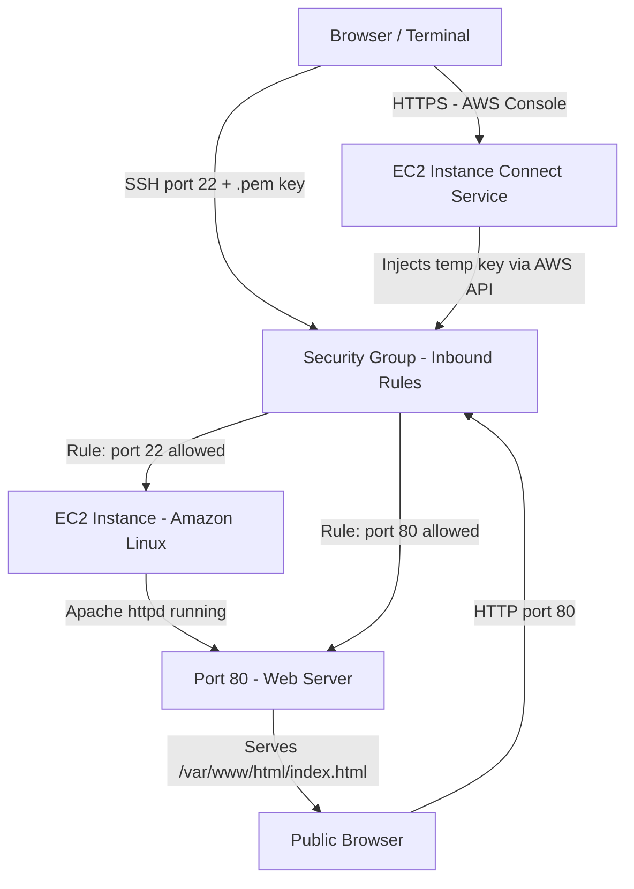

# Connecting to EC2 & Security Groups

## Overview — what it is and why it matters

Once an EC2 instance is running, two things stand between you and a working connection: the authentication method (how you prove who you are) and the Security Group (whether the network allows the traffic at all).

Most connection failures are not application errors — they are firewall rules blocking traffic before it reaches the instance. This topic covers both layers: key-based authentication via SSH and EC2 Instance Connect, and Security Groups as the stateful network firewall controlling what enters and leaves your instance.

---

## Simple explanation

Imagine your EC2 instance is an office inside a locked building.

**The Key Pair** is your personal access card — the building knows your card is valid (public key on the server), and only you hold the physical card (private key on your laptop). No card, no entry.

**The Security Group** is the building's reception policy — a list of who's allowed in, on which door (port), from where (source IP). Even with a valid access card, if reception has no rule allowing your visitor type, you're stopped at the door.

Both layers must be correctly configured. The instance can be running perfectly — if the Security Group has no inbound rule for port 22, every SSH attempt is silently dropped at the network boundary.

---

## Key concepts

### Key Pairs — Public / Private Key Authentication

A key pair is an asymmetric cryptographic pair generated at instance launch. AWS never stores the private key — once the .pem file is downloaded, that's the only copy.

**How it works:**

1. At launch, you select (or create) a key pair
2. AWS places the **public key** on the instance at `~/.ssh/authorized_keys` for the default user
3. You keep the **private key** (.pem file) on your machine
4. When you SSH in, your SSH client uses the private key to prove identity — no password ever transmitted

**Default usernames by AMI:**

| AMI | Default SSH username |
|---|---|
| Amazon Linux 2 / AL2023 | ec2-user |
| Ubuntu | ubuntu |
| Debian | admin |
| RHEL / CentOS | ec2-user or root |
| Windows | Administrator (RDP) |

> The private key file must have restricted permissions. SSH refuses connections if the .pem file is readable by others: `chmod 400 key.pem`

**Key pair security rules:**
- Never commit .pem files to source control
- Never share private keys between environments (dev key ≠ prod key)
- If a key is lost or compromised: terminate the instance, re-launch with a new key pair, or update `authorized_keys` via the console if the instance is still running

---

### EC2 Instance Connect

EC2 Instance Connect is a browser-based SSH method that doesn't require managing .pem files. AWS injects a temporary, one-time-use public key into the instance's `authorized_keys` for 60 seconds — long enough to establish the SSH session.

**How it differs from SSH with key pairs:**

| | SSH with Key Pair | EC2 Instance Connect |
|---|---|---|
| Requires .pem file | Yes | No |
| Key management | Manual | AWS-managed (ephemeral) |
| Access via | Terminal | Browser or CLI |
| Port 22 required | Yes | Yes (from AWS IP range) |
| Works without public IP | No (direct) | No (requires public IP or endpoint) |
| Best for | Long-term server access | Quick access, demos, lost key recovery |

**Requirement:** Port 22 must be open in the Security Group to the AWS IP range for Instance Connect. The console handles this automatically in most regions if you use the "Connect" button directly.

---

### Security Groups — Stateful Firewall

A Security Group is a virtual firewall applied at the instance's network interface (ENI — Elastic Network Interface). It controls inbound and outbound traffic using rules you define.

**Key characteristics:**

**Stateful** — If an inbound connection is allowed, the return traffic for that connection is automatically allowed outbound, without an explicit outbound rule. This is the critical difference from a Network ACL (stateless).

**Deny by default** — All inbound traffic is blocked unless a rule explicitly allows it. All outbound traffic is allowed by default (can be restricted).

**Allow-only** — Security Group rules can only allow traffic. There is no "Deny" rule option. To block specific traffic, use a Network ACL at the subnet level.

**Applied per-instance** — Multiple instances can share a Security Group, and one instance can have multiple Security Groups. Rules from all attached Security Groups are evaluated together.

---

### Security Group Rule anatomy

Each inbound rule has four components:

| Field | What it defines | Example |
|---|---|---|
| Type / Protocol | The network protocol | TCP, UDP, ICMP, or a named type like SSH, HTTP |
| Port range | Which port(s) the rule covers | 22, 80, 443, or 8080-8090 |
| Source | Where the traffic is allowed from | My IP, a CIDR block, another Security Group ID, or 0.0.0.0/0 |
| Description | Free-text label for the rule | "SSH access from office VPN" |

**Source options explained:**

- `My IP` — Console auto-detects and fills in your current public IP. Changes if your IP changes.
- `0.0.0.0/0` — Any IPv4 address on the internet. Use only for services intended to be publicly accessible (port 80, 443).
- `sg-xxxxxxxx` (Security Group ID) — Only traffic from instances in that Security Group. Preferred pattern for internal service-to-service communication.
- Custom CIDR — e.g., `10.0.0.0/8` for internal VPC traffic only.

> **Never use `0.0.0.0/0` as the source for SSH (port 22), RDP (port 3389), or any database port (3306, 5432, 27017).** These will be probed by automated scanners within minutes of exposure.

---

## Lab — EC2 Instance Connect + Apache Web Server

### Goal

Connect to an EC2 instance using EC2 Instance Connect (no .pem file required), install Apache HTTP Server, update the Security Group to allow port 80, and verify the web server is reachable from a browser.

### Steps

**Part 1 — Open Security Group for Instance Connect**

1. In the EC2 Console, select your running instance
2. Click the **Security** tab → click the Security Group link
3. Click **Edit inbound rules → Add rule**
4. Type: SSH | Port: 22 | Source: **My IP** | Description: "SSH for EC2 Instance Connect"
5. Click **Save rules**

**Part 2 — Connect via EC2 Instance Connect**

6. Select the instance → click **Connect** (top-right)
7. Choose tab: **EC2 Instance Connect**
8. Username: `ec2-user` (Amazon Linux 2023 default)
9. Click **Connect** — a browser terminal opens

**Part 3 — Install Apache and verify**

10. In the browser terminal, run:

```bash
# Update all installed packages
sudo dnf update -y

# Install Apache HTTP Server
sudo dnf install -y httpd

# Start the Apache service
sudo systemctl start httpd

# Enable Apache to start on every reboot
sudo systemctl enable httpd

# Confirm the service is running
sudo systemctl status httpd

# Write a test page
echo "<h1>EC2 Web Server — running</h1><p>Instance ID: $(curl -s http://169.254.169.254/latest/meta-data/instance-id)</p>"   | sudo tee /var/www/html/index.html
```

**Part 4 — Open port 80 in the Security Group**

11. Back in the EC2 Console → Security Group → **Edit inbound rules → Add rule**
12. Type: HTTP | Port: 80 | Source: **0.0.0.0/0** | Description: "Public HTTP"
13. Click **Save rules**

**Part 5 — Verify from the browser**

14. Copy the **Public IPv4 address** from the instance details panel
15. Open a browser tab and navigate to: `http://YOUR_PUBLIC_IP`
16. The page should display the HTML written in step 10

> If the page doesn't load: confirm the Security Group has port 80 open, confirm the instance has a public IP, and confirm the URL uses `http://` not `https://`.

### CLI commands

```bash
# Describe current Security Group rules for an instance
aws ec2 describe-security-groups   --group-ids YOUR_SG_ID   --query "SecurityGroups[*].IpPermissions"   --output table

# Add SSH rule (My IP) via CLI — replace YOUR_IP
aws ec2 authorize-security-group-ingress   --group-id YOUR_SG_ID   --protocol tcp   --port 22   --cidr YOUR_IP/32

# Add HTTP rule (public) via CLI
aws ec2 authorize-security-group-ingress   --group-id YOUR_SG_ID   --protocol tcp   --port 80   --cidr 0.0.0.0/0

# Remove a rule (reverse of authorize)
aws ec2 revoke-security-group-ingress   --group-id YOUR_SG_ID   --protocol tcp   --port 22   --cidr YOUR_IP/32

# Connect via EC2 Instance Connect from the CLI (requires ec2-instance-connect package)
aws ec2-instance-connect send-ssh-public-key   --instance-id YOUR_INSTANCE_ID   --availability-zone ap-south-1a   --instance-os-user ec2-user   --ssh-public-key file://~/.ssh/temp-key.pub
```

---

## Architecture flow



Two inbound paths reach the instance: SSH/Instance Connect on port 22 for administration, and HTTP on port 80 for web traffic. The Security Group evaluates both paths — only explicitly allowed ports reach the instance. Apache serves static content from `/var/www/html`. Because Security Groups are stateful, response traffic for both connections exits automatically without additional outbound rules.

---

## Common mistakes

**Opening SSH (port 22) to 0.0.0.0/0.** This is the single most common EC2 security misconfiguration. Automated scanners run globally 24/7 targeting port 22. Even with key-pair authentication, exposure creates noise, log pollution, and risk. Always scope SSH to your current IP or a bastion host CIDR.

**Losing the .pem file and assuming the instance is inaccessible.** If you lose the private key and the instance is still running, you can recover access by stopping the instance, detaching the root EBS volume, attaching it to a temporary instance, editing `authorized_keys` to add a new public key, then re-attaching. It's recoverable — but tedious. Keep .pem files in a password manager.

**Confusing Security Groups with Network ACLs.** Security Groups are stateful (return traffic automatic), operate at the instance level, and are allow-only. Network ACLs are stateless (return traffic needs explicit rules), operate at the subnet level, and support both allow and deny. Most beginners only need Security Groups.

**Forgetting to remove temporary rules.** Adding port 22 open to all IPs "just to test" and forgetting it exists is how temporary configurations become permanent vulnerabilities. Use the description field, review rules regularly.

**Not assigning a Security Group at all.** New instances get the default Security Group if none is specified. The default SG allows all traffic between instances in the same SG — fine for internal services, but verify it matches your intent.

---

## Real-world use

A company runs a public-facing API on EC2. The Security Group has three inbound rules: port 443 (HTTPS) from `0.0.0.0/0` for public API traffic, port 22 (SSH) from the company's VPN CIDR only for operations access, and port 5000 (internal app) from only the Security Group ID of the load balancer — never from the public internet. No rule uses `0.0.0.0/0` except HTTPS. Quarterly audits review and remove any rules that no longer have a documented purpose.

---

## Key takeaways

- Security Groups are stateful — allow inbound, and return traffic is automatically allowed outbound
- All inbound traffic is blocked by default — you must explicitly allow every port you need
- EC2 Instance Connect injects a temporary key via the AWS API — no .pem file management required
- SSH key pairs use asymmetric cryptography — public key on the server, private key never leaves your machine
- Never open SSH (22), RDP (3389), or database ports to `0.0.0.0/0` in any environment
- Security Groups are allow-only — use Network ACLs for explicit deny rules at the subnet level

---

## Next steps

- [ ] Create a **Bastion Host** pattern — SSH to a hardened jump server, then to private instances
- [ ] Explore **AWS Systems Manager Session Manager** — connect to EC2 without any open inbound ports
- [ ] Learn **Elastic IP** — assign a static public IP so your instance address survives stop/start
- [ ] Study **VPC Security** — how Security Groups, NACLs, and route tables work together
- [ ] Practice the **EC2 key recovery** procedure on a test instance before needing it in production