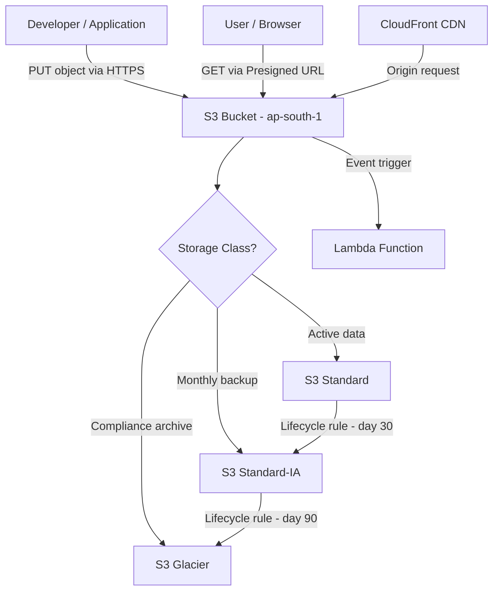

# Amazon S3 Fundamentals

## Overview — what it is and why it matters

S3 (Simple Storage Service) is AWS's object storage service. It stores files — called objects — inside containers called buckets, with virtually unlimited capacity, 99.999999999% (11 nines) durability, and multiple storage classes that let you trade retrieval speed for cost.

S3 is not a file system or a block device. Understanding that distinction upfront prevents a category of architectural mistakes that are expensive to undo.

---

## Simple explanation

Think of S3 like a post office warehouse with intelligent shelving.

Each **object** is a sealed package: your file plus a label (the key) and a description sheet (metadata). You hand it in at the front desk (upload). You retrieve the whole package by its label (download). You cannot open the package and change page 4 — you replace the whole thing.

The **bucket** is your reserved section of the warehouse. Globally identified by name. Stays in one city (region). Holds as many packages as you want.

**Storage classes** are the shelving options: hot shelf near the door (Standard), a back room (Standard-IA), a climate-controlled archive (Glacier). Same package integrity, different retrieval time and monthly rent.

---

## Key concepts

### Object Storage vs Block Storage

The most important S3 concept is what it is *not*.

**Block storage** (AWS EBS — the disk attached to an EC2 instance) divides storage into fixed-size blocks. The operating system addresses them like a hard drive. You can install software, run a database, open a file, modify line 4, and save. The OS manages read/write at the block level.

**Object storage** (S3) stores each file as an indivisible unit — a complete object with a key (its name/path), metadata (content type, size, custom tags), and the data itself. To update a file, you upload a new version. There is no in-place edit.

| | Block Storage (EBS) | Object Storage (S3) |
|---|---|---|
| Access pattern | Random read/write | Upload / Download / Delete |
| In-place modification | Yes | No — replace the whole object |
| Mount as a drive | Yes | No |
| Max object/volume size | Up to 64 TiB (volume) | 5 TB per object, unlimited total |
| Use for | OS disks, databases, active files | Images, backups, logs, archives, static sites |
| Latency | Sub-millisecond (local) | Milliseconds (over HTTP) |
| Pricing model | Per GB provisioned | Per GB stored + per request |

**Decision rule:** if the application needs to open a file and modify part of it — use block storage. If it uploads and retrieves whole files — use object storage.

---

### Buckets

A bucket is the top-level namespace container in S3. Every object in S3 lives inside a bucket, identified by a key (the object's full path/name).

**Bucket rules and behaviour:**

- **Globally unique names** — bucket names share a single namespace across all AWS accounts and all regions. `company-backups` is either yours or taken. Naming convention: lowercase letters, numbers, and hyphens only.
- **Region-bound** — a bucket is created in a specific AWS region. Data does not leave that region unless you explicitly enable Cross-Region Replication. Important for data residency compliance.
- **No true folders** — S3 has a flat namespace. What the console shows as folders are prefixes: an object key of `images/2024/photo.jpg` is just a single string. The `/` characters are part of the key name, not a directory structure.
- **Unlimited objects** — a single bucket can hold an unlimited number of objects, each up to 5 TB.
- **Private by default** — all buckets and objects are private when created. Public access requires explicit configuration and an additional "Block Public Access" setting override.

**Bucket naming tips:** include your account ID or project name as a prefix to avoid collisions: `myproject-prod-assets-123456789012`.

---

### Storage Classes

All S3 storage classes provide the same 11-nines durability. They differ in availability, minimum storage duration, retrieval cost, and monthly storage cost. Choosing the right class for each data type directly reduces costs without touching architecture.

| Storage Class | Access pattern | Retrieval time | Relative cost | Min storage duration |
|---|---|---|---|---|
| S3 Standard | Frequent (daily) | Milliseconds | $$$ | None |
| S3 Standard-IA | Infrequent (monthly) | Milliseconds | $$ + retrieval fee | 30 days |
| S3 One Zone-IA | Infrequent, non-critical | Milliseconds | $ + retrieval fee | 30 days |
| S3 Glacier Instant Retrieval | Archive, occasional access | Milliseconds | $ | 90 days |
| S3 Glacier Flexible Retrieval | Archive, rare access | Minutes to hours | $¢ | 90 days |
| S3 Glacier Deep Archive | Long-term compliance | Hours (up to 12h) | ¢ | 180 days |
| S3 Intelligent-Tiering | Unknown or changing pattern | Milliseconds | Auto-optimised | None |

**When to use each:**

- **Standard** — active production data: application assets, frequently requested files, anything accessed more than once a month
- **Standard-IA** — disaster recovery backups, older log archives, data accessed for monthly reporting
- **Glacier Instant** — compliance archives that regulators might request; infrequent but need immediate response
- **Glacier Flexible / Deep Archive** — legal holds, historical data you're required to retain, video masters you'll (probably) never re-encode
- **Intelligent-Tiering** — when access patterns are unpredictable; S3 monitors and moves objects automatically at no retrieval charge

> Minimum storage durations matter: if you store an object in Standard-IA and delete it after 10 days, you still pay for 30 days. Don't use IA classes for frequently churned data.

---

### S3 Lifecycle Policies

A lifecycle policy is a rule that automatically transitions objects between storage classes or expires (deletes) them based on age or prefix.

Example policy logic:
- Day 0: object uploaded → **Standard**
- Day 30: transition to → **Standard-IA**
- Day 90: transition to → **Glacier Flexible Retrieval**
- Day 365: **Delete**

This is how teams build cost-efficient data retention without writing any code. Define once, runs automatically forever.

---

## Lab — Create S3 Bucket and Upload Files

### Goal

Create an S3 bucket with correct settings, upload objects via the Console, and understand the default private access model — including why pasting an S3 URL directly into a browser returns Access Denied.

### Steps

**Part 1 — Create the bucket**

1. Navigate to **S3 → Create bucket**
2. Bucket name: `yourname-devops-lab-YYYYMMDD` (must be globally unique)
3. AWS Region: select your preferred region (e.g., `ap-south-1`)
4. Object Ownership: leave as **ACLs disabled** (recommended)
5. Block Public Access: **leave all four checkboxes ON** (default — keep private)
6. Versioning: **Enable** (allows recovery of overwritten/deleted objects)
7. Default encryption: **Server-side encryption with Amazon S3 managed keys (SSE-S3)** — enable
8. Click **Create bucket**

**Part 2 — Upload objects**

9. Click your new bucket name → **Upload → Add files**
10. Select two or three files (any type — a text file, an image, a PDF)
11. Under Properties: leave Storage class as **Standard** for now
12. Click **Upload**
13. After upload completes, click on one of the object names
14. Find the **Object URL** — copy it and paste into a new browser tab
15. Observe: `Access Denied` XML response — the object is private by default

**Part 3 — Generate a presigned URL**

16. In the object detail page: **Object actions → Share with a presigned URL**
17. Set expiry: 5 minutes
18. Click **Create presigned URL** — copy the URL
19. Paste into a browser — the file is now accessible (for 5 minutes only)
20. After 5 minutes, the URL expires and returns Access Denied again

**Part 4 — Set a storage class on upload**

21. Click **Upload** again → Add a new file → expand **Properties**
22. Change Storage class to **Standard-IA**
23. Complete upload — the object is stored at lower cost (note: 30-day minimum billing applies)

### CLI commands

```bash
# Create a bucket (replace BUCKET_NAME and REGION)
aws s3api create-bucket   --bucket YOUR_BUCKET_NAME   --region ap-south-1   --create-bucket-configuration LocationConstraint=ap-south-1

# Enable versioning on the bucket
aws s3api put-bucket-versioning   --bucket YOUR_BUCKET_NAME   --versioning-configuration Status=Enabled

# Upload a single file
aws s3 cp ./local-file.txt s3://YOUR_BUCKET_NAME/local-file.txt

# Upload an entire directory recursively
aws s3 sync ./local-folder/ s3://YOUR_BUCKET_NAME/folder/

# List all objects in a bucket
aws s3 ls s3://YOUR_BUCKET_NAME --recursive --human-readable

# Generate a presigned URL valid for 300 seconds (5 minutes)
aws s3 presign s3://YOUR_BUCKET_NAME/local-file.txt --expires-in 300

# Copy object and change its storage class to Standard-IA
aws s3 cp s3://YOUR_BUCKET_NAME/local-file.txt   s3://YOUR_BUCKET_NAME/local-file.txt   --storage-class STANDARD_IA

# Delete an object
aws s3 rm s3://YOUR_BUCKET_NAME/local-file.txt

# Delete the entire bucket and all contents (irreversible)
aws s3 rb s3://YOUR_BUCKET_NAME --force
```

---

## Architecture flow



Objects are uploaded via HTTPS PUT requests and land in the configured storage class. Lifecycle policies automatically transition objects through cheaper tiers as they age. Access is controlled per-request: presigned URLs grant time-limited access to private objects without changing bucket permissions. CloudFront commonly sits in front of S3 to cache and deliver content at edge locations globally. S3 event notifications can trigger Lambda functions on object creation — a common serverless pipeline pattern.

---

## Common mistakes

**Making the entire bucket public to share one file.** A public bucket exposes every object in it, including anything uploaded in the future. Use presigned URLs for temporary, scoped access — or a bucket policy that limits access to specific prefixes.

**Choosing Standard-IA for frequently accessed data.** Standard-IA charges a per-GB retrieval fee on top of the lower storage cost. If objects are accessed more than about once a month, Standard is cheaper overall.

**Ignoring minimum storage durations.** Glacier Deep Archive has a 180-day minimum. Uploading a 1 GB file, realising it's wrong, and deleting it after one day still bills 180 days of storage. Test lifecycle configurations carefully.

**Treating the S3 "folder" in the console as a real directory.** There are no directories in S3. The console creates a zero-byte object with a trailing `/` to simulate folders. Operations like "delete folder" delete all objects with that prefix — confirm before running.

**Not enabling versioning.** Without versioning, overwriting or deleting an object is permanent and immediate. Enable versioning on any bucket holding data that matters — storage cost is low, recovery cost (in time and stress) is high.

**Uploading sensitive files to the wrong bucket or prefix.** S3 access misconfigurations are among the most common causes of data exposure incidents. Always confirm Block Public Access settings and review bucket policies before putting sensitive data in.

---

## Real-world use

A media company stores video uploads in S3 Standard. After 30 days, a lifecycle policy moves processed videos to Standard-IA. After one year, masters are transitioned to Glacier Flexible Retrieval. The active-access tier costs ~$23/TB/month; the archive tier costs ~$0.36/TB/month. On a 200 TB archive, this saves over $4,500/month compared to keeping everything in Standard.

A SaaS application uses S3 as its static asset store, CloudFront as the CDN layer, and S3 event notifications to trigger a Lambda function whenever a user uploads a profile photo — resizing it automatically to three dimensions without a running server.

---

## Key takeaways

- S3 is object storage — upload and retrieve whole files, not random read/write like block storage
- Buckets are globally named, region-bound containers — names must be unique across all AWS accounts
- Objects are private by default — access requires explicit permissions or presigned URLs
- Storage classes trade retrieval speed and cost — same durability across all classes
- Lifecycle policies automate object transitions between classes — set once, runs forever
- Minimum storage duration billing applies to IA and Glacier classes — factor this into object churn rates

---

## Next steps

- [ ] Configure a **Lifecycle Policy** to automatically transition objects to Standard-IA after 30 days
- [ ] Host a **Static Website** from an S3 bucket — enable static website hosting and upload an index.html
- [ ] Set up **S3 Versioning** and practice restoring a previous version of an overwritten object
- [ ] Explore **S3 Event Notifications** — trigger a Lambda on every object upload
- [ ] Learn **Cross-Region Replication (CRR)** — automatically copy objects to a bucket in another region for DR