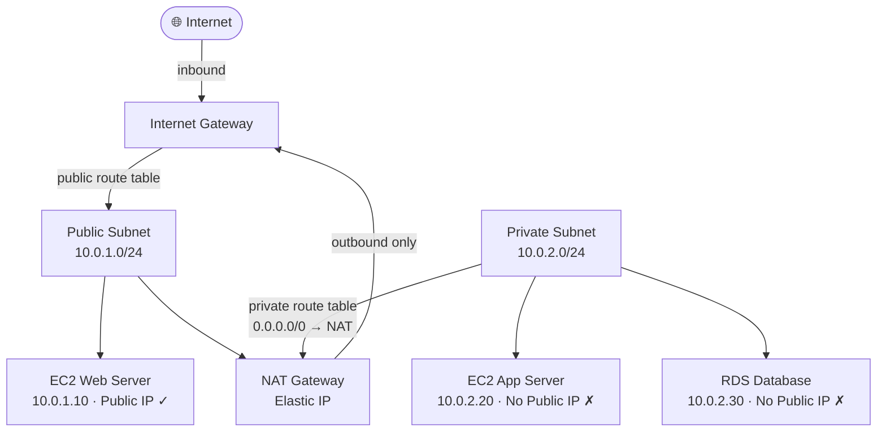

# Amazon VPC Fundamentals

## Overview — what it is and why it matters

VPC (Virtual Private Cloud) is your logically isolated section of the AWS cloud. Every AWS resource that needs network connectivity — EC2 instances, RDS databases, Lambda functions in a VPC, ECS containers — lives inside a VPC.

By default, nothing inside a VPC can reach the internet, and nothing from the internet can reach inside. You build the network intentionally: choose the IP address range, create subnets, attach gateways, and define routing rules.

---

## Simple explanation

Imagine AWS is a city. A VPC is the private campus you own inside that city.

You decide:
- Which **buildings** go where (subnets — some face the street, some are interior-only)
- Which **doors** connect to the outside (Internet Gateway — the main gate, NAT Gateway — a one-way exit)
- Which **roads** traffic can use (Route Tables — the rulebook for every vehicle entering or leaving)

Nothing moves without a road. No road exists without a rule.

---

## Key concepts

### CIDR Block — defining your IP address space

When you create a VPC, you assign it a **CIDR block** — the range of private IP addresses available inside it.

Common choices:

| CIDR Block | Total IPs | Usable IPs | Use case |
|---|---|---|---|
| 10.0.0.0/16 | 65,536 | 65,531 | Standard production VPC |
| 10.0.0.0/24 | 256 | 251 | Small lab/dev VPC |
| 172.16.0.0/16 | 65,536 | 65,531 | Multi-VPC environments |

> AWS reserves 5 IPs in every subnet (network address, VPC router, DNS, future use, broadcast). A /24 subnet gives you 251 usable IPs, not 256.

Subnets divide the VPC CIDR into smaller blocks. A VPC of `10.0.0.0/16` could have:
- Public subnet: `10.0.1.0/24`
- Private subnet: `10.0.2.0/24`

---

### Public Subnet vs Private Subnet

The difference between a public and private subnet is entirely determined by the **route table** attached to it — specifically, whether it has a route to an Internet Gateway.

| | Public Subnet | Private Subnet |
|---|---|---|
| Route to Internet Gateway | Yes (0.0.0.0/0 → IGW) | No |
| Inbound internet traffic | Allowed (with SG rules) | Blocked at network level |
| Outbound internet access | Direct via IGW | Via NAT Gateway only |
| Resources assigned public IPs | Optional (auto-assign) | Never |
| Typical resources | Load balancers, bastion hosts, web servers | App servers, databases, internal APIs |

**Key insight:** "private" in AWS networking means no route to the internet — it is a routing decision, not an encryption or authentication decision.

---

### Internet Gateway (IGW)

An Internet Gateway is a horizontally scaled, redundant, highly available VPC component that allows communication between your VPC and the internet.

**Properties:**
- One IGW per VPC
- Fully managed by AWS — no instance to maintain, no bandwidth limit
- By itself, attaching an IGW doesn't make anything public — a route table must also point `0.0.0.0/0` to the IGW, and the resource must have a public IP

**What it does:** provides the route for public subnet traffic to leave your VPC and reach the internet, and for internet traffic to reach resources in your public subnet.

---

### NAT Gateway

NAT (Network Address Translation) Gateway allows resources in **private subnets** to initiate outbound connections to the internet — for package updates, API calls, downloading dependencies — without being reachable from the internet.

**Key characteristics:**

| Property | Value |
|---|---|
| Direction | Outbound only — private resources call out, internet cannot call in |
| Location | Deployed in a **public subnet** (needs its own internet route via IGW) |
| Managed by | AWS — fully managed, no patching |
| Elastic IP | Requires an Elastic IP address |
| Cost | ~$0.045/hour + $0.045/GB — always running (~$32/month minimum) |
| High availability | Deploy one NAT GW per AZ in production |

**Traffic flow — private EC2 calling the internet:**
1. Private EC2 → private route table → NAT Gateway (in public subnet)
2. NAT Gateway → public route table → Internet Gateway
3. Internet sees only the NAT Gateway's Elastic IP — never the private EC2's address

> NAT Gateway costs ~$32/month even with zero traffic. Always delete it and release the associated Elastic IP after lab work.

---

### Route Tables

A route table is the rulebook for a subnet — it defines where traffic goes based on the destination IP. AWS matches the most specific route first (longest prefix match).

**Public subnet route table:**

| Destination | Target | Meaning |
|---|---|---|
| 10.0.0.0/16 | local | All VPC-internal traffic stays inside |
| 0.0.0.0/0 | igw-xxxxxxxx | All other traffic exits to internet via IGW |

**Private subnet route table:**

| Destination | Target | Meaning |
|---|---|---|
| 10.0.0.0/16 | local | All VPC-internal traffic stays inside |
| 0.0.0.0/0 | nat-xxxxxxxx | All other traffic exits via NAT GW (no inbound) |

Each subnet associates with exactly one route table. One route table can serve multiple subnets.

---

## Lab — VPC Wizard: Public + Private Subnets

### Goal

Use the VPC Wizard to create a production-pattern VPC with one public subnet and one private subnet, with Internet Gateway and NAT Gateway correctly configured and verified.

### Steps

**Part 1 — Create VPC with Wizard**

1. Navigate to **VPC → Your VPCs → Create VPC**
2. Select **VPC and more** (Wizard mode — creates all components)
3. Configure:
   - Name tag: `devops-lab`
   - IPv4 CIDR: `10.0.0.0/16`
   - Availability Zones: **1**
   - Public subnets: **1**
   - Private subnets: **1**
   - NAT gateways: **In 1 AZ** ⚠️ delete after lab
   - VPC endpoints: None
4. Click **Create VPC** — creates VPC, 2 subnets, IGW, NAT GW, 2 route tables

**Part 2 — Verify components**

5. **VPC → Subnets** — confirm two subnets with your name prefix
6. Public subnet → **Route table** tab — confirm `0.0.0.0/0 → igw-xxx`
7. Private subnet → **Route table** tab — confirm `0.0.0.0/0 → nat-xxx`
8. **VPC → Internet Gateways** — confirm attached to your VPC
9. **VPC → NAT Gateways** — confirm state is **Available**

**Part 3 — Launch instances and test connectivity**

10. Launch `t3.micro` in **public subnet** — enable auto-assign public IP
11. Launch `t3.micro` in **private subnet** — no public IP
12. SSH to public instance, verify outbound internet: `curl -s https://example.com | head -5`
13. From public instance, SSH to private instance using its private IP
14. From private instance, verify outbound works: `curl -s https://example.com | head -5`
15. Verify no inbound: try SSH to private instance's private IP from your laptop — connection times out

**Part 4 — Cleanup**

16. Terminate both EC2 instances
17. **VPC → NAT Gateways** → select → **Actions → Delete NAT Gateway**
18. After deletion, **VPC → Elastic IPs** → select associated EIP → **Release**

### CLI commands

```bash
# Create VPC
aws ec2 create-vpc   --cidr-block 10.0.0.0/16   --tag-specifications 'ResourceType=vpc,Tags=[{Key=Name,Value=devops-lab-vpc}]'

# Create public subnet
aws ec2 create-subnet   --vpc-id YOUR_VPC_ID   --cidr-block 10.0.1.0/24   --availability-zone ap-south-1a   --tag-specifications 'ResourceType=subnet,Tags=[{Key=Name,Value=devops-lab-public}]'

# Create private subnet
aws ec2 create-subnet   --vpc-id YOUR_VPC_ID   --cidr-block 10.0.2.0/24   --availability-zone ap-south-1a   --tag-specifications 'ResourceType=subnet,Tags=[{Key=Name,Value=devops-lab-private}]'

# Create and attach Internet Gateway
aws ec2 create-internet-gateway   --tag-specifications 'ResourceType=internet-gateway,Tags=[{Key=Name,Value=devops-lab-igw}]'
aws ec2 attach-internet-gateway   --internet-gateway-id YOUR_IGW_ID   --vpc-id YOUR_VPC_ID

# Add IGW route to public subnet route table
aws ec2 create-route   --route-table-id YOUR_PUBLIC_RT_ID   --destination-cidr-block 0.0.0.0/0   --gateway-id YOUR_IGW_ID

# Allocate Elastic IP and create NAT Gateway in public subnet
aws ec2 allocate-address --domain vpc
aws ec2 create-nat-gateway   --subnet-id YOUR_PUBLIC_SUBNET_ID   --allocation-id YOUR_EIP_ALLOC_ID   --tag-specifications 'ResourceType=natgateway,Tags=[{Key=Name,Value=devops-lab-nat}]'

# Add NAT GW route to private subnet route table
aws ec2 create-route   --route-table-id YOUR_PRIVATE_RT_ID   --destination-cidr-block 0.0.0.0/0   --nat-gateway-id YOUR_NAT_GW_ID

# Cleanup — delete NAT GW then release Elastic IP
aws ec2 delete-nat-gateway --nat-gateway-id YOUR_NAT_GW_ID
aws ec2 release-address --allocation-id YOUR_EIP_ALLOC_ID
```

---

## Architecture flow



Internet traffic enters via IGW and routes to public subnet resources. Private resources have no inbound internet path — their route table sends outbound traffic through NAT Gateway, which translates addresses and exits via IGW. The internet only ever sees the NAT Gateway's Elastic IP. Private resources cannot be directly reached from outside the VPC.

---

## Common mistakes

**Putting databases in public subnets.** A database with a public IP and an open security group port is reachable from the entire internet. Always place datastores in private subnets — no exceptions.

**Forgetting to delete NAT Gateway after labs.** ~$0.045/hour regardless of traffic. A forgotten NAT Gateway costs ~$32/month. Delete it and release the Elastic IP immediately after lab work.

**Misassociating route tables to subnets.** A subnet is exactly as public or private as its route table says. Manually verify the route table association for every subnet after setup.

**Single NAT Gateway across multiple AZs in production.** If the NAT Gateway's AZ goes down, all private subnets lose outbound internet access. In production, deploy one NAT Gateway per AZ.

**Confusing Security Groups with the subnet boundary.** A private subnet blocks inbound traffic at the routing layer — but Security Groups still apply within the subnet. Both layers need correct configuration.

---

## Real-world use

A three-tier production application: Application Load Balancer in the public subnet (internet-facing), EC2 application servers in a private subnet (no public IP, receive traffic from ALB Security Group only), RDS in a separate private subnet (accessible only from the app server Security Group). No database port has ever had a public IP. Developers access app servers via AWS Systems Manager Session Manager — no bastion host, no SSH port open to the internet.

---

## Key takeaways

- A VPC is your isolated private network inside AWS — deny-by-default, everything built intentionally
- Public vs private subnet is a route table decision: does `0.0.0.0/0` point to an IGW?
- Internet Gateway enables two-way internet traffic for public subnets
- NAT Gateway enables outbound-only internet access for private subnets — no inbound ever
- Route tables are the rulebook — longest prefix match wins, one per subnet
- NAT Gateway costs ~$32/month idle — always delete after lab work

---

## Next steps

- [ ] Add a **second AZ** with its own public and private subnets for true high availability
- [ ] Replace the bastion host pattern with **AWS Systems Manager Session Manager** — zero open ports
- [ ] Explore **VPC Peering** — private connectivity between two VPCs
- [ ] Learn **Network ACLs** — stateless subnet-level firewall, complements Security Groups
- [ ] Study **VPC Flow Logs** — capture and inspect all network traffic metadata for security auditing