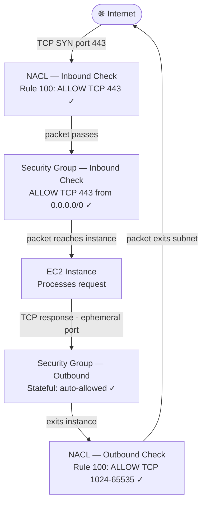

# Network Security: Security Groups vs Network ACLs

## Overview — what it is and why it matters

AWS VPCs have two layers of network access control. Security Groups (SGs) operate at the instance level and are stateful. Network ACLs (NACLs) operate at the subnet level and are stateless. In a default VPC both layers exist simultaneously — every packet passes through both before reaching or leaving an instance.

Understanding the difference is not academic. The most common reason a correctly-configured Security Group still fails to allow traffic is a restrictive NACL — and the most common NACL mistake is forgetting to write return traffic rules.

---

## Simple explanation

Two security checks happen every time a packet enters your VPC subnet and reaches an instance.

**Check 1 — Network ACL (subnet boundary):** Did this packet pass the subnet's entry checkpoint? Rules are numbered, evaluated in order, first match wins. Both directions evaluated independently — inbound and outbound are separate rule sets.

**Check 2 — Security Group (instance boundary):** Is this packet allowed to reach this specific instance? Stateful — if the inbound direction is allowed, the return traffic is automatically permitted without a separate rule.

Both checks must pass. A correctly configured Security Group does nothing if the NACL drops the packet at the subnet boundary first.

---

## Key concepts

### Stateful vs Stateless — the core distinction

This single concept explains all the behavioural differences between SGs and NACLs.

**Stateful (Security Group):**
The firewall tracks the state of each connection. When an inbound packet is allowed, the system records "a connection was established on this port from this source." When the server sends a response, the firewall automatically allows it out — no return rule required.

**Stateless (Network ACL):**
Every packet is evaluated in isolation, with no memory of previous packets. An HTTP request arriving inbound is one evaluation. The HTTP response leaving outbound is an entirely separate evaluation. If there is no outbound rule permitting the response, it is dropped — even if the inbound request was explicitly allowed.

| | Security Group | Network ACL |
|---|---|---|
| State tracking | Stateful | Stateless |
| Return traffic | Auto-allowed | Explicit rule required |
| Rule types | Allow only | Allow and Deny |
| Rule evaluation | All rules evaluated | Numbered order, first match wins |
| Scope | Instance (ENI) | Subnet (all instances) |
| Default action | Deny all inbound | Allow all (default NACL) |
| Applied at | Instance launch | Subnet association |

---

### Security Groups — deep dive

A Security Group is a stateful virtual firewall attached to an Elastic Network Interface (ENI). One ENI can have up to 5 Security Groups; all rules across all attached SGs are combined and evaluated together.

**Inbound rules** control what traffic is allowed to reach the instance.
**Outbound rules** control what traffic the instance can send out. Default: allow all outbound.

**Key Security Group behaviours:**

- **Allow-only:** There is no DENY rule in a Security Group. To block traffic, you simply do not add an Allow rule for it. This means you cannot use an SG to explicitly block a specific IP — use a NACL for that.
- **Stateful return traffic:** A request allowed in will always get a response out, even if the outbound rules are tightened. The connection tracking happens below the rule evaluation layer.
- **Source can be another SG:** Instead of a CIDR, the source of an inbound rule can be a Security Group ID. Only traffic from instances in that SG is allowed. This is the correct pattern for internal service communication — never use `0.0.0.0/0` for internal traffic.
- **Changes take effect immediately:** Modifying a Security Group rule applies instantly to all instances using it, with no restart required.

**Typical Security Group setup for a web server:**

| Direction | Type | Port | Source | Purpose |
|---|---|---|---|---|
| Inbound | HTTPS | 443 | 0.0.0.0/0 | Public web traffic |
| Inbound | HTTP | 80 | 0.0.0.0/0 | Redirect to HTTPS |
| Inbound | SSH | 22 | Your IP only | Admin access |
| Outbound | All traffic | All | 0.0.0.0/0 | Default — allow all out |

---

### Network ACLs — deep dive

A Network ACL is a stateless firewall attached at the subnet boundary. Every subnet in a VPC has exactly one NACL associated with it (the default NACL unless you assign a custom one). Unlike Security Groups, NACLs evaluate inbound and outbound traffic independently with numbered rules.

**Rule evaluation:**
Rules are numbered (1–32766). AWS evaluates rules in ascending order and stops at the first match. Rule `*` (the implicit deny-all at the end, rule number 32767) catches everything not matched by an explicit rule.

**Ephemeral ports — the stateless trap:**
When a client connects to a server on port 443, the server's response goes back to a random high port on the client (ephemeral port, typically 1024–65535). In a Security Group, this is handled automatically. In a NACL, you must explicitly allow outbound traffic on the ephemeral port range for the response to reach the client.

```
Client request:  source port 54321 → destination port 443
Server response: source port 443   → destination port 54321 (ephemeral)
```

**Typical custom NACL inbound rules:**

| Rule # | Type | Protocol | Port range | Source | Action |
|---|---|---|---|---|---|
| 100 | HTTPS | TCP | 443 | 0.0.0.0/0 | ALLOW |
| 110 | HTTP | TCP | 80 | 0.0.0.0/0 | ALLOW |
| 120 | SSH | TCP | 22 | Your IP/32 | ALLOW |
| 130 | Custom TCP | TCP | 1024-65535 | 0.0.0.0/0 | ALLOW |
| * | All traffic | All | All | 0.0.0.0/0 | DENY |

**Typical custom NACL outbound rules:**

| Rule # | Type | Protocol | Port range | Destination | Action |
|---|---|---|---|---|---|
| 100 | HTTPS | TCP | 443 | 0.0.0.0/0 | ALLOW |
| 110 | HTTP | TCP | 80 | 0.0.0.0/0 | ALLOW |
| 120 | Custom TCP | TCP | 1024-65535 | 0.0.0.0/0 | ALLOW |
| * | All traffic | All | All | 0.0.0.0/0 | DENY |

> Rule 130 inbound and Rule 120 outbound (1024–65535) allow ephemeral return traffic. Without these, connections appear to hang — the request goes through but the response never arrives.

---

### Default rules in a new VPC

**Default Security Group (auto-created with VPC):**

| Direction | Rule | Effect |
|---|---|---|
| Inbound | Allow all from same SG | Instances in the same SG can talk to each other |
| Inbound | (nothing else) | All other inbound blocked |
| Outbound | Allow all to 0.0.0.0/0 | All outbound allowed |

**Default Network ACL (auto-created with VPC):**

| Rule # | Direction | Action | Traffic |
|---|---|---|---|
| 100 | Inbound | ALLOW | All traffic, 0.0.0.0/0 |
| * | Inbound | DENY | All traffic (catch-all) |
| 100 | Outbound | ALLOW | All traffic, 0.0.0.0/0 |
| * | Outbound | DENY | All traffic (catch-all) |

The default NACL allows all traffic in both directions — rule 100 matches before the catch-all deny. This is intentional for new VPCs; custom NACLs start with no rules (deny all) and require explicit configuration.

---

## Lab — Examine Default NACL and Security Group Rules

### Goal

Inspect the default NACL and Security Group rules created with your VPC, then observe the effect of a missing NACL return traffic rule — proving stateless behaviour with a live connection test.

### Steps

**Part 1 — Inspect the default Security Group**

1. Navigate to **VPC → Security Groups**
2. Find the Security Group named **default** for your VPC
3. Click **Inbound rules** tab — note the single rule: All traffic from source `sg-xxxxxxxx` (itself)
4. Click **Outbound rules** tab — note: All traffic to `0.0.0.0/0`
5. This means: by default, instances block all external inbound traffic and allow all outbound

**Part 2 — Inspect the default Network ACL**

6. Navigate to **VPC → Network ACLs**
7. Find the NACL associated with your VPC (marked "Default: Yes")
8. Click **Inbound rules** — note Rule 100: ALL traffic ALLOW, Rule `*`: ALL DENY
9. Click **Outbound rules** — same structure: Rule 100 ALLOW all, Rule `*` DENY all
10. Note the subnet associations tab — this NACL covers all default subnets

**Part 3 — Create a custom NACL and observe stateless behaviour**

11. Navigate to **VPC → Network ACLs → Create network ACL**
12. Name: `test-stateless-nacl`, select your VPC → Create
13. Note: custom NACLs start with only the deny-all rule — no traffic passes
14. Associate it with your public subnet (Subnet associations tab → Edit)
15. Try to access your EC2 web server — it will time out
16. Add inbound rule: Rule 100 — ALLOW TCP 80 from 0.0.0.0/0
17. Try again — still times out (response has no outbound path)
18. Add outbound rule: Rule 100 — ALLOW TCP 1024-65535 to 0.0.0.0/0
19. Try again — now it works. This is stateless behaviour in action.
20. Re-associate the default NACL to restore normal operation

### CLI commands

```bash
# List all Security Groups in your VPC
aws ec2 describe-security-groups   --filters "Name=vpc-id,Values=YOUR_VPC_ID"   --query "SecurityGroups[*].[GroupId,GroupName,Description]"   --output table

# List all NACLs in your VPC
aws ec2 describe-network-acls   --filters "Name=vpc-id,Values=YOUR_VPC_ID"   --query "NetworkAcls[*].[NetworkAclId,IsDefault,Tags[?Key=='Name'].Value|[0]]"   --output table

# View inbound rules of a specific NACL
aws ec2 describe-network-acls   --network-acl-ids YOUR_NACL_ID   --query "NetworkAcls[0].Entries[?Egress==`false`]"   --output table

# Add an inbound ALLOW rule to a NACL (rule 100, TCP 443)
aws ec2 create-network-acl-entry   --network-acl-id YOUR_NACL_ID   --ingress   --rule-number 100   --protocol tcp   --port-range From=443,To=443   --cidr-block 0.0.0.0/0   --rule-action allow

# Add outbound ephemeral port range rule (return traffic)
aws ec2 create-network-acl-entry   --network-acl-id YOUR_NACL_ID   --egress   --rule-number 100   --protocol tcp   --port-range From=1024,To=65535   --cidr-block 0.0.0.0/0   --rule-action allow

# Add an explicit DENY rule (e.g., block a specific IP — only possible with NACL)
aws ec2 create-network-acl-entry   --network-acl-id YOUR_NACL_ID   --ingress   --rule-number 90   --protocol -1   --cidr-block 192.0.2.100/32   --rule-action deny
```

---

## Architecture flow



Every inbound packet passes the NACL inbound check first, then the Security Group inbound check. Response packets pass the Security Group outbound (auto-allowed, stateful) then the NACL outbound (must have an explicit rule for the ephemeral port range). A single missing rule at any layer drops the packet silently.

---

## Common mistakes

**Adding a Security Group rule and wondering why traffic still fails.** The NACL is evaluated first, at the subnet boundary. If the NACL is blocking the traffic, the Security Group never gets a chance to allow it. Always check both layers when debugging connection issues.

**Forgetting the ephemeral port range in NACL outbound rules.** This is the most common NACL mistake. Clients connect from a random high port (1024–65535). The response must go back to that port. Without an outbound rule covering 1024–65535, TCP connections silently hang after the request is sent — the server responds but the client never receives the data.

**Using the default NACL as if it's restrictive.** The default NACL allows all traffic (Rule 100: ALLOW ALL). It provides no meaningful security on its own. Teams who assume "we have a NACL" are protected often discover that it allows everything.

**Adding NACL DENY rules when Security Groups would suffice.** NACLs apply to all instances in a subnet. A NACL DENY rule intended for one instance also affects every other instance in that subnet. Use Security Groups for instance-specific rules; reserve NACLs for subnet-wide policies (block a known malicious IP range).

**Inserting rules without considering numbering.** A new Allow rule at rule number 200 has no effect if a Deny rule at rule number 100 already matches the same traffic. Rule order matters in NACLs — Security Groups have no ordering concept (all rules are evaluated simultaneously).

---

## Real-world use

An enterprise VPC uses NACLs as a coarse first filter: a single NACL rule blocks a list of known malicious CIDR ranges from ever entering the subnet — before any Security Group evaluation. Individual service Security Groups then apply fine-grained, instance-specific rules. The NACL handles "block this IP for everyone"; the Security Group handles "allow this port for this service." Each layer does what it's best at.

---

## Key takeaways

- Security Groups are stateful — allow inbound, return traffic is automatic; no deny rules possible
- NACLs are stateless — every packet evaluated independently; must explicitly allow return traffic
- NACLs support DENY rules; Security Groups do not — use NACLs to explicitly block specific IPs
- NACL rules are numbered and evaluated in order; first match wins; Security Group rules all apply
- Always allow outbound TCP 1024–65535 in custom NACLs for ephemeral return traffic
- Default NACL allows all traffic — it is not a security control in its default state

---

## Next steps

- [ ] Create a custom NACL that restricts a public subnet to HTTPS only (port 443 inbound + ephemeral outbound)
- [ ] Use **VPC Flow Logs** to capture and inspect actual traffic allowed and denied at both layers
- [ ] Explore **AWS Network Firewall** — a managed stateful deep-packet-inspection firewall for VPCs
- [ ] Study **AWS WAF** — application-layer (Layer 7) filtering for HTTP/HTTPS traffic on ALBs and CloudFront
- [ ] Learn **Security Group referencing** — using SG IDs as sources instead of CIDRs for internal services