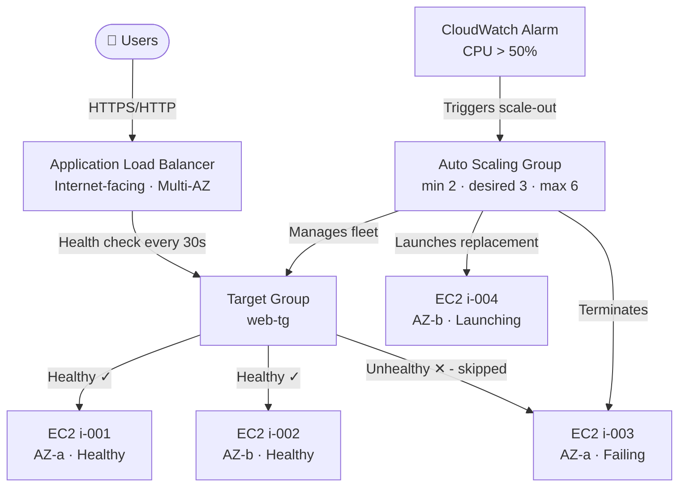

# Elastic Load Balancing & Auto Scaling

## Overview — what it is and why it matters

High availability means your application remains reachable even when individual components fail. Fault tolerance means it continues operating correctly under those failures. On AWS, these properties are built from two services working together: Elastic Load Balancing (ELB) distributes incoming traffic across a fleet of instances, and Auto Scaling Groups (ASG) maintain the desired fleet size by replacing failed instances and adjusting capacity based on demand.

Neither service alone is sufficient. An ALB without an ASG distributes traffic but cannot replace failed instances. An ASG without an ALB has no single entry point, making it impossible to seamlessly remove unhealthy instances from the traffic path.

---

## Simple explanation

Imagine a restaurant with multiple chefs and a head waiter.

The **Application Load Balancer** is the head waiter — every order comes through them. They assign tables (instances) to guests (requests), skip the chef who called in sick, and keep the service running without guests knowing anything changed.

The **Auto Scaling Group** is the restaurant manager — constantly watching how busy it is. Too many orders coming in? Call in extra chefs. Three chefs sitting idle at 2am? Send them home. One chef collapsed? Replace them immediately.

Together: the head waiter handles the moment-to-moment traffic, the manager handles the strategic fleet decisions.

---

## Key concepts

### Application Load Balancer (ALB)

The ALB is a Layer 7 (HTTP/HTTPS) load balancer. It receives all incoming traffic on a listener, evaluates routing rules, and forwards requests to registered targets in a target group.

**Core components:**

| Component | What it is | Example |
|---|---|---|
| Listener | Port + protocol ALB accepts traffic on | HTTPS:443 |
| Target Group | Collection of EC2 instances (or IPs, Lambda) that receive traffic | `web-servers-tg` |
| Health Check | HTTP request ALB sends to each target to verify it's alive | GET / → expect 200 |
| Routing Rule | Condition → action mapping on the listener | path /api/* → api-tg |

**Health check mechanics:**
Every target in a target group receives health check requests at a configured interval (default: 30 seconds). A target must return a successful response (2xx/3xx HTTP status) consecutively for a configured threshold (default: 5 times) to be marked Healthy. It must fail consecutively (default: 2 times) to be marked Unhealthy and removed from rotation.

**ALB routing algorithms:**
- **Round Robin (default):** Requests distributed sequentially across all healthy targets
- **Least Outstanding Requests:** Sends each new request to the target with fewest in-flight requests — better for variable request processing times
- **Weighted Target Groups:** Split traffic by percentage across multiple target groups — useful for blue/green deployments

**Key ALB properties:**
- Operates across multiple AZs — highly available by default
- Terminates SSL/TLS (HTTPS) centrally — instances can use HTTP internally
- Supports path-based and host-based routing — multiple services behind one ALB
- Integrates with AWS WAF for application-layer security
- Sticky sessions (session affinity) via cookies if stateful applications require it

---

### Auto Scaling Group (ASG)

An Auto Scaling Group is a managed fleet of EC2 instances defined by a Launch Template (what each instance looks like) and a capacity configuration (how many).

**The three capacity numbers:**

| Setting | Meaning | Practical rule |
|---|---|---|
| Minimum | Floor — ASG will never go below this count | Always ≥ 2 for HA; ≥ 1 per AZ |
| Desired | Target capacity right now | Set to your normal traffic baseline |
| Maximum | Ceiling — ASG will never exceed this count | Set based on cost ceiling and peak load estimate |

**ASG instance lifecycle:**
1. Instance launches from Launch Template
2. Instance runs user data script (installs app, starts service)
3. Instance registers with ALB Target Group (health checks begin)
4. Instance passes health checks → marked InService
5. ALB begins sending traffic
6. On scale-in or failure → instance deregisters from ALB (connection draining)
7. Instance terminates

**Self-healing behaviour:**
When the ALB marks a target Unhealthy, the ASG receives the signal and terminates the failed instance, launching a replacement using the same Launch Template. This happens without human intervention — typically within 2–5 minutes end to end.

---

### Scaling Policies

Scaling policies define the conditions under which the ASG adjusts its desired capacity.

**Dynamic scaling — reacts to real-time metrics:**

| Policy type | How it works | Best for |
|---|---|---|
| Target Tracking | Maintain a metric at a target value (e.g. CPU = 50%) | Most common — simple and effective |
| Step Scaling | Add/remove instances in steps based on metric severity | Graduated response to load spikes |
| Simple Scaling | Single action on alarm trigger; has a cooldown period | Legacy — use Target Tracking instead |

**Scheduled scaling — reacts to known patterns:**
Pre-define capacity changes at specific times. A retail app might schedule capacity +4 instances every Friday at 5pm, -4 instances every Monday at 2am. No CloudWatch alarm needed — pure calendar-based.

**Predictive scaling:**
Uses ML to analyse historical patterns and proactively scale before anticipated load — preemptive rather than reactive. Pairs with dynamic scaling for combined coverage.

**Target Tracking example (most used):**
```json
{
  "PolicyType": "TargetTrackingScaling",
  "TargetTrackingConfiguration": {
    "PredefinedMetricSpecification": {
      "PredefinedMetricType": "ASGAverageCPUUtilization"
    },
    "TargetValue": 50.0
  }
}
```
ASG will add instances when average CPU exceeds 50% and remove them when it drops — automatically, continuously, no alarm management needed.

---

### Launch Templates

A Launch Template defines everything about each EC2 instance the ASG launches: the AMI, instance type, key pair, security groups, IAM role, user data script, and EBS volumes. It replaces the older Launch Configuration (which could not be versioned or modified).

```bash
# Create a Launch Template
aws ec2 create-launch-template   --launch-template-name web-server-lt   --version-description "v1 - base web server"   --launch-template-data '{
    "ImageId": "ami-XXXXXXXX",
    "InstanceType": "t3.micro",
    "KeyName": "my-key",
    "SecurityGroupIds": ["sg-XXXXXXXX"],
    "IamInstanceProfile": {"Name": "web-server-role"},
    "UserData": "IyEvYmluL2Jhc2gKc3VkbyBkbmYgaW5zdGFsbCAteSBodHRwZAo="
  }'
```
> The UserData above is base64-encoded. It runs `sudo dnf install -y httpd` on launch.

---

## Lab — Build ASG + ALB in your VPC

### Goal

Deploy a self-healing, load-balanced web application: an ALB distributing traffic across an ASG-managed fleet of EC2 instances in two Availability Zones. Demonstrate self-healing by manually terminating an instance and observing ASG replacement.

### Steps

**Part 1 — Create a Launch Template**

1. Navigate to **EC2 → Launch Templates → Create launch template**
2. Name: `web-server-lt`
3. AMI: Amazon Linux 2023 (Free Tier eligible)
4. Instance type: `t3.micro`
5. Key pair: select existing or create new
6. Security group: create new — allow HTTP port 80 inbound (from the ALB Security Group — we will come back to this)
7. Under **Advanced details → User data**, paste:

```bash
#!/bin/bash
sudo dnf install -y httpd
sudo systemctl start httpd
sudo systemctl enable httpd
echo "<h1>Hello from $(hostname -f)</h1>" | sudo tee /var/www/html/index.html
```

8. Click **Create launch template**

**Part 2 — Create the ALB**

9. Navigate to **EC2 → Load Balancers → Create load balancer → Application Load Balancer**
10. Name: `web-alb`
11. Scheme: **Internet-facing**
12. VPC: select your VPC; Subnets: select both public subnets (one per AZ)
13. Security group: create new — allow HTTP 80 inbound from `0.0.0.0/0`
14. Listener: HTTP:80
15. Default action: **Create target group**
    - Type: Instances
    - Name: `web-tg`
    - Protocol: HTTP, Port: 80
    - Health check path: `/`
    - Healthy threshold: 2, Unhealthy threshold: 2, Interval: 10 seconds
16. Click **Create load balancer**
17. Update the EC2 Security Group from Part 1: change HTTP inbound source from `0.0.0.0/0` to the ALB Security Group ID — instances should only accept traffic from the ALB, not directly from the internet

**Part 3 — Create the Auto Scaling Group**

18. Navigate to **EC2 → Auto Scaling Groups → Create Auto Scaling Group**
19. Name: `web-asg`
20. Launch template: `web-server-lt` (latest version)
21. VPC: your VPC; Subnets: both private subnets (one per AZ)
22. Load balancing: **Attach to an existing load balancer** → select `web-tg`
23. Health checks: enable **ELB health checks** (in addition to EC2 default)
24. Capacity: Minimum **2**, Desired **2**, Maximum **4**
25. Scaling policies: **Target tracking** → CPU utilization → target **50%**
26. Click through to **Create Auto Scaling Group**

**Part 4 — Test self-healing**

27. Wait for both instances to appear as Healthy in the Target Group
28. Copy the ALB DNS name and open it in a browser — the page loads, showing the instance hostname
29. Refresh multiple times — the hostname changes as ALB round-robins between instances
30. Go to **EC2 → Instances** → select one of the ASG instances → **Instance state → Terminate**
31. Watch the Target Group — the terminated instance moves to Unhealthy then Unused
32. Watch the ASG → Activity tab — a new instance launches automatically within ~2 minutes
33. Refresh the browser — all traffic now routes to the surviving and new instance

### CLI commands

```bash
# Create Auto Scaling Group using a Launch Template
aws autoscaling create-auto-scaling-group   --auto-scaling-group-name web-asg   --launch-template LaunchTemplateName=web-server-lt,Version='$Latest'   --min-size 2   --max-size 4   --desired-capacity 2   --target-group-arns YOUR_TARGET_GROUP_ARN   --health-check-type ELB   --health-check-grace-period 60   --vpc-zone-identifier "SUBNET_ID_AZ1,SUBNET_ID_AZ2"

# Apply Target Tracking scaling policy (CPU target 50%)
aws autoscaling put-scaling-policy   --auto-scaling-group-name web-asg   --policy-name cpu-target-tracking   --policy-type TargetTrackingScaling   --target-tracking-configuration '{
    "PredefinedMetricSpecification":{"PredefinedMetricType":"ASGAverageCPUUtilization"},
    "TargetValue": 50.0
  }'

# Describe current ASG state and instance health
aws autoscaling describe-auto-scaling-groups   --auto-scaling-group-names web-asg   --query "AutoScalingGroups[0].{Min:MinSize,Desired:DesiredCapacity,Max:MaxSize,Instances:Instances[*].{ID:InstanceId,State:LifecycleState,Health:HealthStatus}}"

# Manually set desired capacity (simulate manual scale)
aws autoscaling set-desired-capacity   --auto-scaling-group-name web-asg   --desired-capacity 3   --honor-cooldown

# Describe ALB target group health
aws elbv2 describe-target-health   --target-group-arn YOUR_TARGET_GROUP_ARN   --query "TargetHealthDescriptions[*].{ID:Target.Id,Port:Target.Port,State:TargetHealth.State}"

# Get ALB DNS name
aws elbv2 describe-load-balancers   --names web-alb   --query "LoadBalancers[0].DNSName"   --output text
```

---

## Architecture flow



Users reach the ALB, which routes only to healthy targets in the Target Group. The ASG continuously monitors instance health via ELB health checks — when an instance fails, the ASG terminates it and launches a replacement from the Launch Template. CloudWatch alarms trigger dynamic scaling: when average CPU exceeds the target threshold, the ASG increases desired capacity; when load drops, it scales in and terminates excess instances.

---

## Common mistakes

**Setting ASG minimum to 1.** A minimum of 1 means a single AZ failure or instance failure can drop to zero running instances. Always set minimum ≥ 2, with subnets across at least 2 AZs.

**Using EC2 health checks instead of ELB health checks.** EC2 health checks only verify the instance is running at the hypervisor level. ELB health checks verify the application is actually responding on the target port. A running EC2 instance with a crashed web server passes EC2 health checks but fails ELB health checks — only the latter results in replacement.

**Not setting a health check grace period.** When ASG launches a new instance, the user data script needs time to install and start the application. Without a grace period (60–120 seconds is typical), the ASG may terminate a healthy-but-still-booting instance immediately on the first failed health check.

**Putting both the ALB and EC2 instances in the same security group.** Use separate security groups: one for the ALB (allows port 80/443 from internet), one for EC2 (allows port 80 only from the ALB Security Group). This ensures instances are never directly reachable from the internet, only through the ALB.

**Attaching ASG to a public subnet.** ASG instances should live in private subnets. Only the ALB needs public subnet placement. Private placement ensures instances have no public IPs and are not directly internet-accessible.

---

## Real-world use

A SaaS company runs their API tier with an ASG (min 3, desired 5, max 20) behind an ALB. Target Tracking keeps average CPU near 60%. During a product launch, traffic spikes 8x in 10 minutes — ASG adds 15 instances over 4 scale-out events. The ALB distributes traffic as each new instance joins the target group. After the spike, scale-in gradually removes instances over the following hour. The engineering team is not paged once — the system self-manages entirely.

---

## Key takeaways

- ALB distributes traffic across healthy targets; it is the single entry point for user requests
- ASG maintains fleet health and size — replaces failed instances, scales with demand
- ELB health checks (not EC2 health checks) drive ASG replacement decisions — enable them
- Always set ASG minimum ≥ 2 across at least 2 Availability Zones for high availability
- Target Tracking scaling policy is the default choice — pick a metric, set a target, done
- EC2 instances belong in private subnets; only the ALB needs public subnet placement

---

## Next steps

- [ ] Configure **HTTPS on the ALB** with an ACM certificate — terminate TLS at the load balancer
- [ ] Set up **ALB access logs** to S3 — every request logged for debugging and compliance
- [ ] Explore **Blue/Green deployments** using weighted target groups on the same ALB
- [ ] Learn **AWS CloudWatch dashboards** — visualise ASG scaling events and ALB request metrics
- [ ] Study **Predictive Scaling** — proactive capacity adjustments based on ML-detected patterns