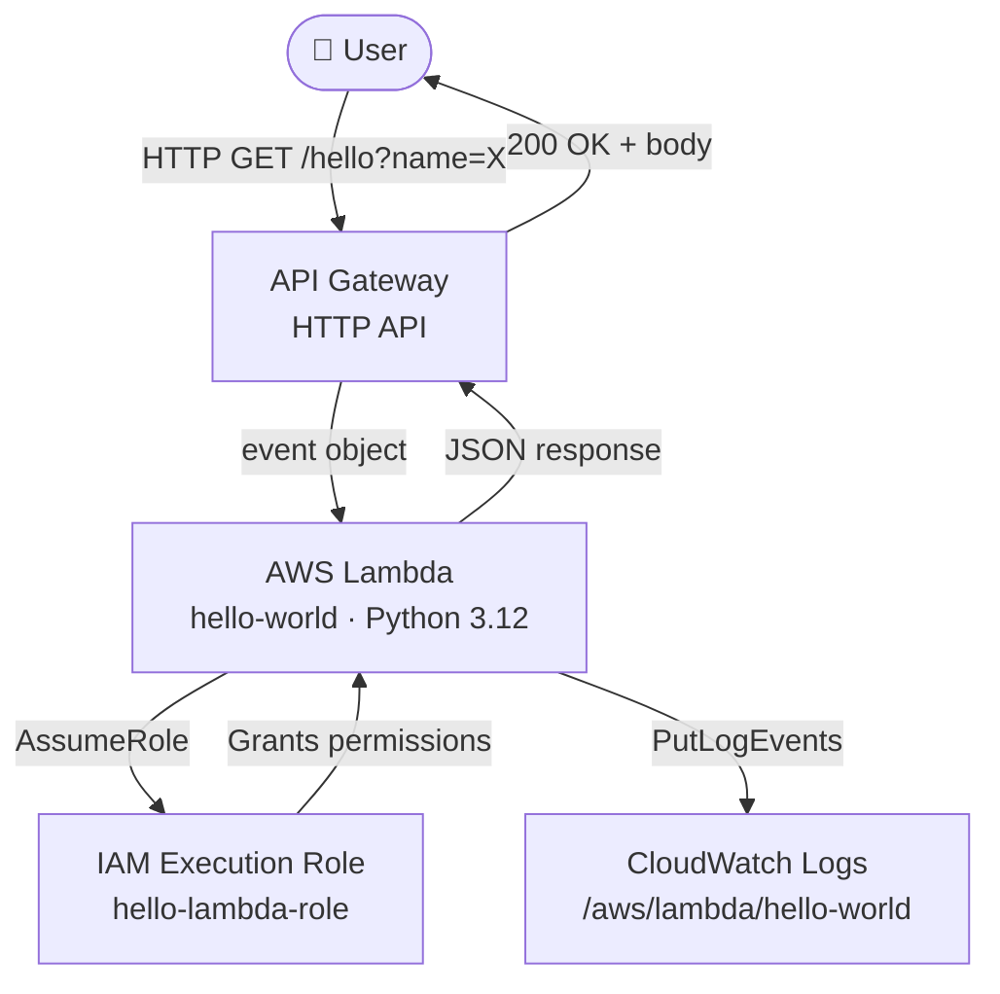

# AWS Lambda & Serverless

## Overview — what it is and why it matters

Serverless computing does not mean an absence of servers — it means the servers are someone else's concern. AWS manages provisioning, patching, scaling, and availability. You provide only the code and the conditions under which it should run. AWS Lambda is the core serverless compute service: a function-as-a-service (FaaS) platform where code executes in response to events and billing is calculated per millisecond of actual runtime.

The practical consequence: a Lambda function that runs 200ms once per second costs less per month than a single t3.micro EC2 instance running idle. For irregular, bursty, or event-driven workloads, Lambda is almost always the right compute primitive.

---

## Simple explanation

Imagine a vending machine.

The machine (Lambda) sits idle, costs nothing while waiting. When someone presses a button (an event — an API call, a file upload, a timer), it springs into action, dispenses the item (runs the function), and goes idle again. You pay only for the dispense, not for the hours of waiting.

An EC2 instance is a full kitchen — always on, always staffed, paying rent whether there are customers or not. Lambda is the vending machine: instant, specific, billed only for actual use.

---

## Key concepts

### Event-Driven Architecture

Lambda functions do not run continuously. They are invoked by events from other AWS services or external sources. Every Lambda invocation carries an event object — a JSON payload describing what triggered it and containing the relevant data.

**Common event sources:**

| Trigger | Event type | Typical use |
|---|---|---|
| API Gateway | HTTP request (GET, POST, etc.) | REST APIs, webhooks |
| S3 | ObjectCreated / ObjectDeleted | Image processing, ETL on upload |
| EventBridge | Scheduled rule or pattern | Cron jobs, automated workflows |
| SQS | Message batch from queue | Async processing, decoupled systems |
| DynamoDB Streams | Record change event | Real-time data replication |
| SNS | Topic notification | Fan-out, notifications |

A single Lambda function can have multiple triggers. Each invocation is independent — Lambda scales by running multiple concurrent instances automatically, up to 1,000 concurrent executions by default (quota can be raised).

---

### Execution Role

An Execution Role is an IAM role that Lambda assumes when the function runs. It defines what AWS services and resources the function is permitted to interact with.

Without an execution role, Lambda can do nothing — it cannot read from S3, write to DynamoDB, or publish to SNS. Permissions must be explicitly granted via the role's attached IAM policies.

**Minimum required policy for every Lambda function:**
```json
{
  "Version": "2012-10-17",
  "Statement": [
    {
      "Effect": "Allow",
      "Action": [
        "logs:CreateLogGroup",
        "logs:CreateLogStream",
        "logs:PutLogEvents"
      ],
      "Resource": "arn:aws:logs:*:*:*"
    }
  ]
}
```
> This grants only CloudWatch Logs access — the absolute minimum for any function. Add additional permissions (S3, DynamoDB, SNS, etc.) based on what the function actually needs. Never attach AdministratorAccess to a Lambda execution role.

**Trust relationship (allows Lambda service to assume the role):**
```json
{
  "Version": "2012-10-17",
  "Statement": [{
    "Effect": "Allow",
    "Principal": {"Service": "lambda.amazonaws.com"},
    "Action": "sts:AssumeRole"
  }]
}
```

---

### Cold Starts vs Warm Starts

Lambda runs code inside a managed container (an execution environment). The container lifecycle has two states:

**Cold Start** — the first invocation of a function, or an invocation after the environment has been idle and recycled. AWS must:
1. Allocate a new execution environment
2. Download and initialise the deployment package
3. Run any initialisation code outside the handler
4. Execute the handler

Cold starts add latency — typically 100ms to 1,000ms depending on runtime, package size, and memory allocation. Python and Node.js cold starts are significantly faster than Java or .NET.

**Warm Start** — a subsequent invocation that reuses an existing execution environment. The container is already running; only the handler executes. Latency drops to single-digit milliseconds.

**Practical strategies to minimise cold start impact:**

| Strategy | How it helps |
|---|---|
| Provisioned Concurrency | Pre-warms a specified number of execution environments — eliminates cold starts at a cost |
| Smaller deployment packages | Less code to initialise — faster cold start |
| Efficient initialisation code | Move SDK clients and DB connections outside the handler (they persist across warm invocations) |
| Choose Python or Node.js | Faster runtimes than Java or .NET for cold start scenarios |

---

## Lab — Hello World Lambda + API Gateway

### Goal

Create a Python Lambda function that returns a JSON greeting, invoke it manually, attach it to an API Gateway endpoint, and understand how the execution role controls permissions.

### Steps

**Part 1 — Create the Execution Role**

1. Navigate to **IAM → Roles → Create role**
2. Trusted entity: **AWS service** → **Lambda**
3. Attach policy: **AWSLambdaBasicExecutionRole** (grants CloudWatch Logs access)
4. Name: `hello-lambda-role`
5. Click **Create role**

**Part 2 — Create the Lambda Function**

6. Navigate to **Lambda → Create function**
7. Choose: **Author from scratch**
8. Function name: `hello-world`
9. Runtime: **Python 3.12**
10. Execution role: **Use an existing role** → select `hello-lambda-role`
11. Click **Create function**
12. In the inline code editor, replace the default code with:

```python
import json

def lambda_handler(event, context):
    name = event.get("queryStringParameters", {}) or {}
    name = name.get("name", "World")
    
    return {
        "statusCode": 200,
        "headers": {"Content-Type": "application/json"},
        "body": json.dumps({
            "message": f"Hello, {name}!",
            "source": "AWS Lambda"
        })
    }
```

13. Click **Deploy**

**Part 3 — Test the Function Directly**

14. Click the **Test** tab → **Create new event**
15. Event name: `test-event`
16. Paste this JSON as the event body:
```json
{
  "queryStringParameters": {
    "name": "Parikshit"
  }
}
```
17. Click **Test** — the response panel shows status 200 and the JSON greeting

**Part 4 — Attach API Gateway**

18. Click **Add trigger** → select **API Gateway**
19. Create a new API: **HTTP API**
20. Security: **Open** (for testing; restrict in production)
21. Click **Add**
22. Copy the API endpoint URL from the trigger details
23. Open the URL in a browser: `https://<id>.execute-api.<region>.amazonaws.com/default/hello-world?name=Parikshit`
24. The JSON response appears in the browser — the function is now publicly callable

### CLI commands

```bash
# Create the execution role
aws iam create-role   --role-name hello-lambda-role   --assume-role-policy-document '{
    "Version":"2012-10-17",
    "Statement":[{"Effect":"Allow","Principal":{"Service":"lambda.amazonaws.com"},"Action":"sts:AssumeRole"}]
  }'

# Attach basic execution policy
aws iam attach-role-policy   --role-name hello-lambda-role   --policy-arn arn:aws:iam::aws:policy/service-role/AWSLambdaBasicExecutionRole

# Deploy the function (assumes handler.py zipped as function.zip)
aws lambda create-function   --function-name hello-world   --runtime python3.12   --role arn:aws:iam::YOUR_ACCOUNT_ID:role/hello-lambda-role   --handler handler.lambda_handler   --zip-file fileb://function.zip   --timeout 15   --memory-size 128

# Invoke function directly from CLI
aws lambda invoke   --function-name hello-world   --payload '{"queryStringParameters":{"name":"Parikshit"}}'   --cli-binary-format raw-in-base64-out   response.json && cat response.json

# Tail CloudWatch logs in real time
aws logs tail /aws/lambda/hello-world --follow
```

---

## Architecture flow



A user's HTTP request reaches API Gateway, which transforms it into a Lambda event object and invokes the function. Lambda assumes its execution role to gain permissions, runs the handler, logs output to CloudWatch, and returns a response. API Gateway forwards that response to the user. The entire cycle completes in under 50ms on a warm invocation.

---

## Common mistakes

**Giving Lambda AdministratorAccess.** It bypasses the permission error immediately but is a critical security risk. Always scope the execution role to the specific actions the function needs (e.g. `s3:GetObject` on a specific bucket, not `s3:*` on `*`).

**Putting SDK clients inside the handler.** Initialising boto3 clients or database connections inside `lambda_handler()` means they are recreated on every invocation. Move them to module scope (outside the handler) — they persist across warm invocations and dramatically reduce per-call overhead.

**Ignoring cold starts for latency-sensitive APIs.** If your function backs a user-facing API with sub-100ms latency requirements, cold starts will occasionally miss that target. Enable Provisioned Concurrency for those functions.

**Setting timeout too low.** Default Lambda timeout is 3 seconds. A function connecting to an RDS database or making downstream HTTP calls can easily exceed this during cold start or under load. Set timeout intentionally based on the function's actual worst-case execution time (maximum 15 minutes).

**Not checking CloudWatch Logs on errors.** Lambda always logs to CloudWatch — stdout, stderr, and the runtime's own error messages. The first debugging step for any unexpected behaviour is always `aws logs tail /aws/lambda/<function-name> --follow`.

---

## Real-world use

A media platform processes user-uploaded profile photos: an S3 `ObjectCreated` event triggers a Lambda function that generates three thumbnail sizes, stores them back to S3, and writes the resulting URLs to DynamoDB — all within 800ms. The function runs thousands of times per day during peak hours and zero times at 3am. Monthly compute cost: under $2. An equivalent EC2-based processing service would cost $30–50/month at minimum, idle or not.

---

## Key takeaways

- Lambda runs code in response to events — it never runs idle and costs nothing when not invoked
- Every function needs an execution role: the IAM role defines what AWS resources the function can access
- Cold starts add latency on first invocation; warm invocations reuse the container and are near-instant
- Move initialisation code (SDK clients, DB connections) outside the handler to benefit from warm reuse
- CloudWatch Logs captures all output automatically — always check logs first when debugging
- Lambda integrates natively with API Gateway, S3, SQS, EventBridge, DynamoDB, and dozens of other AWS services

---

## Next steps

- [ ] Connect Lambda to **DynamoDB** — store and retrieve data from a function
- [ ] Use **Lambda Layers** — share common dependencies (e.g. boto3 extensions) across functions
- [ ] Explore **Step Functions** — orchestrate multiple Lambda functions into stateful workflows
- [ ] Configure **Provisioned Concurrency** — eliminate cold starts for latency-sensitive functions
- [ ] Study **Lambda@Edge** — run functions at CloudFront edge locations globally