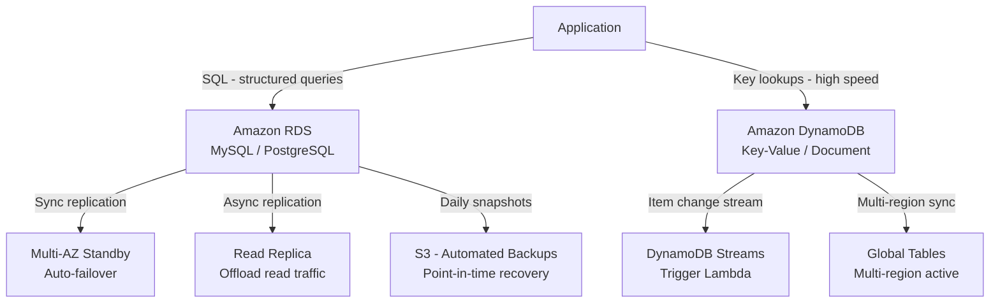

# Databases on AWS: RDS vs DynamoDB

## Overview — what it is and why it matters

AWS offers two distinct managed database categories. Amazon RDS (Relational Database Service) runs traditional SQL engines — MySQL, PostgreSQL, Oracle, SQL Server, MariaDB — with AWS managing the infrastructure. Amazon DynamoDB is a fully serverless, key-value and document database built for consistent single-digit millisecond performance at virtually unlimited scale.

Choosing incorrectly is expensive to undo. Schema migrations are painful. Data model refactors at scale are worse. Understanding the tradeoffs before the first line of code matters.

---

## Simple explanation

Think of the difference as a **spreadsheet vs a folder of sticky notes**.

**RDS (spreadsheet):** Data lives in tables with defined columns. Every row has the same structure. Relationships between tables are explicit (foreign keys). You query with SQL — flexible, powerful, but requires a fixed schema up front.

**DynamoDB (folder of sticky notes):** Each item is an independent JSON document. Two items in the same table can have completely different attributes. You access by key — predictably fast, but queries outside the primary key require planning.

---

## Key concepts

### Relational vs NoSQL — the core distinction

| | Relational (RDS) | NoSQL (DynamoDB) |
|---|---|---|
| Data model | Tables with fixed schema | Key-value / Document items |
| Query language | SQL — JOINs, aggregations | Key lookups, filter expressions |
| Schema | Defined before data insertion | Flexible per item |
| Relationships | Foreign keys, JOINs | Denormalized, single table design |
| Transactions | Full ACID guaranteed | ACID transactions available (limited) |
| Scaling | Vertical (bigger instance) + read replicas | Horizontal (unlimited, automatic) |
| Latency | Low (ms) | Single-digit ms at any scale |
| Pricing | Per instance-hour (running 24/7) | Per read/write request (on-demand) |
| Best for | Complex queries, structured data, analytics | High-scale simple access, flexible schema |

---

### Amazon RDS — deep dive

RDS removes the operational burden of running a database server. You choose the engine and instance size; AWS manages installation, configuration, patching, backups, and failover.

**Supported engines:**

| Engine | Use case |
|---|---|
| MySQL | Most common web application database |
| PostgreSQL | Advanced SQL features, JSON support, GIS |
| MariaDB | MySQL-compatible, open source |
| Oracle | Enterprise applications requiring Oracle compatibility |
| SQL Server | .NET applications, Microsoft ecosystem |
| Aurora MySQL / PostgreSQL | AWS-native, up to 5x MySQL performance, auto-storage |

**Key managed features:**

**Automated backups:** Daily automated snapshot + transaction logs enabling point-in-time recovery to any second within the retention window (1–35 days). Zero configuration required.

**Multi-AZ deployment:** RDS maintains a synchronous standby replica in a different AZ. If the primary instance fails (hardware fault, AZ outage), RDS automatically promotes the standby — typically within 1–2 minutes. The DNS endpoint remains the same; applications reconnect after a brief pause.

**Read Replicas:** Asynchronous copies of the database used to offload read traffic. Up to 15 replicas for Aurora, 5 for other engines. Can be promoted to standalone databases for disaster recovery or migration.

**Automated patching:** AWS applies minor version patches and OS security updates during a configurable maintenance window — no manual SSH or patching needed.

**Encryption:** At-rest encryption via AWS KMS with one toggle at creation time. In-transit encryption via SSL/TLS.

---

### Amazon DynamoDB — deep dive

DynamoDB is fully serverless — there are no instances to provision, no clusters to size, no capacity planning for storage. You create a table, define a primary key, and start writing items.

**Data model:**

Every DynamoDB table has a **primary key**, which is either:
- **Partition key only (simple PK):** A single attribute that uniquely identifies each item (e.g., `userId`)
- **Partition key + Sort key (composite PK):** Two attributes combined — partition key groups items, sort key orders them (e.g., `userId` + `timestamp`)

Each item can contain any additional attributes — no schema enforcement. One user item might have 3 attributes; another might have 30.

**Access patterns are king in DynamoDB.** Unlike SQL where you define the schema and write queries later, DynamoDB requires you to know your access patterns before designing the table. The primary key and Global Secondary Indexes (GSIs) must cover every access pattern you need.

**Capacity modes:**

| Mode | How it works | Best for |
|---|---|---|
| On-demand | Pay per request; AWS scales automatically | Unpredictable or spiky traffic |
| Provisioned | Set read/write capacity units; auto-scaling available | Predictable traffic; cost optimization |

**DynamoDB Streams:** An ordered, time-limited log of every item change (insert, update, delete) in a table. Used to trigger Lambda functions, replicate data, audit changes.

**Global Tables:** Multi-region, multi-active replication — read and write from any region, DynamoDB synchronizes automatically. Single-digit ms latency globally.

---

### Managed Service Benefits — what you stop doing

This is the underappreciated value of both services:

| Task on self-managed DB | On RDS | On DynamoDB |
|---|---|---|
| Provision hardware/VM | None | None |
| Install database software | None | None |
| Configure replication | Point-and-click | Automatic |
| Write backup scripts | Automatic (configured) | Automatic |
| Apply OS patches | AWS maintenance window | N/A (serverless) |
| Apply DB engine patches | AWS maintenance window | N/A |
| Monitor disk capacity | CloudWatch alert | Auto-scales |
| Handle hardware failure | Automatic failover (Multi-AZ) | Automatic |

For a solo engineer or small team, managed databases eliminate what previously required a dedicated DBA.

---

## Lab — Launch RDS Free Tier + Create DynamoDB Table

### Goal

Launch a free-tier MySQL RDS instance, connect to it, and run SQL queries. Create a DynamoDB table, insert an item, and query it. Experience the provisioning speed difference: RDS takes minutes; DynamoDB is instant.

### Steps

**Part 1 — Launch RDS MySQL (Free Tier)**

1. Navigate to **RDS → Create database**
2. Creation method: **Standard create**
3. Engine: **MySQL** | Version: MySQL 8.0
4. Template: **Free tier** (sets db.t3.micro, single AZ, no Multi-AZ)
5. DB instance identifier: `devops-lab-db`
6. Master username: `admin`
7. Master password: set a strong password and store it
8. Instance configuration: `db.t3.micro` (pre-selected by Free Tier)
9. Storage: 20 GiB gp2 (Free Tier includes 20 GiB)
10. Connectivity: VPC: your VPC | Subnet group: create new
11. Public access: **Yes** (for this lab only — never in production)
12. VPC security group: create new — allow MySQL port 3306 from your IP
13. Monitoring: disable Enhanced Monitoring (avoids cost)
14. Click **Create database** — provisioning takes 5–10 minutes

**Part 2 — Connect and query RDS**

15. Once status shows **Available**, click the DB identifier
16. Copy the **Endpoint** (e.g., `devops-lab-db.xxxx.ap-south-1.rds.amazonaws.com`)

```bash
# Connect using MySQL client
mysql -h YOUR_RDS_ENDPOINT -u admin -p

# Once connected, run SQL
CREATE DATABASE appdb;
USE appdb;

CREATE TABLE users (
  id INT AUTO_INCREMENT PRIMARY KEY,
  name VARCHAR(100) NOT NULL,
  email VARCHAR(150) UNIQUE NOT NULL,
  created_at TIMESTAMP DEFAULT CURRENT_TIMESTAMP
);

INSERT INTO users (name, email) VALUES
  ('Alice', 'alice@example.com'),
  ('Bob', 'bob@example.com');

SELECT * FROM users;
SELECT name, email FROM users WHERE id = 1;
```

**Part 3 — Create DynamoDB table**

17. Navigate to **DynamoDB → Tables → Create table**
18. Table name: `Users`
19. Partition key: `userId` (String)
20. Sort key: `createdAt` (String) — optional but good practice
21. Table settings: **Default settings** (on-demand capacity)
22. Click **Create table** — available in seconds

**Part 4 — Insert and query DynamoDB items**

23. Click the table → **Explore table items → Create item**
24. Add attributes:
    - `userId`: `u-001`
    - `createdAt`: `2024-01-01T00:00:00Z`
    - `name`: `Alice`
    - `email`: `alice@example.com`
    - `preferences`: `{"theme": "dark", "language": "en"}`
25. Click **Create item**

### CLI commands

```bash
# Describe an RDS instance
aws rds describe-db-instances   --db-instance-identifier devops-lab-db   --query "DBInstances[0].{Status:DBInstanceStatus,Endpoint:Endpoint.Address,Engine:Engine}"

# Create DynamoDB table via CLI
aws dynamodb create-table   --table-name Users   --attribute-definitions     AttributeName=userId,AttributeType=S     AttributeName=createdAt,AttributeType=S   --key-schema     AttributeName=userId,KeyType=HASH     AttributeName=createdAt,KeyType=RANGE   --billing-mode PAY_PER_REQUEST

# Put an item into DynamoDB
aws dynamodb put-item   --table-name Users   --item '{
    "userId": {"S": "u-001"},
    "createdAt": {"S": "2024-01-01T00:00:00Z"},
    "name": {"S": "Alice"},
    "email": {"S": "alice@example.com"}
  }'

# Get item by primary key
aws dynamodb get-item   --table-name Users   --key '{"userId": {"S": "u-001"}, "createdAt": {"S": "2024-01-01T00:00:00Z"}}'

# Query all items for a userId (with sort key range)
aws dynamodb query   --table-name Users   --key-condition-expression "userId = :uid"   --expression-attribute-values '{":uid": {"S": "u-001"}}'

# Cleanup — delete RDS instance (stop billing)
aws rds delete-db-instance   --db-instance-identifier devops-lab-db   --skip-final-snapshot
```

---

## Architecture flow



Applications use both databases for different workloads. RDS handles structured, transactional data with Multi-AZ for availability and automated backups to S3. DynamoDB handles high-velocity, flexible data with Streams for event-driven integrations and Global Tables for multi-region deployments. Both eliminate the operational burden of self-managed database servers.

---

## Common mistakes

**Using RDS for a workload that needs DynamoDB-level scale.** RDS scales vertically — you upgrade the instance. The largest RDS instance has limits. DynamoDB scales horizontally to any throughput. Choosing RDS for a real-time gaming leaderboard or IoT telemetry pipeline creates a scaling ceiling you will eventually hit.

**Using DynamoDB like a relational database.** Designing a DynamoDB table without first mapping access patterns, then trying to "just add a JOIN" or complex query is the most common DynamoDB mistake. DynamoDB does not support JOINs. Every access pattern must be covered by the primary key or a GSI — plan before you build.

**Leaving RDS instances running in unused accounts.** Free Tier covers 750 hours/month of db.t3.micro. A single instance costs that in one month. After Free Tier expires (12 months), an idle db.t3.micro costs ~$13/month. Delete lab instances when done.

**Not enabling Multi-AZ for production RDS.** A single-AZ RDS instance is a single point of failure. Hardware failure, AZ outage, or OS crash means downtime until manual recovery. Multi-AZ costs ~2x but the standby is synchronous — failover is automatic and takes under 2 minutes.

**Storing large blobs in DynamoDB.** DynamoDB has a 400 KB item size limit. Storing images, PDFs, or large JSON blobs directly in DynamoDB will cause failures at scale. Store large objects in S3 and keep only the S3 key reference in DynamoDB.

---

## Real-world use

A SaaS platform uses both in the same application: user accounts, subscription records, and billing history live in RDS PostgreSQL — structured, relational, queried with complex SQL for reporting. User sessions, feature flags, and notification preferences live in DynamoDB — simple key lookups, schema varies per user, must handle millions of concurrent sessions with sub-10ms reads. The two databases coexist in the same VPC, each solving the problem it's best suited for.

---

## Key takeaways

- RDS is managed relational SQL — MySQL, PostgreSQL, and others; AWS handles backups, patching, failover
- DynamoDB is serverless NoSQL — key-value and document model; scales to any throughput automatically
- Managed service = no infrastructure to provision, patch, or operate; focus on schema and queries
- Multi-AZ on RDS = automatic standby + failover; always enable for production workloads
- DynamoDB access patterns must be designed upfront — no JOINs, no ad-hoc queries
- Delete lab RDS instances when done — idle instances bill per hour

---

## Next steps

- [ ] Enable **RDS Multi-AZ** and simulate a failover — observe the automatic promotion
- [ ] Create a **DynamoDB Global Secondary Index (GSI)** to query by email instead of userId
- [ ] Connect an **EC2 instance** (or Lambda) to RDS using the private endpoint — no public access
- [ ] Enable **DynamoDB Streams** and trigger a Lambda on every item write
- [ ] Explore **Amazon Aurora** — AWS-native relational engine with up to 5x MySQL performance