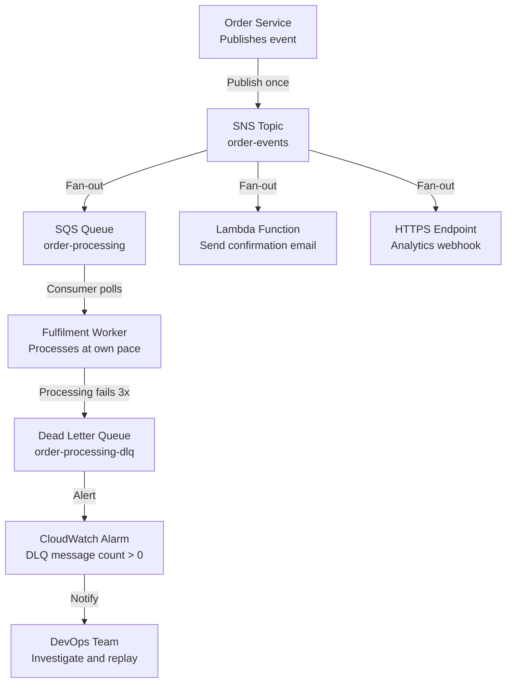

# Decoupling Apps: SQS & SNS

## Overview — what it is and why it matters

Tight coupling is when two services communicate directly — one calls the other, waits for a response, and fails if that response doesn't arrive. It is the most common source of cascading failures in distributed systems.

Amazon SQS (Simple Queue Service) and Amazon SNS (Simple Notification Service) are the two primary AWS tools for decoupling: SQS buffers messages between producer and consumer so they operate independently, and SNS broadcasts a single event to multiple subscribers simultaneously.

Together they enable systems where individual components can fail, slow down, or scale independently without affecting each other.

---

## Simple explanation

Imagine a restaurant kitchen.

**Tight coupling** is a waiter who personally cooks each dish. If the waiter is busy, orders pile up and customers wait. If the waiter falls over, service stops.

**SQS (queue)** is the kitchen ticket rail. Waiters clip tickets on the rail (producers enqueue messages), cooks pull tickets when ready (consumers poll and process). The waiter and cook are decoupled — neither blocks the other.

**SNS (topic)** is a PA announcement system. The manager announces "Table 4's food is ready" once. Every relevant station (pick-up, billing, table runner) hears it simultaneously — no manager calling each station individually.

---

## Key concepts

### Tight Coupling vs Loose Coupling

| | Tight Coupling | Loose Coupling (SQS/SNS) |
|---|---|---|
| Communication | Direct synchronous call | Async message / event |
| If consumer is slow | Producer blocks or errors | Queue absorbs the backlog |
| If consumer is down | Producer request fails | Messages wait in queue |
| Scaling consumer | Producer must know about it | Consumer scales independently |
| Adding a new subscriber | Modify the producer | Subscribe to SNS topic |
| Traffic spike impact | Service crash | Queue fills, consumer processes when ready |

**The fundamental shift:** producers no longer care whether consumers are available. They publish to a queue or topic and move on. The message will be processed — eventually, reliably.

---

### Amazon SQS — Simple Queue Service

SQS is a fully managed message queue. Producers send messages; consumers poll the queue and process them at their own pace. AWS manages the infrastructure, replication, and message durability.

**Key SQS concepts:**

**Visibility timeout:** When a consumer polls a message, SQS makes it invisible to other consumers for a configurable period (default: 30 seconds). This allows the consumer time to process and delete the message. If the consumer fails to delete it before the timeout expires, the message becomes visible again and can be picked up by another consumer. This prevents message loss without preventing duplicate processing.

**At-least-once delivery:** SQS guarantees every message is delivered at least once. Rarely, a message may be delivered more than once (due to distributed system internals). Consumers must be idempotent — processing the same message twice must produce the same result as processing it once.

**Two queue types:**

| | Standard Queue | FIFO Queue |
|---|---|---|
| Throughput | Nearly unlimited | 3,000 msg/s (with batching) |
| Ordering | Best-effort (not guaranteed) | Strict first-in-first-out |
| Delivery | At-least-once (possible duplicates) | Exactly-once processing |
| Use case | High-throughput, order doesn't matter | Payments, order processing |
| Naming | Any name | Must end in `.fifo` |

**Long polling vs short polling:**
- Short polling: SQS returns immediately, even if the queue is empty (wasteful API calls)
- Long polling (recommended): SQS waits up to 20 seconds for a message to arrive before returning empty — reduces empty responses and API costs significantly

---

### Amazon SNS — Simple Notification Service

SNS is a fully managed publish/subscribe messaging service. A producer publishes a message to a **topic**. Every **subscriber** of that topic receives the message simultaneously.

**Supported subscriber types:**

| Subscriber | Delivery method | Use case |
|---|---|---|
| SQS queue | Message placed in queue | Async processing pipeline |
| Lambda function | Function invoked with payload | Real-time event processing |
| HTTP/HTTPS endpoint | POST request sent | Webhooks, third-party integrations |
| Email | Email delivered | Human notification, alerts |
| SMS | Text message sent | Mobile alerts |
| Amazon Kinesis Data Firehose | Streamed | Large-scale log/event ingestion |

**Fan-out pattern (SQS + SNS combined):**

SNS alone delivers to all subscribers but does not buffer — if a Lambda subscriber is temporarily throttled, that delivery attempt may fail. The robust pattern is:

1. SNS topic receives the event
2. SNS delivers to multiple SQS queues (one per subscriber group)
3. Each SQS queue buffers and delivers to its own consumer

This gives you fan-out (one event, many consumers) combined with the durability and retry guarantees of SQS.

---

### Dead Letter Queue (DLQ)

A Dead Letter Queue is a secondary SQS queue that receives messages that cannot be successfully processed after a maximum number of receive attempts.

**How it works:**
1. A message is placed in the main queue
2. A consumer polls the message, fails to process it (exception, timeout, logic error)
3. The message becomes visible again after the visibility timeout
4. This repeats up to the configured **maxReceiveCount** (e.g., 3 times)
5. After maxReceiveCount is exceeded, SQS moves the message to the DLQ

**Why DLQs matter:**
Without a DLQ, a poison message (a message that always fails processing) loops forever, consuming resources and blocking the queue. With a DLQ, it is isolated — the main queue keeps processing healthy messages, and the DLQ provides a place to inspect, alert on, and reprocess failed messages after fixing the bug.

**DLQ alarm:** Always set a CloudWatch alarm on the DLQ's `ApproximateNumberOfMessagesVisible` metric. If messages appear in the DLQ, something in your consumer is broken — you want to know immediately.

---

## Lab — SQS Queue + SNS Topic + Subscription

### Goal

Create an SQS queue and an SNS topic, subscribe the queue to the topic, publish a test message to SNS, and observe it arrive in SQS. Configure a DLQ and observe the visibility timeout behaviour.

### Steps

**Part 1 — Create SQS Queue**

1. Navigate to **SQS → Create queue**
2. Type: **Standard**
3. Name: `order-processing-queue`
4. Visibility timeout: **30 seconds**
5. Message retention: **4 days** (default)
6. Leave other settings as default → **Create queue**
7. Copy the Queue ARN from the queue details

**Part 2 — Create Dead Letter Queue**

8. Create a second SQS queue: `order-processing-dlq` (same settings)
9. Go back to `order-processing-queue` → **Edit**
10. Scroll to **Dead-letter queue** → Enable → select `order-processing-dlq`
11. Set **Maximum receives**: **3** (after 3 failed attempts, route to DLQ)
12. Save

**Part 3 — Create SNS Topic**

13. Navigate to **SNS → Topics → Create topic**
14. Type: **Standard**
15. Name: `order-events`
16. Click **Create topic** → copy the Topic ARN

**Part 4 — Subscribe SQS to SNS**

17. In the SNS topic → **Create subscription**
18. Protocol: **Amazon SQS**
19. Endpoint: paste the SQS queue ARN
20. Click **Create subscription**
21. Navigate back to the SQS queue → **Access policy → Edit**
22. Add this statement to allow SNS to send to the queue:

```json
{
  "Effect": "Allow",
  "Principal": {"Service": "sns.amazonaws.com"},
  "Action": "sqs:SendMessage",
  "Resource": "YOUR_SQS_QUEUE_ARN",
  "Condition": {
    "ArnEquals": {"aws:SourceArn": "YOUR_SNS_TOPIC_ARN"}
  }
}
```

**Part 5 — Publish a message and observe**

23. In the SNS topic → **Publish message**
24. Subject: `Order Placed`
25. Message body: `{"orderId": "ord-001", "userId": "u-123", "total": 49.99}`
26. Click **Publish message**
27. Navigate to the SQS queue — **Approximate Messages Available** should show **1**
28. Click **Send and receive messages → Poll for messages**
29. The message appears — click it to see the SNS envelope wrapping your payload
30. Note: the message is now invisible (visibility timeout active). Refresh — it disappears.
31. Wait 30 seconds — it reappears (visibility timeout expired, not deleted)
32. To permanently remove: select message → **Delete**

### CLI commands

```bash
# Create Standard SQS queue
aws sqs create-queue   --queue-name order-processing-queue   --attributes VisibilityTimeout=30,MessageRetentionPeriod=345600

# Create Dead Letter Queue
aws sqs create-queue --queue-name order-processing-dlq

# Get queue ARN
aws sqs get-queue-attributes   --queue-url YOUR_QUEUE_URL   --attribute-names QueueArn   --query Attributes.QueueArn --output text

# Set DLQ on main queue (replace DLQ_ARN)
aws sqs set-queue-attributes   --queue-url YOUR_MAIN_QUEUE_URL   --attributes '{
    "RedrivePolicy": "{"deadLetterTargetArn":"DLQ_ARN","maxReceiveCount":"3"}"
  }'

# Create SNS topic
aws sns create-topic --name order-events

# Subscribe SQS queue to SNS topic
aws sns subscribe   --topic-arn YOUR_TOPIC_ARN   --protocol sqs   --notification-endpoint YOUR_SQS_QUEUE_ARN

# Publish message to SNS topic
aws sns publish   --topic-arn YOUR_TOPIC_ARN   --subject "Order Placed"   --message '{"orderId":"ord-001","userId":"u-123","total":49.99}'

# Receive message from SQS (long polling, 10s wait)
aws sqs receive-message   --queue-url YOUR_QUEUE_URL   --wait-time-seconds 10   --max-number-of-messages 1

# Delete a message after processing (replace RECEIPT_HANDLE)
aws sqs delete-message   --queue-url YOUR_QUEUE_URL   --receipt-handle "RECEIPT_HANDLE_FROM_RECEIVE"
```

---

## Architecture flow



The Order Service publishes a single event to the SNS topic. SNS fans it out simultaneously to an SQS queue (for fulfilment processing), a Lambda (for email), and an HTTPS endpoint (for analytics). The SQS consumer processes at its own pace — if a message fails three times, it moves to the DLQ. A CloudWatch alarm fires on any DLQ activity, ensuring failures are never silent.

---

## Common mistakes

**Deleting a message before confirming successful processing.** Once deleted from SQS, a message is gone permanently. The correct pattern: receive message → process → delete only on success. If processing fails, let the visibility timeout expire so the message can be retried.

**Not making consumers idempotent.** SQS at-least-once delivery means the same message may arrive twice. If your consumer inserts a database row on each receipt, two receipts mean two rows. Design processing to be idempotent — processing the same message twice produces the same outcome as processing it once.

**Skipping the DLQ.** Without a DLQ, a poison message loops forever — consuming Lambda invocations, EC2 CPU, or SQS receive charges indefinitely. Always attach a DLQ and alarm on it.

**Using short polling in production.** Short polling calls the SQS API even when the queue is empty, generating unnecessary API charges and wasted compute cycles. Always use long polling (WaitTimeSeconds=20) in production consumers.

**Confusing SNS delivery failure with SQS retry.** SNS does not retry failed deliveries to SQS (the queue's access policy must allow SNS to write). If the SQS access policy is misconfigured, SNS silently drops the message. Always verify the subscription confirmed (Status: Confirmed in SNS console) and the access policy allows `sqs:SendMessage` from SNS.

---

## Real-world use

An e-commerce platform receives 50,000 orders per hour during a sale event. Directly calling the fulfilment service at that rate would require provisioning for peak capacity permanently — expensive and fragile. Instead: the order API publishes to an SNS topic in under 1ms per order. SQS absorbs the 50k/hour spike. Three fulfilment worker instances process the queue at their combined capacity of 15k/hour — the queue grows during the spike and drains afterwards. No orders are lost. No over-provisioning required. The fulfilment team deploys a fix to a processing bug mid-sale: they pause the consumer, deploy, resume. The queue held every message during the pause.

---

## Key takeaways

- Tight coupling means direct synchronous calls — one service failure cascades to all callers
- SQS decouples producers and consumers — the queue absorbs spikes and survives consumer downtime
- SNS fans out one event to multiple subscribers simultaneously — producers never need to know their consumers
- Dead Letter Queues isolate failing messages — always attach one and alarm on it
- SQS visibility timeout prevents message loss without preventing retries — delete only after successful processing
- Use long polling (WaitTimeSeconds=20) in all SQS consumers to reduce empty API calls

---

## Next steps

- [ ] Connect a **Lambda function** as an SQS consumer — event source mapping handles polling automatically
- [ ] Enable **SQS FIFO queue** for ordered processing (payment workflows, inventory updates)
- [ ] Set up a **CloudWatch alarm** on DLQ message count — zero tolerance for silent failures
- [ ] Explore **Amazon EventBridge** — a more powerful event bus for complex routing rules and SaaS integrations
- [ ] Learn **SQS batch processing** — Lambda can process up to 10 SQS messages per invocation for cost efficiency