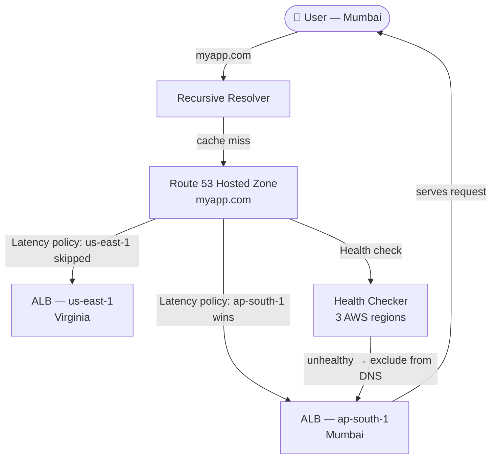

# DNS & Amazon Route 53

## Overview — what it is and why it matters

Every user request to a web application starts with DNS — the Domain Name System. Before a single byte of application data is exchanged, the browser must translate a human-readable domain name into a routable IP address. Amazon Route 53 is AWS's globally distributed DNS service, operating from over 100 edge locations worldwide and backed by a 100% availability SLA — the only AWS service with that guarantee.

Route 53 covers three distinct functions: domain registration (buying and owning a domain), DNS hosting (storing and serving DNS records via Hosted Zones), and traffic routing (applying policies that determine which endpoint a DNS query resolves to). Understanding all three is necessary to build reliable, globally distributed applications on AWS.

---

## Simple explanation

DNS is the internet's phone book. You look up a name (myapp.com), it returns a number (52.1.2.3), and your device dials that number directly. Without DNS, every user would need to know and type raw IP addresses.

Route 53 is the page in that phone book that you control. When someone looks up your domain, Route 53 answers. And unlike a static phone book, Route 53 can answer differently depending on who's asking — routing a user in Mumbai to a server in Asia, a user in New York to a server in the US, all from the same domain name.

---

## Key concepts

### How DNS Resolution Works (Step by Step)

Understanding the resolution chain matters because it explains TTL behaviour, propagation delays, and why DNS changes are not instant.

1. User types `myapp.com` in a browser
2. Browser checks its local cache — if a fresh answer exists, done
3. Browser asks the **Recursive Resolver** (operated by the ISP or a public resolver like 8.8.8.8)
4. Recursive Resolver checks its own cache — if fresh, returns the answer
5. If not cached, Resolver asks a **Root Nameserver** — "who handles .com?"
6. Root NS returns the address of the **.com TLD Nameserver**
7. Resolver asks the TLD NS — "who handles myapp.com?"
8. TLD NS returns Route 53's nameserver addresses (set during domain registration)
9. Resolver asks **Route 53** — "what is the IP for myapp.com?"
10. Route 53 looks up the Hosted Zone, applies the routing policy, returns the record value
11. Resolver caches the answer for the record's TTL duration, returns it to the browser
12. Browser connects directly to the returned IP address

The full chain (steps 5–10) is called a **recursive lookup** and completes in under 100ms globally. Once cached, subsequent lookups skip to step 4 until TTL expires.

---

### Domain Registration

A domain name (e.g. `myapp.com`) must be purchased from a domain registrar. Route 53 is an accredited registrar — domains can be bought directly in the AWS console without a third-party service.

When a domain is registered in Route 53:
- AWS creates a **Hosted Zone** automatically
- AWS sets the domain's **NS records** at the TLD registry to point to Route 53's nameservers
- The domain is yours for the registration period (1–10 years, renewable)

**Domain registration pricing examples:**

| TLD | Annual cost (approx.) |
|---|---|
| .com | $14 |
| .net | $11 |
| .io | $39 |
| .link | $5 |
| .click | $3 |

> For labs: use a cheap TLD like `.click` or `.link` to keep cost under $5. Alternatively, use an existing domain and just add Route 53 as the DNS host without transferring registration.

---

### Hosted Zones

A Hosted Zone is a container for DNS records belonging to a domain. Every domain that Route 53 answers for must have a Hosted Zone.

**Two types:**
- **Public Hosted Zone** — answers DNS queries from the public internet; used for internet-facing applications
- **Private Hosted Zone** — answers DNS queries only within one or more specified VPCs; used for internal service discovery (e.g. `api.internal` resolves only inside the VPC)

**Cost:** $0.50/month per Hosted Zone (public or private), plus $0.40 per million queries.

**Common DNS record types in a Hosted Zone:**

| Record Type | What it maps | Example |
|---|---|---|
| A | Domain → IPv4 address | `myapp.com → 52.1.2.3` |
| AAAA | Domain → IPv6 address | `myapp.com → 2001:db8::1` |
| CNAME | Domain → another domain name | `www.myapp.com → myapp.com` |
| MX | Domain → mail server | `myapp.com → mail.google.com` |
| TXT | Domain → arbitrary text | Domain verification, SPF records |
| NS | Domain → nameserver addresses | Set automatically by Route 53 |
| Alias | Domain → AWS resource DNS name | `myapp.com → ALB DNS name` |

**Alias records** deserve special attention. CNAME records cannot be set at the zone apex (the root domain, e.g. `myapp.com` — only subdomains like `www.myapp.com`). Alias records solve this: they map a root domain directly to an AWS resource (ALB, CloudFront, S3 website endpoint, API Gateway) and are free — Route 53 does not charge for Alias record queries.

---

### Routing Policies

Routing policies define the logic Route 53 applies when answering a DNS query. All routing policies are configured at the record level — the same domain can have multiple records with different policies.

**Simple**
The default. One record returns one value. No logic, no conditions. Use when there is a single endpoint and no need for traffic splitting or health-based routing.

**Weighted**
Multiple records for the same name, each with a weight (0–255). Route 53 distributes queries proportionally to the weights. Use for canary deployments, A/B testing, or gradually shifting traffic to a new version.

Example: weight 90 → v1 (stable), weight 10 → v2 (new release). After validation, shift to 0/100.

**Latency-Based**
Multiple records for the same name, each associated with an AWS Region. Route 53 measures the latency between the user's resolver and each Region, returning the record for the lowest-latency Region. Use for global applications where response time matters.

> Latency-based routing uses network latency data maintained by Route 53, not real-time measurements. The decision is made per DNS query, not per HTTP request.

**Failover**
Two records: PRIMARY and SECONDARY. Route 53 monitors the primary with a health check. If the primary fails, Route 53 automatically returns the secondary record. Use for active-passive DR configurations.

**Geolocation**
Returns records based on the geographic location of the DNS resolver (not the user's IP directly). Can route by continent, country, or US state. Use for content localisation, regulatory compliance, or language-specific endpoints.

**Geoproximity (Traffic Flow only)**
Like Geolocation, but allows a bias — expanding or shrinking the geographic area routed to each endpoint. Requires Route 53 Traffic Flow (visual policy editor).

**IP-Based**
Routes queries based on the CIDR block of the client's IP address. Use when you know the IP ranges of specific user groups (e.g. corporate network, ISP) and want to route them to a specific endpoint.

**Multi-Value Answer**
Returns up to 8 healthy records selected randomly. Not a substitute for a load balancer but provides basic client-side load distribution with health checks.

---

### Health Checks

Route 53 health checks actively monitor endpoints and influence routing decisions for Failover, Weighted, Latency, and Geolocation policies — unhealthy records are excluded from DNS responses automatically.

**Health check types:**
- **Endpoint** — HTTP, HTTPS, or TCP check against an IP or domain on a defined path and interval
- **Calculated** — combines results of multiple child health checks (AND/OR logic); a parent check fails if a threshold of children fail
- **CloudWatch Alarm** — health is determined by the state of a CloudWatch alarm; useful for monitoring metrics beyond HTTP response (e.g. queue depth, error rate)

Health checks run from multiple AWS regions simultaneously. An endpoint is considered healthy if the configured threshold of checkers report success.

---

## Lab — Register a Domain and Point It to an S3 Website

### Goal

Register a domain (or use an existing one), create a Hosted Zone, enable S3 static website hosting, and create an Alias record that resolves the domain to the S3 website — a fully functional URL with no server.

### Steps

**Part 1 — Enable S3 Static Website Hosting**

1. Navigate to **S3 → Create bucket**
2. Bucket name: must exactly match the domain (e.g. `myapp.click`) — this is required for S3 website hosting with a custom domain
3. Region: choose one (note it — matters for the endpoint)
4. Uncheck **Block all public access** → acknowledge the warning
5. Click **Create bucket**
6. Upload a simple `index.html`:
```html
<!DOCTYPE html>
<html>
  <head><title>Hello Route 53</title></head>
  <body><h1>DNS is working.</h1></body>
</html>
```
7. Go to the bucket → **Properties → Static website hosting → Edit**
8. Enable static website hosting · Index document: `index.html`
9. Save — copy the **Bucket website endpoint** (looks like `http://myapp.click.s3-website-us-east-1.amazonaws.com`)
10. Go to **Permissions → Bucket policy** → add a public read policy:
```json
{
  "Version": "2012-10-17",
  "Statement": [{
    "Effect": "Allow",
    "Principal": "*",
    "Action": "s3:GetObject",
    "Resource": "arn:aws:s3:::myapp.click/*"
  }]
}
```
11. Open the S3 website endpoint in a browser — the page loads

**Part 2 — Register a Domain (or configure existing)**

12. Navigate to **Route 53 → Registered domains → Register domain**
13. Search for a cheap TLD: try `.click`, `.link`, or `.info`
14. Add to cart → fill in contact details → complete purchase
15. Wait for registration confirmation email (~5–15 minutes for most TLDs)
16. A **Hosted Zone** is created automatically — navigate to it

**Part 3 — Create an Alias Record**

17. In the Hosted Zone for your domain → **Create record**
18. Record name: leave blank (this creates the root domain record)
19. Record type: **A**
20. Toggle: **Alias** → ON
21. Route traffic to: **Alias to S3 website endpoint**
22. Region: select the region where your bucket lives
23. Choose the S3 endpoint that appears in the dropdown
24. Routing policy: **Simple**
25. TTL: **60** (low — makes lab iteration fast)
26. Click **Create records**
27. Wait ~1–2 minutes, then open `http://yourdomain.click` — the page loads from S3

**Part 4 — Add a Weighted Record (bonus)**

28. Create a second S3 bucket in a different region with different HTML content
29. Create two A Alias records for the same domain — one per S3 endpoint
30. Set weights: 70 and 30
31. Refresh the domain multiple times — observe traffic splitting between the two pages

### CLI commands

```bash
# List all Hosted Zones in the account
aws route53 list-hosted-zones   --query "HostedZones[*].{Name:Name,ID:Id,Records:ResourceRecordSetCount}"

# Get the nameservers for your Hosted Zone (use these at your registrar if domain is external)
aws route53 get-hosted-zone   --id YOUR_HOSTED_ZONE_ID   --query "DelegationSet.NameServers"

# Create a simple A record pointing to an IP address
aws route53 change-resource-record-sets   --hosted-zone-id YOUR_HOSTED_ZONE_ID   --change-batch '{
    "Changes": [{
      "Action": "UPSERT",
      "ResourceRecordSet": {
        "Name": "myapp.com",
        "Type": "A",
        "TTL": 300,
        "ResourceRecords": [{"Value": "52.1.2.3"}]
      }
    }]
  }'

# Create two weighted records for A/B traffic split
aws route53 change-resource-record-sets   --hosted-zone-id YOUR_HOSTED_ZONE_ID   --change-batch '{
    "Changes": [
      {
        "Action": "UPSERT",
        "ResourceRecordSet": {
          "Name": "myapp.com", "Type": "A", "TTL": 60,
          "SetIdentifier": "v1-stable", "Weight": 90,
          "ResourceRecords": [{"Value": "52.1.2.3"}]
        }
      },
      {
        "Action": "UPSERT",
        "ResourceRecordSet": {
          "Name": "myapp.com", "Type": "A", "TTL": 60,
          "SetIdentifier": "v2-canary", "Weight": 10,
          "ResourceRecords": [{"Value": "52.9.8.7"}]
        }
      }
    ]
  }'

# Check DNS propagation from CLI (test resolution)
dig myapp.com +short

# Query Route 53 directly (bypass local cache)
dig myapp.com @8.8.8.8 +short
```

---

## Architecture flow



A user in Mumbai queries `myapp.com`. Route 53 applies the Latency routing policy, determines that `ap-south-1` has lower network latency for this resolver, and returns that endpoint's IP. The user connects directly to the Mumbai ALB — without any application-layer redirect. If Route 53's health checker detects the Mumbai endpoint is unhealthy, it automatically excludes it from responses and the next query resolves to Virginia.

---

## Common mistakes

**Setting a high TTL before changing DNS records.** If the current TTL is 86400 (24 hours) and the IP address changes, resolvers worldwide continue serving the old IP for up to 24 hours. Always lower the TTL to 60–300 seconds at least one TTL-cycle before making a record change, then restore it after propagation confirms.

**Using CNAME at the zone apex.** DNS specification prohibits CNAME records at the root of a zone (e.g. `myapp.com`). Only subdomains support CNAME. Use Route 53 Alias records at the apex — they behave like CNAME, work at the root, and are free.

**Confusing Geolocation with Latency routing.** Geolocation routes based on where the DNS resolver is geographically located. Latency routing routes based on measured network latency to each AWS Region. A user in India connecting via a resolver in Singapore gets routed to Singapore under Geolocation, but may get routed elsewhere under Latency if another Region has lower latency from that resolver.

**Forgetting to set health checks on Failover records.** A Failover routing policy without a health check on the primary record will never trigger failover — Route 53 has no signal that the primary is unhealthy. Health checks must be explicitly attached to the primary record.

**Expecting instant DNS propagation.** DNS changes in Route 53 take effect within 60 seconds at Route 53's servers, but cached answers at resolvers worldwide persist until their TTL expires. "Why isn't my change live?" is almost always a TTL/caching issue, not a Route 53 problem.

---

## Real-world use

A global SaaS platform serves customers across North America, Europe, and India. All three regions run identical application stacks behind ALBs. Route 53 Latency routing ensures each user hits the closest Region automatically — no application code, no redirects, no CDN configuration. Health checks on each regional ALB mean that if the Mumbai stack goes down, Indian traffic automatically fails over to the next-lowest-latency Region within the next DNS TTL cycle. The engineering team configures this once; it operates indefinitely without intervention.

---

## Key takeaways

- DNS translates domain names to IP addresses; every user request starts with a DNS lookup before the application is reached
- A Hosted Zone contains the DNS records for a domain; Route 53 answers queries for those records from 100+ edge locations globally
- Alias records solve the apex domain limitation and route to AWS resources (ALB, CloudFront, S3) at no query cost
- TTL controls how long resolvers cache answers — lower it before any planned DNS change; restore it after
- Routing policies (Simple, Weighted, Latency, Failover, Geolocation) apply logic to DNS responses without touching application code
- Health checks integrate with routing policies to automatically exclude unhealthy endpoints from DNS responses

---

## Next steps

- [ ] Configure **HTTPS with ACM** — add a CloudFront distribution in front of the S3 website; attach an ACM certificate for TLS
- [ ] Set up **Failover routing** — create a primary and secondary record with health checks; terminate the primary and observe automatic failover
- [ ] Explore **Route 53 Resolver** — use inbound/outbound endpoints to resolve private DNS names between on-premises networks and VPCs
- [ ] Learn **Route 53 Traffic Flow** — the visual policy editor for composing complex multi-policy routing rules
- [ ] Study **DNSSEC on Route 53** — sign your Hosted Zone to protect against DNS spoofing and cache poisoning