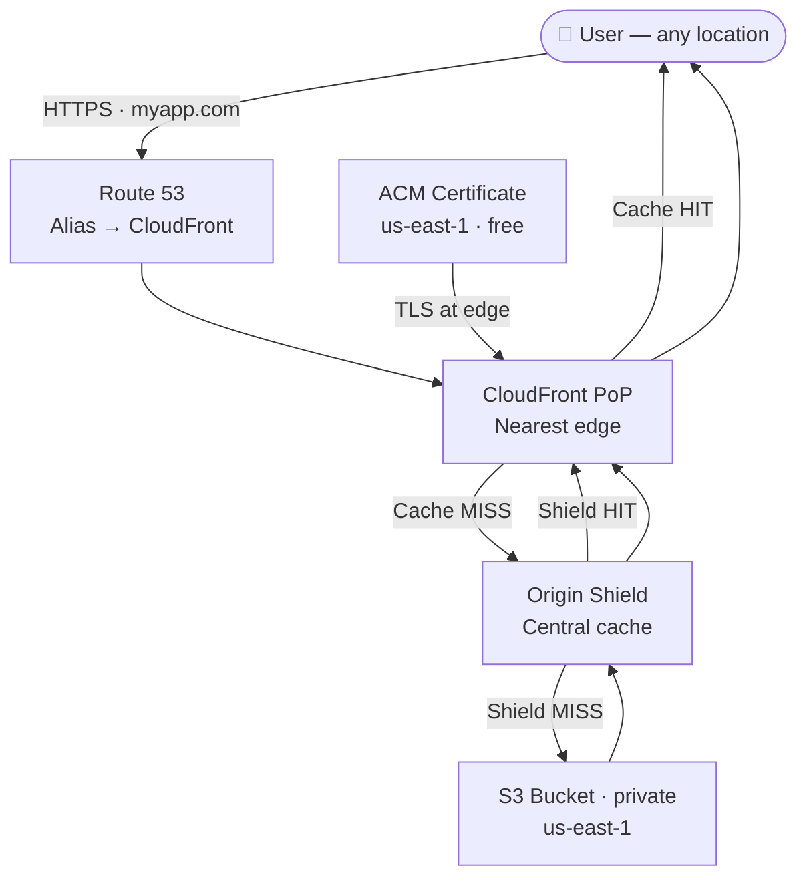

# CDN & Amazon CloudFront

## Overview — what it is and why it matters

A Content Delivery Network solves a physics problem: data takes time to travel. A user in Mumbai fetching from a server in us-east-1 crosses roughly 13,000 km of network — latency at that distance is a floor, not a bug. Amazon CloudFront eliminates most of it by caching content at over 550 Points of Presence worldwide so the majority of requests are served from a location geographically near the user, not from the origin.

CloudFront is also the standard way to add HTTPS to an S3 static website, enforce security policies at the edge, lock the origin private, and optionally attach AWS WAF for application-layer protection — all without modifying application code.

---

## Simple explanation

Imagine a publisher with one warehouse and thousands of pop-up stalls worldwide. When someone orders a popular book, the warehouse ships one copy to the nearest stall. Every customer after that gets the book from the stall immediately — the warehouse never hears about it. The warehouse only ships again when the stall's stock expires (TTL) or the book is updated (cache invalidation).

CloudFront is the network of stalls. S3 (or any origin) is the warehouse. The cache hit ratio measures how often the stall already has what users need.

---

## Key concepts

### Edge Locations and Points of Presence

CloudFront routes each user request to the nearest PoP using Anycast — every PoP advertises the same IP prefix and BGP selects the topologically closest one automatically. No routing configuration is needed.

Each PoP has two tiers:
- **Edge Locations** — front-line cache servers that serve cached responses directly to users
- **Regional Edge Caches** — a larger mid-tier cache between edge locations and the origin; retains less-popular content longer, reducing the volume of origin fetches from individual edges

**Global PoP coverage (examples):**

| Region | Example cities |
|---|---|
| Asia Pacific | Mumbai, Chennai, Singapore, Tokyo, Sydney, Seoul, Jakarta |
| Europe | Frankfurt, London, Paris, Amsterdam, Stockholm, Milan |
| Americas | New York, São Paulo, Los Angeles, Chicago, Toronto, Santiago |
| Middle East / Africa | Dubai, Tel Aviv, Cape Town, Nairobi |

---

### Caching and TTL

When an edge receives a request for an object it does not have (**cache miss**), it fetches from the origin, stores a copy, and returns it. Every subsequent request for the same object (**cache hit**) is served from the edge without contacting the origin.

**TTL controls object freshness:**

| Setting | Default | Range | Configured via |
|---|---|---|---|
| Default TTL | 86,400s (24 hrs) | Configurable | Cache Policy |
| Minimum TTL | 0s | 0 → Max TTL | Cache Policy |
| Maximum TTL | 31,536,000s (1 yr) | Min TTL → 1yr | Cache Policy |

Origin HTTP headers override the Cache Policy TTL when present:
- `Cache-Control: max-age=3600` — cache for 1 hour
- `Cache-Control: no-cache` — always revalidate before serving
- `Cache-Control: no-store` — never cache this response
- `Expires: <datetime>` — explicit expiry timestamp

**Cache key** — determines what makes two requests equivalent for caching. By default: URL path only. Query strings, headers, and cookies can be added — but each unique combination creates a separate cache entry, fragmenting the cache and degrading hit ratio. Only include values in the cache key if the response genuinely differs based on them.

**Cache hit ratio** — percentage of requests served from the cache without an origin fetch. Monitor via CloudWatch metric `CacheHitRate`. Target:
- Static assets (HTML, CSS, JS, images): 90–99%
- API responses with short TTLs: 50–80%
- Personalised or authenticated content: varies; may not be cacheable

**Cache invalidation** — forces CloudFront to discard cached objects before TTL expires. Creates origin traffic proportional to distribution size — use selectively.

```bash
# Invalidate all paths in the distribution
aws cloudfront create-invalidation   --distribution-id YOUR_DIST_ID   --paths "/*"

# Invalidate specific files (more targeted, lower cost at scale)
aws cloudfront create-invalidation   --distribution-id YOUR_DIST_ID   --paths "/index.html" "/assets/app.js"
```

> First 1,000 invalidation paths/month are free; $0.005 per path beyond that. For CI/CD pipelines deploying frequently, use **versioned filenames** (`app.abc123.js`) instead — new names are treated as new cache entries automatically, with zero invalidation cost.

---

### Origin Shield

Origin Shield is an optional additional caching tier between CloudFront's regional edge caches and the origin. One AWS Region is designated as a centralised shield through which all origin fetches are routed.

**Without Origin Shield:** each of CloudFront's ~13 regional edge caches may independently fetch the same object from the origin — up to 13 origin requests for one piece of content on a global cache miss.

**With Origin Shield:** all regional edges route misses through the single shield Region. The origin is fetched once; subsequent misses from other regions hit the shield instead.

**Choose the shield Region closest to the origin** — not to users. The goal is to minimise origin-to-shield latency, since user-to-edge latency is already handled by the edge layer.

**When Origin Shield pays off:**
- High-traffic content accessed from multiple continents
- Origins with per-request costs (Lambda, API Gateway, third-party APIs)
- Origins with request-rate limits or limited capacity
- Reducing S3 GET request charges on large media libraries

**Cost:** ~$0.0095–$0.0160 per 10,000 requests through the shield (region-dependent). Offset by reduced origin traffic and cost at high volume.

---

### SSL/TLS and HTTPS with ACM

HTTPS requires a TLS certificate. AWS Certificate Manager (ACM) issues free, publicly trusted TLS certificates for use with CloudFront — no purchase, no manual renewal.

**Hard requirement:** the ACM certificate must be in **us-east-1**, regardless of origin region or user location. This is a CloudFront constraint, not a recommendation. A certificate in `ap-south-1` will not appear in the CloudFront distribution SSL dropdown.

**How TLS termination works with CloudFront:**
1. User's browser initiates a TLS handshake with the nearest edge location
2. CloudFront terminates TLS at the edge using the ACM certificate — handshake completes close to the user
3. CloudFront makes a separate, independent connection to the origin (configurable as HTTP or HTTPS)
4. The user always gets HTTPS regardless of the origin-to-edge protocol

**Viewer protocol policy options:**

| Setting | Behaviour | Recommendation |
|---|---|---|
| HTTP and HTTPS | Allows both protocols | Never use in production |
| Redirect HTTP to HTTPS | 301 redirect to the HTTPS URL | Default for most applications |
| HTTPS only | HTTP requests receive 403 | Use where HTTP must never work |

**Origin Access Control (OAC)** — prevents users from accessing the S3 bucket directly, bypassing CloudFront. OAC supersedes the older Origin Access Identity (OAI). With OAC enabled:
- S3 bucket policy allows only the CloudFront service principal to call `s3:GetObject`
- Requests include a signed header CloudFront generates using SigV4
- Public S3 access is blocked — the S3 bucket URL returns 403 to all clients
- All traffic must flow through CloudFront, enforcing HTTPS, WAF rules, and geo-restrictions

---

## Lab — S3 Static Website Behind CloudFront with HTTPS

### Goal

Add a CloudFront distribution with a free ACM certificate and OAC to the S3 static website from Topic 13. Enforce HTTPS, lock the S3 bucket private, update Route 53 to point the custom domain to CloudFront, and verify caching behaviour firsthand via a content update and invalidation.

### Steps

**Part 1 — Request an ACM Certificate (must be us-east-1)**

1. In the AWS Console, switch to the **us-east-1** region
2. Navigate to **Certificate Manager → Request certificate**
3. Certificate type: **Public**
4. Domain names: `myapp.com` and `www.myapp.com`
5. Validation method: **DNS validation**
6. Click **Request**
7. On the certificate detail page, click **Create records in Route 53** — Route 53 adds the CNAME validation records automatically
8. Wait 2–5 minutes for status to show **Issued**

**Part 2 — Create the CloudFront Distribution**

9. Navigate to **CloudFront → Create distribution**
10. Origin domain: select the S3 bucket REST endpoint from the dropdown — **not** the S3 website URL (`bucket.s3.amazonaws.com`, not `bucket.s3-website-region.amazonaws.com`)
11. Origin access: **Origin access control settings** → **Create new OAC** → Sign requests: Yes → Create
12. CloudFront displays a banner — click **Copy policy** (save this for Part 3)
13. Default cache behaviour → Viewer protocol policy: **Redirect HTTP to HTTPS**
14. Allowed HTTP methods: **GET, HEAD**
15. Cache policy: **CachingOptimized** (built-in policy for S3 static content)
16. Settings → Alternate domain names: add `myapp.com` and `www.myapp.com`
17. Custom SSL certificate: select the ACM cert from Part 1
18. Default root object: `index.html`
19. Click **Create distribution** — deployment takes 5–10 minutes (watch Status column)

**Part 3 — Apply OAC Policy to S3 and Block Public Access**

20. Navigate to **S3 → your bucket → Permissions → Bucket policy → Edit**
21. Paste the OAC policy copied in step 12 (replace account ID and distribution ID placeholders):
```json
{
  "Version": "2012-10-17",
  "Statement": [{
    "Sid": "AllowCloudFrontServicePrincipal",
    "Effect": "Allow",
    "Principal": {"Service": "cloudfront.amazonaws.com"},
    "Action": "s3:GetObject",
    "Resource": "arn:aws:s3:::YOUR-BUCKET-NAME/*",
    "Condition": {
      "StringEquals": {
        "AWS:SourceArn": "arn:aws:cloudfront::YOUR_ACCOUNT_ID:distribution/YOUR_DIST_ID"
      }
    }
  }]
}
```
22. Go to **S3 → Permissions → Block public access → Edit** → enable **Block all public access** → save
23. Test: open the S3 bucket website URL → should return **403 Access Denied** — correct

**Part 4 — Update Route 53 to Point to CloudFront**

24. Navigate to **Route 53 → Hosted Zone → your domain**
25. Edit the A record for `myapp.com`:
    - Alias: ON · Route traffic to: **Alias to CloudFront distribution** · select your distribution
26. Repeat for `www.myapp.com`
27. Open `https://myapp.com` — padlock visible, content loads from CloudFront

**Part 5 — Test Caching and Invalidation**

28. Update `index.html` in S3 (change the page heading)
29. Hard-reload `https://myapp.com` — old content still appears (edge cache is serving it)
30. Run a cache invalidation:
```bash
aws cloudfront create-invalidation   --distribution-id YOUR_DIST_ID   --paths "/*"
```
31. Wait ~30 seconds, reload — updated content appears

### CLI commands

```bash
# List all distributions and their status
aws cloudfront list-distributions   --query "DistributionList.Items[*].{ID:Id,Domain:DomainName,Status:Status,Enabled:Enabled}"

# Get cache hit statistics for the last hour
aws cloudwatch get-metric-statistics   --namespace AWS/CloudFront   --metric-name CacheHitRate   --dimensions Name=DistributionId,Value=YOUR_DIST_ID Name=Region,Value=Global   --start-time $(date -u -v-1H +%Y-%m-%dT%H:%M:%SZ)   --end-time $(date -u +%Y-%m-%dT%H:%M:%SZ)   --period 3600   --statistics Average

# Create invalidation for specific paths
aws cloudfront create-invalidation   --distribution-id YOUR_DIST_ID   --paths "/index.html" "/assets/*"

# Check invalidation completion status
aws cloudfront list-invalidations   --distribution-id YOUR_DIST_ID   --query "InvalidationList.Items[*].{ID:Id,Status:Status,Time:CreateTime}"

# Get the CloudFront domain name to use in Route 53 Alias record
aws cloudfront get-distribution   --id YOUR_DIST_ID   --query "Distribution.DomainName" --output text

# Verify ACM certificate is Issued in us-east-1
aws acm list-certificates   --region us-east-1   --query "CertificateSummaryList[*].{Domain:DomainName,Status:Status}"
```

---

## Architecture flow



Users resolve `myapp.com` via Route 53, which returns the CloudFront distribution via an Alias record. CloudFront routes to the nearest PoP. Cache HITs return immediately from the edge. MISSes go through Origin Shield before reaching S3. S3 is private — only the CloudFront OAC identity can read objects. TLS is terminated at the edge using the ACM certificate; users always get HTTPS regardless of the internal origin protocol.

---

## Common mistakes

**Requesting the ACM certificate in the wrong region.** CloudFront requires the certificate to be in `us-east-1` — globally. A certificate created in any other region (even the origin's region) will not appear in the CloudFront SSL dropdown. Always provision the cert in `us-east-1` first, before creating the distribution.

**Using the S3 website endpoint as the CloudFront origin.** The S3 website endpoint (`bucket.s3-website-region.amazonaws.com`) does not support OAC and forces HTTP-only origin communication. Use the S3 REST endpoint (`bucket.s3.region.amazonaws.com`) and enable OAC for private access and HTTPS-to-origin support.

**Not invalidating the cache after updating S3 content.** Editing a file in S3 has no effect on what CloudFront's edges are serving. The edges continue to return cached versions until TTL expires. Always run an invalidation after deploying updated content — or adopt versioned filenames to make TTL irrelevant.

**Leaving S3 public access enabled after enabling OAC.** OAC adds a bucket policy that grants CloudFront read access, but it does not automatically revoke public access. If public access remains open, the S3 URL still works — bypassing CloudFront, HTTPS enforcement, WAF rules, and geo-restrictions entirely. Block all public access at the bucket level after applying the OAC policy.

**Bloating the cache key with session cookies or user IDs.** If cookies like `sessionid` or `user_token` are included in the cache key, every unique session creates a separate cache entry. The cache hit ratio collapses, every request reaches the origin, and CloudFront provides no speed benefit. Only include cache-key components that genuinely change the content of the response.

---

## Real-world use

A software company ships product documentation as a static site: 2,000 HTML pages, 400 MB of assets. On a major product launch, 80,000 users worldwide hit the docs in the first 30 minutes. CloudFront serves all 80,000 requests from cached copies at nearby edge locations. S3 receives fewer than 200 origin requests during the entire event. The site loads in under 400ms from every continent. CloudFront bill for the day: under $4. The same traffic routed directly to S3 cross-region would have been unusably slow for non-US users and cost proportionally more in S3 request fees.

---

## Key takeaways

- CloudFront caches content at 550+ edge locations; cache HITs serve in single-digit milliseconds without contacting the origin
- TTL controls cache freshness; invalidation forces early eviction — use versioned filenames in CI/CD to avoid invalidation costs
- Origin Shield centralises origin fetches across all regional edges, collapsing many misses into one origin request
- ACM provides free auto-renewing TLS certificates — always request in `us-east-1` for CloudFront, regardless of origin region
- OAC locks the S3 bucket private; all traffic must pass through CloudFront, enforcing HTTPS and any WAF policies
- The standard production static site stack on AWS is S3 + CloudFront + ACM + Route 53 — four managed services, zero servers

---

## Next steps

- [ ] Attach **AWS WAF** to the distribution — add rate limiting, IP allow/block lists, and geographic restrictions
- [ ] Configure **CloudFront Functions** — lightweight JavaScript at the edge for header manipulation, URL rewrites, A/B redirects
- [ ] Enable **Real-Time Logs** — stream access logs to Kinesis Data Firehose for sub-minute latency observability
- [ ] Explore **CloudFront with API Gateway** — cache API responses at the edge to reduce Lambda invocations
- [ ] Study **Signed URLs and Signed Cookies** — restrict distribution content to authenticated users with time-limited access tokens