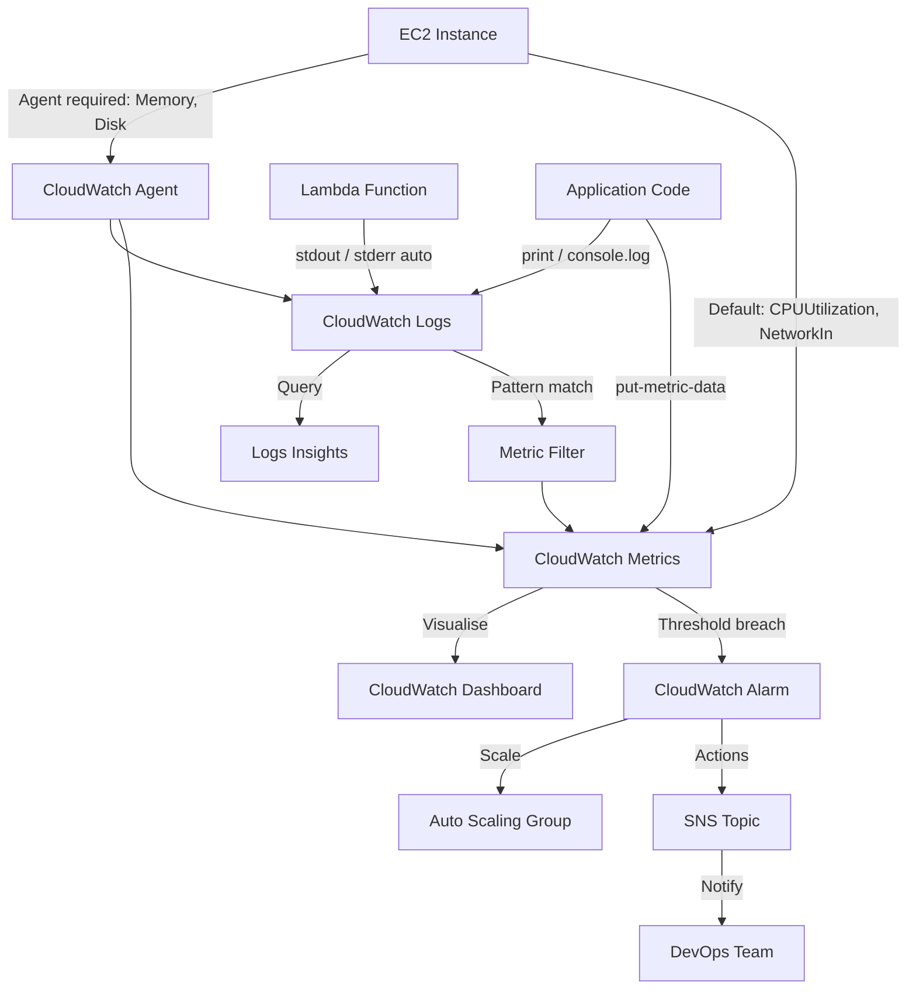

# Monitoring: Amazon CloudWatch

## Overview — what it is and why it matters

CloudWatch is AWS's native observability service. It collects metrics (numerical time-series data from AWS resources), logs (text output from applications and services), and events (state changes in your AWS environment). It then lets you visualise, alert on, and query all of it from a single service.

Without CloudWatch, you have no visibility into whether your application is healthy, why it is slow, or when a resource will run out of capacity. With CloudWatch configured correctly, you know about problems before users do.

---

## Simple explanation

Imagine a hospital monitoring ward.

**Metrics** are the vital signs — heart rate, blood pressure, temperature — measured continuously and plotted on a chart. Normal variation is expected; a sustained spike triggers concern.

**Alarms** are the monitor thresholds — the red lines that trigger a nurse alert when a reading stays above a critical value for too long. The alarm does not call the nurse once and stop; it calls as long as the reading stays above the threshold.

**Logs** are the patient notes — a running text record of everything that happened, written by the nurses and doctors. When something goes wrong, you read the notes to understand what preceded the event.

---

## Key concepts

### Metrics

A metric is a time-ordered set of data points representing a measurable aspect of an AWS resource or application.

**Anatomy of a metric data point:**

| Field | Description | Example |
|---|---|---|
| Namespace | Service or app grouping | `AWS/EC2`, `AWS/RDS`, `MyApp/Orders` |
| Metric name | What is being measured | `CPUUtilization`, `Latency`, `ErrorCount` |
| Dimension | Key-value identifier for the specific resource | `InstanceId: i-001abc` |
| Value | The measurement | `42` |
| Unit | The measurement unit | `Percent`, `Count`, `Bytes`, `Milliseconds` |
| Timestamp | When the data point was recorded | `2024-01-15T09:00:00Z` |

**Default AWS metrics (no configuration needed):**

| Service | Key default metrics |
|---|---|
| EC2 | CPUUtilization, NetworkIn/Out, DiskReadOps, StatusCheckFailed |
| RDS | DatabaseConnections, FreeStorageSpace, ReadLatency, CPUUtilization |
| ALB | RequestCount, HTTPCode_Target_4XX_Count, TargetResponseTime |
| Lambda | Invocations, Errors, Duration, Throttles, ConcurrentExecutions |
| S3 | BucketSizeBytes, NumberOfObjects |
| SQS | NumberOfMessagesSent, ApproximateNumberOfMessagesVisible |

**What default metrics do NOT include:**
- EC2 memory usage (RAM)
- EC2 disk space utilisation
- Application-level metrics (request latency at the app layer, custom business counters)

These require either the **CloudWatch Agent** (for system-level EC2 metrics) or manual `put-metric-data` calls from application code.

**Resolution options:**
- Standard resolution: 1 data point per minute (default, free)
- High resolution: 1 data point per second (custom metrics only, higher cost)

---

### Alarms

A CloudWatch Alarm evaluates a metric over a configurable time window and triggers actions when the metric crosses a threshold.

**Alarm states:**

| State | Meaning |
|---|---|
| OK | Metric is within the defined threshold for the evaluation period |
| ALARM | Metric has exceeded (or fallen below) the threshold for the required number of consecutive evaluation periods |
| INSUFFICIENT_DATA | Not enough data points have been collected yet to evaluate the alarm |

**Configuring an alarm — the key parameters:**

- **Metric:** Which metric to watch (e.g., `CPUUtilization` for instance `i-001`)
- **Statistic:** How to aggregate data points in a period (Average, Sum, Maximum, Minimum, SampleCount)
- **Period:** Duration of each evaluation window (e.g., 300 seconds = 5 minutes)
- **Evaluation periods:** How many consecutive periods must breach the threshold to trigger ALARM (e.g., 2 periods = the metric must be above the threshold for 10 minutes before alarming)
- **Threshold:** The value to compare against (e.g., `> 80` for CPUUtilization)
- **Comparison operator:** GreaterThanThreshold, LessThanThreshold, etc.

**Alarm actions:**
- **SNS notification:** Send a message to an SNS topic — subscribers receive email, SMS, Slack (via Lambda), or PagerDuty alerts
- **EC2 actions:** Stop, terminate, reboot, or recover the instance
- **Auto Scaling:** Scale the ASG out (more instances) or in (fewer instances) based on metric load
- **Systems Manager:** Create an OpsItem for incident tracking

**Composite alarms:** A higher-level alarm that triggers only when multiple underlying alarms are in ALARM state simultaneously. Reduces alert noise — a CPU spike alone doesn't page you, but CPU spike AND elevated error rate together do.

---

### CloudWatch Logs

CloudWatch Logs collects, stores, and makes searchable the text output from applications, OS-level processes, and AWS services.

**Structure:**

```
Log Group: /aws/lambda/my-function       (logical grouping per application/service)
  └── Log Stream: 2024/01/15/[$LATEST]abc123  (one stream per Lambda instance/invocation batch)
       └── Log events (individual lines with timestamps)
```

**Which services write to CloudWatch Logs automatically:**
- Lambda (all stdout/stderr)
- API Gateway (access logs — requires configuration)
- VPC Flow Logs (network traffic metadata)
- CloudTrail (API activity — separate log group)
- RDS (error and slow query logs — optional)

**EC2 requires the CloudWatch Agent:**
EC2 does not write application or system logs to CloudWatch by default. You must install the CloudWatch Agent, which reads log files from the OS filesystem and streams them to CloudWatch. The agent also provides memory and disk space metrics.

**CloudWatch Logs Insights:**
An interactive query engine for log data. Queries run across all log streams in a log group.

```
# Find all errors in the last 1 hour
fields @timestamp, @message, @logStream
| filter @message like /ERROR/
| sort @timestamp desc
| limit 50

# Count request rates by status code
fields @timestamp, status
| stats count() as requests by status
| sort requests desc

# Find Lambda cold starts
fields @initDuration
| filter @initDuration > 0
| stats avg(@initDuration), max(@initDuration) by bin(5m)
```

**Metric Filters:**
A metric filter scans incoming log events for a pattern and publishes a data point to a custom CloudWatch metric when a match is found. This bridges the gap between logs and alarms — you can alarm on log content.

Example: Filter for `"ERROR"` → publish 1 data point to `MyApp/ErrorCount` → alarm when count exceeds 10 per minute.

**Log retention:**
By default, CloudWatch Logs never expire. Every log group continues to accumulate and bill at $0.03/GB/month stored. Always set a retention policy. Common choices:

| Use case | Retention |
|---|---|
| Debug / development logs | 7–14 days |
| Application logs | 30–90 days |
| Security / audit logs | 1–2 years (or S3 archive) |
| Compliance-required | 7 years |

---

## Lab — CloudWatch Dashboard: EC2 CPU + S3 Bucket Size

### Goal

Create a CloudWatch Dashboard with two widgets: one monitoring EC2 CPU utilisation (with an alarm), and one monitoring S3 bucket size over time. Configure a billing alarm as a bonus.

### Steps

**Part 1 — Create a CloudWatch Dashboard**

1. Navigate to **CloudWatch → Dashboards → Create dashboard**
2. Dashboard name: `DevOps-Lab-Dashboard`
3. Click **Create dashboard**
4. When prompted to add a widget, click **Cancel** — add widgets manually below

**Part 2 — Add EC2 CPU Widget**

5. Click **Add widget** → choose **Line** → **Next**
6. Select **Metrics** source
7. Browse to **EC2 → Per-Instance Metrics**
8. Search for your instance ID, select `CPUUtilization`
9. Click **Create widget**
10. Resize and position the widget on the dashboard

**Part 3 — Add S3 Bucket Size Widget**

11. Click **Add widget** → choose **Line** → **Next**
12. Browse to **S3 → Storage Metrics**
13. Find your bucket name, select `BucketSizeBytes` (storage type: `StandardStorage`)
14. Set period to **1 day** (S3 metrics are daily)
15. Click **Create widget**
16. Save the dashboard (top-right **Save dashboard**)

**Part 4 — Create a CPU High Alarm**

17. Navigate to **CloudWatch → Alarms → Create alarm**
18. Select metric: EC2 → Per-Instance Metrics → `CPUUtilization` for your instance
19. Period: **5 minutes** | Statistic: **Average**
20. Threshold: **Greater than 80** | for **2 out of 2** evaluation periods
21. Alarm name: `EC2-High-CPU-Alarm`
22. Notification: Create a new SNS topic `ec2-alerts`, add your email address
23. Confirm the subscription email AWS sends
24. Click **Create alarm**

**Part 5 — Create a Billing Alarm (Free Tier protection)**

25. Change region to **us-east-1** (billing metrics only exist there)
26. **CloudWatch → Alarms → Create alarm**
27. Browse to **Billing → Total Estimated Charge** → `EstimatedCharges` → USD
28. Threshold: **Greater than 5** (alert at $5)
29. Alarm name: `AWS-Billing-Alert-5USD`
30. Notification: reuse the SNS topic from Part 4 or create a new one
31. Click **Create alarm**

### CLI commands

```bash
# Create a CloudWatch alarm for EC2 CPU (email notification via SNS)
aws cloudwatch put-metric-alarm   --alarm-name "EC2-High-CPU-Alarm"   --alarm-description "Alert when CPU exceeds 80% for 10 minutes"   --metric-name CPUUtilization   --namespace AWS/EC2   --dimensions Name=InstanceId,Value=YOUR_INSTANCE_ID   --period 300   --evaluation-periods 2   --threshold 80   --comparison-operator GreaterThanThreshold   --statistic Average   --alarm-actions YOUR_SNS_TOPIC_ARN   --ok-actions YOUR_SNS_TOPIC_ARN

# Publish a custom metric from CLI
aws cloudwatch put-metric-data   --namespace "MyApp/Performance"   --metric-name "OrderProcessingTime"   --dimensions Service=checkout   --value 245   --unit Milliseconds

# Describe alarm state
aws cloudwatch describe-alarms   --alarm-names "EC2-High-CPU-Alarm"   --query "MetricAlarms[0].{State:StateValue,Reason:StateReason}"

# List log groups
aws logs describe-log-groups   --query "logGroups[*].{Name:logGroupName,Retention:retentionInDays,SizeMB:storedBytes}"   --output table

# Set log retention to 30 days
aws logs put-retention-policy   --log-group-name /aws/lambda/your-function   --retention-in-days 30

# Run a Logs Insights query
aws logs start-query   --log-group-name /aws/lambda/your-function   --start-time $(date -d '1 hour ago' +%s)   --end-time $(date +%s)   --query-string 'fields @timestamp, @message | filter @message like /ERROR/ | sort @timestamp desc | limit 20'
```

---

## Architecture flow



Metrics flow from AWS resources (automatically) and application code (via put-metric-data) into CloudWatch. Alarms evaluate metrics against thresholds and trigger SNS notifications or ASG scaling actions. Logs flow from Lambda automatically and from EC2 via the CloudWatch Agent. Metric Filters bridge logs and metrics — extracting numerical signals from text. Logs Insights provides ad-hoc query capability across all log streams. Dashboards assemble metrics and alarms into a single operational view.

---

## Common mistakes

**Not setting log retention.** Every CloudWatch log group defaults to never-expire. Logs accumulate indefinitely at $0.03/GB/month. A Lambda function with verbose logging generating 10 GB/month costs $3/month in log storage — small, but it compounds across functions and years. Set retention on every log group immediately after creation.

**Relying on default EC2 metrics for memory monitoring.** CPUUtilization is reported by the hypervisor and requires no agent. Memory utilization is an OS-level metric — the hypervisor cannot see inside the instance. Install the CloudWatch Agent on every EC2 instance that needs memory or disk monitoring.

**Setting too few evaluation periods.** A single-period alarm (N=1) fires on every temporary spike. Set 2–3 evaluation periods so the alarm only fires on sustained issues, not transient bursts. This reduces false-positive pages significantly.

**Not configuring OK actions on alarms.** Alarm actions fire when the alarm state changes to ALARM — but without OK actions, you don't know when the issue resolves. Always add the same SNS topic to both alarm-actions and ok-actions for a complete incident lifecycle.

**Forgetting billing alarms in us-east-1.** Billing metrics are only available in the us-east-1 region regardless of where your workloads run. A billing alarm set in any other region will never receive data and will stay in INSUFFICIENT_DATA indefinitely.

---

## Real-world use

A production web application uses CloudWatch across three dimensions: a dashboard shows ALB request count, target response time, and EC2 CPU side by side — the engineering team has this on a TV during business hours. Alarms page the on-call engineer when ALB 5xx error rate exceeds 1% for 5 minutes or EC2 CPU exceeds 85% for 10 minutes. A metric filter on the application log group counts `"PAYMENT_FAILED"` log events and alarms when more than 5 occur per minute — a signal that catches payment processing degradation minutes before it becomes customer-visible.

---

## Key takeaways

- Metrics are time-series data points — AWS resources emit them automatically; application metrics require code or the CloudWatch Agent
- Alarms evaluate metrics against thresholds and trigger SNS, EC2, or ASG actions when breached
- Logs collect text output — Lambda writes automatically, EC2 requires the CloudWatch Agent
- Logs Insights queries log data with SQL-like syntax — find errors, measure latency, debug failures
- Metric Filters bridge logs to metrics — detect a log pattern, publish it as a metric, alarm on it
- Always set log retention — default is never-expire, which accumulates storage cost indefinitely

---

## Next steps

- [ ] Install the **CloudWatch Agent** on an EC2 instance — collect memory, disk, and custom application logs
- [ ] Create a **Composite Alarm** — alert only when CPU spike AND error rate spike occur simultaneously
- [ ] Set up **CloudWatch Container Insights** for ECS or Kubernetes workloads
- [ ] Explore **AWS X-Ray** — distributed tracing to follow a request across multiple services
- [ ] Learn **CloudTrail** — the API-level audit log for every action taken in your AWS account