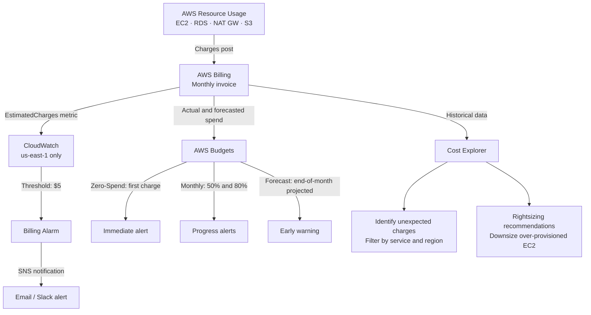

# AWS Billing & Cost Management

## Overview — what it is and why it matters

AWS bills on a pay-per-use model — every resource that runs generates a charge, and some resources generate charges even when they appear idle (stopped EC2 instances still bill for EBS storage; unused Elastic IPs bill by the hour; NAT Gateways bill whether or not traffic passes through them). Without cost management tooling configured, surprise charges are not a matter of if, but when.

This topic covers the three AWS tools that together constitute a complete cost protection and analysis strategy: AWS Budgets for proactive alerting, CloudWatch Billing Alarms for reactive thresholds, and Cost Explorer for retrospective investigation.

---

## Simple explanation

Think of AWS billing like a hotel minibar.

Everything is available immediately. Nothing is explicitly locked. Some items are "complimentary" (Free Tier) but have quiet limits. Others are easy to forget you opened. At checkout, the bill covers everything used — and "I didn't know it was charging" is not a discount.

**Budgets** are a spending limit you tell the hotel in advance — "call me if my extras hit $20."

**Billing Alarms** are a direct charge notification — "text me the moment anything posts to my bill."

**Cost Explorer** is the itemised receipt — "show me exactly what I spent and on what."

---

## Key concepts

### AWS Free Tier — what it actually covers

The Free Tier is not a blanket "always free" guarantee. It has three tiers with important nuances:

| Free Tier type | How it works | Catch |
|---|---|---|
| Always Free | Never expires (e.g., Lambda 1M requests/month, DynamoDB 25 GB) | Specific limits apply — exceeding them bills normally |
| 12-Month Free | Applies during the first 12 months from account creation | Expires silently — no notification when it ends |
| Trials | Short-term trial of specific services | Billing begins after the trial ends automatically |

**Services with common Free Tier surprises:**
- **EC2 t2.micro / t3.micro:** 750 hours/month — running one instance 24/7 uses exactly 744 hours. A second instance of any size immediately starts billing.
- **RDS db.t3.micro:** 750 hours/month — same calculation. Two RDS instances exceed the limit.
- **S3:** 5 GB storage, 20,000 GET requests, 2,000 PUT requests — data transfer out is not free.
- **Data transfer out:** 100 GB/month free in the first 12 months, then $0.09/GB for traffic out of AWS to the internet.

---

### Charges That Catch Beginners

These are the most common source of unexpected AWS bills for learners:

| Resource | Charge | When it happens |
|---|---|---|
| NAT Gateway | ~$0.045/hour (~$32/month) | Every hour it exists, even with zero traffic |
| Elastic IP (unattached) | $0.005/hour (~$3.60/month) | Any EIP not attached to a running instance |
| EC2 stopped instance | ~$0.08/GB/month for EBS | The instance stops billing; the disk does not |
| RDS stopped instance | Storage cost continues | RDS auto-starts after 7 days of being stopped |
| CloudWatch Logs (no retention) | $0.03/GB/month stored | Default: never expire — logs accumulate indefinitely |
| S3 Standard-IA / Glacier | 30-day minimum storage duration | Objects deleted early still bill for the full minimum |

> The single most important habit: **delete, don't stop**. For lab resources you're done with — terminate EC2 instances, delete RDS instances, delete NAT Gateways and release Elastic IPs.

---

### CloudWatch Billing Alarm

A billing alarm is a CloudWatch alarm that monitors the `EstimatedCharges` metric in the `AWS/Billing` namespace. This metric is updated several times per day with your total estimated charges across all services.

**Important constraint:** Billing metrics only exist in the **us-east-1** region. A billing alarm created in any other region will stay in `INSUFFICIENT_DATA` indefinitely — it will never fire.

**Recommended setup:**
- Threshold: $5 (fires before the monthly bill becomes significant)
- Second alarm: $20 (catches runaway spend)
- Action: SNS topic → email (or Slack via Lambda)

---

### AWS Budgets

AWS Budgets is a dedicated cost monitoring service, more capable than billing alarms alone. It supports:

- **Cost budgets:** Alert when actual or forecasted spend exceeds a threshold
- **Usage budgets:** Alert when usage of a specific service metric (e.g., EC2 hours) exceeds a threshold
- **Reservation/Savings Plan budgets:** Alert when Reserved Instance or Savings Plan utilisation drops below a target
- **Forecast-based alerts:** Alert before the threshold is reached, based on predicted end-of-month spend

**Budget alert types:**
- **Actual:** Fires when real charges have posted and crossed the threshold
- **Forecasted:** Fires when AWS predicts the current trend will exceed the budget by month-end — fires early, before you've actually overspent

**Zero-Spend Budget:**
A budget with a $0.01 threshold on actual spend. Fires the moment any charge posts to the account — useful for accounts that should be completely free (purely Free Tier usage).

**Recommended budget setup for learners:**

| Budget | Amount | Alerts |
|---|---|---|
| Zero-Spend-Budget | $0.01 | Actual > 100% |
| Monthly-Cost-Budget | $20 | Actual > 50% ($10), Actual > 80% ($16), Forecasted > 100% |

---

### AWS Cost Explorer

Cost Explorer is an interactive tool for visualising, filtering, and analysing historical AWS spend. It shows costs broken down by service, region, Availability Zone, linked account, usage type, and resource tag.

**What Cost Explorer is used for:**
- Finding which service generated an unexpected charge
- Identifying underutilised resources (EC2 instances with consistently low CPU)
- Comparing month-over-month spend trends
- Getting rightsizing recommendations (suggested instance downgrades based on utilisation data)
- Viewing Reserved Instance and Savings Plan coverage and utilisation

**Cost allocation tags:**
Tags applied to AWS resources (EC2 instances, S3 buckets, RDS instances) can be activated as cost allocation tags. Once activated, cost data can be filtered by these tags in Cost Explorer — enabling per-project, per-team, or per-environment cost breakdowns.

Example: Tag all resources with `Environment: dev` or `Environment: prod` and `Owner: parikshit` — then filter Cost Explorer to see total dev environment costs separately from production.

---

### Consolidated Billing (AWS Organizations)

Consolidated Billing allows multiple AWS accounts to be managed under a single master (management) account. All linked accounts' bills are combined into one invoice.

**Benefits:**
- **Volume discounts:** AWS pricing tiers are calculated across all linked accounts combined — the total usage earns volume pricing even if individual accounts would not qualify alone
- **Free Tier sharing:** Each member account gets its own Free Tier — useful for isolating dev/prod environments without sharing Free Tier limits
- **Single payment:** One invoice, one credit card, one payment for all accounts
- **Service Control Policies (SCPs):** The management account can apply account-level permission guardrails to member accounts using AWS Organizations

**Typical structure for a learner or small team:**
- Management account: billing and governance only (no workloads deployed here)
- Dev account: learning and development resources
- Prod account: production workloads
- Sandbox account: short-lived experiments (easy to nuke entirely)

---

## Lab — Zero-Spend Budget + $5 Billing Alarm

### Goal

Set up a complete cost protection layer: a Zero-Spend Budget that fires on first charge, a $5 billing alarm via CloudWatch, and verify Cost Explorer is enabled.

### Steps

**Part 1 — $5 Billing Alarm (CloudWatch)**

1. **Critical: switch to us-east-1 region** (billing metrics are only in this region)
2. Navigate to **CloudWatch → Alarms → Create alarm**
3. Click **Select metric**
4. Browse to **Billing → Total Estimated Charge**
5. Select `EstimatedCharges` with Currency: **USD**
6. Click **Select metric**
7. Period: **6 hours** | Statistic: **Maximum**
8. Threshold: **Greater than** | Value: **5**
9. Datapoints to alarm: **1 out of 1**
10. Click **Next**
11. Notification: **Create new topic**
    - Topic name: `aws-billing-alerts`
    - Email: your email address
    - Click **Create topic**
12. Click **Next** → Alarm name: `AWS-Billing-Alert-5USD`
13. Click **Create alarm**
14. Check your email — confirm the SNS subscription

**Part 2 — Zero-Spend Budget (AWS Budgets)**

15. Navigate to **AWS Budgets** (search "Budgets" in the console)
16. Click **Create budget**
17. Choose **Use a template** → select **Zero spend budget**
18. Budget name: `Zero-Spend-Budget`
19. Email recipients: your email address
20. Click **Create budget**

**Part 3 — Monthly Cost Budget with Forecast Alert**

21. Click **Create budget** again
22. Choose **Customize** → **Cost budget**
23. Budget name: `Monthly-Cost-Budget`
24. Period: **Monthly** | Budget amount: **Fixed** | Amount: **$20**
25. Click **Next**
26. Add alert thresholds:
    - Threshold 1: **Actual** cost > **50%** → notify your email
    - Click **Add alert threshold**
    - Threshold 2: **Actual** cost > **80%** → notify your email
    - Click **Add alert threshold**
    - Threshold 3: **Forecasted** cost > **100%** → notify your email
27. Click through to **Create budget**

**Part 4 — Enable Cost Explorer**

28. Navigate to **Cost Management → Cost Explorer**
29. If not already enabled: click **Enable Cost Explorer** (takes up to 24 hours for data to appear)
30. Once enabled, explore the default view:
    - Change grouping to **Service** — see spend by AWS service
    - Change time range to **Last 6 months** — see historical trends
    - Use the filter panel to scope by **Region**

### CLI commands

```bash
# Create a CloudWatch billing alarm at $5 (must run in us-east-1)
aws cloudwatch put-metric-alarm   --region us-east-1   --alarm-name "AWS-Billing-Alert-5USD"   --alarm-description "Alert when estimated charges exceed $5"   --metric-name EstimatedCharges   --namespace AWS/Billing   --dimensions Name=Currency,Value=USD   --period 21600   --evaluation-periods 1   --threshold 5   --comparison-operator GreaterThanThreshold   --statistic Maximum   --alarm-actions YOUR_SNS_TOPIC_ARN   --ok-actions YOUR_SNS_TOPIC_ARN

# Create a Zero-Spend Budget via CLI
aws budgets create-budget   --account-id YOUR_ACCOUNT_ID   --budget '{
    "BudgetName": "Zero-Spend-Budget",
    "BudgetLimit": {"Amount": "0.01", "Unit": "USD"},
    "TimeUnit": "MONTHLY",
    "BudgetType": "COST"
  }'   --notifications-with-subscribers '[{
    "Notification": {
      "NotificationType": "ACTUAL",
      "ComparisonOperator": "GREATER_THAN",
      "Threshold": 100,
      "ThresholdType": "PERCENTAGE"
    },
    "Subscribers": [{"SubscriptionType": "EMAIL", "Address": "your@email.com"}]
  }]'

# List current budgets
aws budgets describe-budgets   --account-id YOUR_ACCOUNT_ID   --query "Budgets[*].{Name:BudgetName,Amount:BudgetLimit.Amount,Actual:CalculatedSpend.ActualSpend.Amount}"

# Get current month cost and usage by service
aws ce get-cost-and-usage   --time-period Start=$(date +%Y-%m-01),End=$(date +%Y-%m-%d)   --granularity MONTHLY   --metrics BlendedCost   --group-by Type=DIMENSION,Key=SERVICE   --query "ResultsByTime[0].Groups[*].{Service:Keys[0],Cost:Metrics.BlendedCost.Amount}"   --output table

# Describe current billing alarm state (us-east-1)
aws cloudwatch describe-alarms   --region us-east-1   --alarm-names "AWS-Billing-Alert-5USD"   --query "MetricAlarms[0].{State:StateValue,Threshold:Threshold,Reason:StateReason}"
```

---

## Architecture flow



AWS charges post to the billing system as resources are used. CloudWatch monitors the EstimatedCharges metric and fires an alarm when a dollar threshold is breached. AWS Budgets independently monitors actual and forecasted spend, providing earlier warnings before charges accumulate. Cost Explorer provides post-hoc analysis when a charge appears on the bill — enabling root cause identification and ongoing cost optimisation.

---

## Common mistakes

**Creating a billing alarm in the wrong region.** Billing metrics only exist in us-east-1. An alarm in ap-south-1 or any other region will show `INSUFFICIENT_DATA` indefinitely and never fire. Always confirm you are in us-east-1 before creating billing alarms.

**Relying on Free Tier without understanding its limits.** Free Tier is a 12-month promotion for most services, not a permanent guarantee. It expires silently at month 13 with no notification. Set budget alerts to catch the transition.

**Stopping (not terminating) lab resources.** A stopped EC2 instance does not bill for compute but continues to bill for its attached EBS volumes. A stopped RDS instance continues to bill for storage — and automatically restarts after 7 days. Terminate lab resources when done; do not stop them.

**Not activating cost allocation tags.** AWS resource tags exist but are not cost allocation tags by default. They must be individually activated in the Billing console. Without activation, Cost Explorer cannot filter by tags, making per-project cost analysis impossible.

**Assuming a budget alert means charges are blocked.** AWS Budgets sends notifications — it does not stop AWS services or block charges. An account that exceeds a budget continues running and billing. Budgets are a visibility tool, not an enforcement mechanism.

---

## Real-world use

An engineering team of five uses AWS Organizations with separate dev and prod accounts. The dev account has a $100/month budget with 50%/80% alerts and a Zero-Spend Budget. Every EC2 and RDS resource is tagged with `Project` and `Owner`. Cost Explorer filters by tag show each engineer their individual spend for the month. A weekly Slack notification (via CloudWatch → SNS → Lambda → Slack webhook) posts the team's current month-to-date spend each Monday morning. Surprises are eliminated — not because resources are carefully shut down manually, but because the visibility infrastructure makes surprises impossible to miss.

---

## Key takeaways

- Free Tier is a 12-month promotion for most services, not a permanent guarantee — set alerts before month 13
- Billing alarms must be created in **us-east-1** — billing metrics do not exist in other regions
- AWS Budgets supports forecast alerts — warns before you overspend, not after
- Terminated resources stop all billing; stopped resources may continue billing for storage
- Cost Explorer identifies which service generated an unexpected charge — always the first investigation tool
- Cost allocation tags must be explicitly activated in the Billing console before they appear in Cost Explorer

