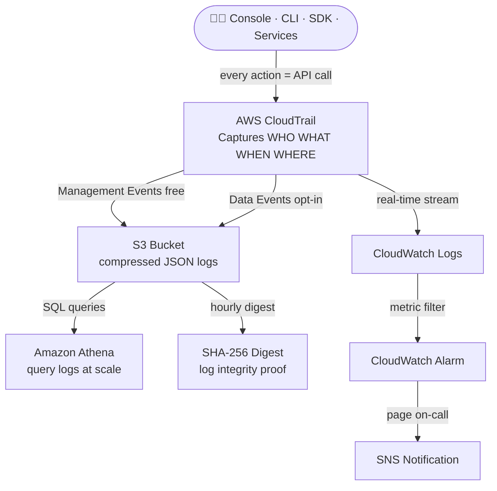

# Auditing & AWS CloudTrail

## Overview — what it is and why it matters

Every action in AWS — clicking a button in the console, running a CLI command, a Lambda function writing to S3 — is an API call made against an AWS service endpoint. AWS CloudTrail records every one of those calls, in every region, across every service, into a persistent, tamper-evident audit log.

CloudTrail is not optional infrastructure for compliant organisations — it is the foundational layer of AWS security and operational visibility. Without it, there is no authoritative answer to "who deleted that resource," "what changed before the outage," or "was this account accessed from an unexpected location." With it, every one of those questions has a precise, queryable answer.

---

## Simple explanation

Think of CloudTrail as a security camera system for your entire AWS account. Every entrance, every room, every action — recorded, timestamped, and stored. When something goes wrong, you do not guess what happened. You rewind the tape.

The tape lives in S3. It never stops recording. The default 90-day view in the console is a preview window — creating a Trail means owning the full archive indefinitely, on your terms.

---

## Key concepts

### What CloudTrail records — the anatomy of an event

Every CloudTrail log record is a JSON object capturing the full context of one API call:

```json
{
  "eventVersion": "1.08",
  "userIdentity": {
    "type": "IAMUser",
    "userName": "alice",
    "arn": "arn:aws:iam::123456789012:user/alice",
    "accountId": "123456789012"
  },
  "eventTime": "2026-05-20T14:32:11Z",
  "eventSource": "s3.amazonaws.com",
  "eventName": "DeleteObject",
  "awsRegion": "ap-south-1",
  "sourceIPAddress": "203.0.113.5",
  "userAgent": "Mozilla/5.0 (console)",
  "requestParameters": {
    "bucketName": "prod-data",
    "key": "reports/Q1-2026.csv"
  },
  "responseElements": null,
  "errorCode": null,
  "errorMessage": null
}
```

**The six questions every CloudTrail event answers:**

| Field | Answers | Example |
|---|---|---|
| `userIdentity` | WHO made the call | IAM user "alice", role "lambda-exec" |
| `eventName` | WHAT was called | DeleteObject, RunInstances, PutBucketPolicy |
| `eventTime` | WHEN it happened | 2026-05-20T14:32:11Z |
| `awsRegion` | WHERE (region) | ap-south-1, us-east-1 |
| `sourceIPAddress` | WHERE (network) | 203.0.113.5, aws.internal (service-to-service) |
| `errorCode` | Did it SUCCEED | null = success, AccessDenied, NoSuchBucket |

---

### Management Events vs Data Events

The two event categories capture fundamentally different layers of activity:

**Management Events — control plane**

Operations that create, modify, configure, or delete AWS resources. These describe changes to the infrastructure itself, not to the data inside it.

| Example API calls | Service | Why it matters |
|---|---|---|
| `CreateBucket` | S3 | New bucket created — by whom? |
| `RunInstances` | EC2 | Instance launched — expected? |
| `AttachRolePolicy` | IAM | Permissions escalated — authorised? |
| `DeleteTrail` | CloudTrail | Someone tried to cover their tracks |
| `CreateUser` | IAM | New account created — legitimate? |
| `ModifyDBInstance` | RDS | Database configuration changed |
| `UpdateFunctionCode` | Lambda | Function code replaced |

Management Events are **enabled by default** in CloudTrail Event History (90-day rolling window). Creating a Trail captures them in S3 indefinitely. **No additional cost** for management events in a Trail (S3 storage cost applies).

**Data Events — data plane**

Operations that read or write data inside resources. These describe access to the content of resources, not the resources themselves.

| Example API calls | Service | Why it matters |
|---|---|---|
| `GetObject` / `PutObject` | S3 | Who read or wrote which file |
| `DeleteObject` | S3 | Data deletion — intentional? |
| `InvokeFunction` | Lambda | Who called the function, how often |
| `GetItem` / `PutItem` | DynamoDB | Row-level access visibility |
| `GetSecretValue` | Secrets Manager | Who retrieved a secret |

Data Events are **disabled by default** — they generate extremely high event volumes (every S3 GET on a busy bucket can be millions per day) and incur additional cost ($0.10 per 100,000 events). Enable selectively, per resource or resource type, based on compliance and security requirements.

**Choosing what to enable:**

| Use case | Enable |
|---|---|
| General audit trail | Management Events only |
| S3 data exfiltration detection | Data Events on specific sensitive buckets |
| Lambda invocation audit | Data Events on specific functions |
| Full compliance (PCI-DSS, HIPAA) | Management + Data Events |

---

### Trails and S3 Delivery

The default CloudTrail Event History is a 90-day rolling window visible in the console — it cannot be exported, queried at scale, or retained beyond 90 days. A **Trail** is a persistent configuration that delivers log files to an S3 bucket under your control.

**Trail types:**

| Type | Scope | Recommendation |
|---|---|---|
| Single-region | Logs one region only | Use only when required for cost isolation |
| Multi-region | Logs all current and future regions | Default — always use this |
| Organisation trail | Logs all accounts in an AWS Organization | Required for centralised multi-account auditing |

**S3 log file structure:**
```
s3://YOUR-TRAIL-BUCKET/
  AWSLogs/
    123456789012/            ← Account ID
      CloudTrail/
        ap-south-1/          ← Region
          2026/
            05/
              20/
                123456789012_CloudTrail_ap-south-1_20260520T1430Z_XYZ.json.gz
```

Log files are compressed (gzip), delivered within ~15 minutes of the events occurring, and partitioned by account/region/date — aligned with Athena's partition pruning for efficient queries.

**Log File Validation** — CloudTrail generates a SHA-256 digest file every hour that cryptographically signs all log files delivered in that window. Validating the digest proves that logs were not modified, deleted, or forged after delivery. Enable this on every production trail.

---

### Querying Logs with Athena

S3 log files are JSON — readable with `jq` or `grep` for spot checks, but not scalable for investigation across millions of events. Amazon Athena queries the log files in S3 directly using SQL, with no data loading or transformation required.

```sql
-- Find all actions by a specific IAM user in the last 7 days
SELECT eventtime, eventsource, eventname, awsregion, sourceipaddress
FROM cloudtrail_logs
WHERE useridentity.username = 'alice'
  AND eventtime > '2026-05-13'
ORDER BY eventtime DESC
LIMIT 100;

-- Find all failed/denied API calls (access investigation)
SELECT eventtime, eventname, useridentity.arn, errormessage, sourceipaddress
FROM cloudtrail_logs
WHERE errorcode IN ('AccessDenied', 'UnauthorizedOperation')
  AND eventtime > '2026-05-20'
ORDER BY eventtime DESC;

-- Find all DeleteObject calls on the prod S3 bucket
SELECT eventtime, useridentity.arn, requestparameters
FROM cloudtrail_logs
WHERE eventname = 'DeleteObject'
  AND requestparameters LIKE '%prod-data%'
ORDER BY eventtime DESC;
```

---

### CloudWatch Logs Integration and Real-Time Alerts

Trails can be configured to forward events to CloudWatch Logs simultaneously with S3 delivery. This enables real-time metric filters and alarms on specific event patterns — turning the audit log into an active security monitoring layer.

**Useful CloudWatch Metric Filters:**

| Alarm | Filter pattern | Why |
|---|---|---|
| Root account used | `{ $.userIdentity.type = "Root" }` | Root usage should never happen in production |
| CloudTrail disabled | `{ $.eventName = "StopLogging" }` | Attacker covering tracks |
| IAM policy changed | `{ $.eventName = "PutUserPolicy" || $.eventName = "AttachRolePolicy" }` | Privilege escalation |
| Security group modified | `{ $.eventName = "AuthorizeSecurityGroupIngress" }` | Firewall opened |
| Console login without MFA | `{ $.eventName = "ConsoleLogin" && $.additionalEventData.MFAUsed != "Yes" }` | Weak authentication |

Each filter creates a CloudWatch metric → attach a CloudWatch Alarm → trigger SNS → page the on-call team. Root account usage → alert fires within seconds.

---

## Lab — Create a Trail and Read Your Own Logs

### Goal

Create a multi-region CloudTrail trail that delivers logs to an S3 bucket. Perform a set of console actions. Locate the log files in S3, decompress them, and read the exact JSON records for the actions just taken. Query the logs with Athena to find specific events.

### Steps

**Part 1 — Create an S3 Bucket for Trail Logs**

1. Navigate to **S3 → Create bucket**
2. Bucket name: `cloudtrail-logs-YOUR-ACCOUNT-ID` (globally unique; including account ID is convention)
3. Region: choose your primary region
4. Block all public access: **ON** (default — keep it)
5. Versioning: **Enable** (protects log files from overwrite)
6. Click **Create bucket**

**Part 2 — Create the CloudTrail Trail**

7. Navigate to **CloudTrail → Trails → Create trail**
8. Trail name: `management-trail`
9. Storage location: **Use existing S3 bucket** → select the bucket from Part 1
10. Log file SSE-KMS encryption: optional for lab (enable in production)
11. Log file validation: **Enable** ← always on
12. CloudWatch Logs: **Enable** → create a new log group `/aws/cloudtrail/management-trail`
13. Events:
    - Management events: **Read** ✓ and **Write** ✓
    - Data events: leave off for now
    - Insights events: leave off
14. Click **Create trail**

**Part 3 — Generate Some Activity**

15. Perform a handful of actions so there are events to observe:
    - Open **EC2 → Security Groups** (read)
    - Open **IAM → Users** (read)
    - Create and immediately delete an S3 bucket named `cloudtrail-test-delete-me`
    - Run a CLI command:
```bash
aws sts get-caller-identity
aws ec2 describe-instances --region ap-south-1
```
16. Wait 10–15 minutes for CloudTrail to deliver the log files

**Part 4 — Find and Read the Log Files**

17. Navigate to **S3 → cloudtrail-logs-YOUR-ACCOUNT → AWSLogs/ACCOUNT-ID/CloudTrail/REGION/YEAR/MONTH/DAY/**
18. Download one `.json.gz` file
19. Decompress and inspect:
```bash
# Decompress and pretty-print
gunzip -c 123456789012_CloudTrail_ap-south-1_20260520T1430Z.json.gz | python3 -m json.tool | less

# Find the CreateBucket event specifically
gunzip -c *.json.gz | python3 -c "
import json,sys
for line in sys.stdin:
    data = json.loads(line)
    for e in data.get('Records', []):
        if e.get('eventName') == 'CreateBucket':
            print(json.dumps(e, indent=2))
"
```

**Part 5 — Query with Athena (optional but recommended)**

20. Navigate to **CloudTrail → Event history → Create Athena table** — CloudTrail generates the CREATE TABLE statement automatically
21. Open Athena → run the generated DDL → query:
```sql
SELECT eventtime, eventsource, eventname, sourceipaddress, errorcode
FROM cloudtrail_logs_YOUR_ACCOUNT
WHERE eventtime > '2026-05-20'
ORDER BY eventtime DESC
LIMIT 50;
```

### CLI commands

```bash
# Create an S3 bucket for trail logs with versioning enabled
aws s3api create-bucket   --bucket cloudtrail-logs-$(aws sts get-caller-identity --query Account --output text)   --region ap-south-1   --create-bucket-configuration LocationConstraint=ap-south-1

aws s3api put-bucket-versioning   --bucket cloudtrail-logs-$(aws sts get-caller-identity --query Account --output text)   --versioning-configuration Status=Enabled

# Create a multi-region trail with log file validation
aws cloudtrail create-trail   --name management-trail   --s3-bucket-name cloudtrail-logs-YOUR-ACCOUNT-ID   --is-multi-region-trail   --enable-log-file-validation   --include-global-service-events

# Start logging (trails are created stopped — must explicitly start)
aws cloudtrail start-logging --name management-trail

# Verify trail is active and check its config
aws cloudtrail get-trail-status --name management-trail   --query "{Logging:IsLogging,LastDelivery:LatestDeliveryTime,LastDigest:LatestDigestDeliveryTime}"

# Look up recent events directly in Event History (last 1 hour, no S3 needed)
aws cloudtrail lookup-events   --lookup-attributes AttributeKey=EventName,AttributeValue=DeleteBucket   --start-time $(date -u -v-1H +%Y-%m-%dT%H:%M:%SZ)   --query "Events[*].{Time:EventTime,User:Username,Event:EventName}"

# Validate log file integrity for a specific digest file
aws cloudtrail validate-logs   --trail-arn arn:aws:cloudtrail:ap-south-1:YOUR-ACCOUNT-ID:trail/management-trail   --start-time 2026-05-20T00:00:00Z
```

---

## Architecture flow



Every AWS API call — human or automated — flows through CloudTrail. Management Events are captured free by default. Trails deliver compressed JSON logs to S3, where Athena provides SQL-scale querying. CloudWatch Logs integration enables real-time alerting: a metric filter detects a specific event pattern (root login, CloudTrail disabled, IAM escalation), a CloudWatch Alarm triggers, and SNS pages the on-call engineer within seconds of the event occurring.

---

## Common mistakes

**Relying on the 90-day Event History without creating a Trail.** The console's Event History is a convenience feature — it is not a replacement for a Trail. It cannot be searched programmatically, cannot be retained beyond 90 days, does not support Athena querying, and does not include Data Events. Every AWS account that matters should have at least one multi-region Trail writing to S3.

**Leaving log file validation disabled.** Without log file validation, there is no cryptographic proof that log files were not modified after delivery. If logs are ever needed for a legal proceeding or a security investigation, unvalidated logs carry significantly less evidentiary weight. Enable validation at trail creation — it costs nothing extra.

**Not protecting the trail S3 bucket.** The trail bucket is the most security-sensitive object in the account. An attacker who deletes the bucket erases the evidence of their actions. Apply a bucket policy that denies `DeleteObject` and `DeleteBucket` to all principals including account root. Enable Object Lock (WORM) for compliance-grade tamper protection.

**Turning off CloudTrail to "save money."** Management Events are free to record in a Trail. The only cost is S3 storage for the log files — typically under $5/month for a single account. The cost of not having logs during an incident investigation is immeasurable. Never disable CloudTrail on active accounts.

**Enabling Data Events on all S3 buckets without filtering.** Enabling Data Events on `arn:aws:s3:::*` (all buckets) records every GetObject from every bucket in the account. For accounts with high-traffic S3 workloads this can generate hundreds of millions of events per day at $0.10 per 100,000 events. Enable Data Events per bucket and per event type (write-only, or read+write) on specifically sensitive resources only.

---

## Real-world use

A fintech company's security team receives a PagerDuty alert at 02:47 UTC: a CloudWatch Alarm fired on an IAM policy change event. The on-call engineer opens CloudTrail, searches for `AttachRolePolicy` events in the last hour, and finds a single event: a service role had `AdministratorAccess` attached by an IAM user from an IP address in an unexpected country. The user's credentials had been compromised. Total time from event to detection: 40 seconds. Total time to revoke and remediate: 8 minutes. Without CloudTrail, the same compromise might have gone undetected for days.

---

## Key takeaways

- CloudTrail records every AWS API call — WHO, WHAT, WHEN, WHERE, and whether it succeeded — across every service and region
- Management Events (infrastructure changes) are captured free by default; Data Events (object-level access) are opt-in and incur additional cost
- The 90-day Event History is a preview; create a multi-region Trail to own your logs in S3 indefinitely
- Enable log file validation at trail creation — SHA-256 digests prove logs were not tampered with after delivery
- Forward logs to CloudWatch Logs to trigger real-time alerts on critical event patterns (root login, trail disabled, IAM escalation)
- Athena provides SQL querying directly on S3 log files — no ETL, no data warehouse, no loading required

---

## Next steps

- [ ] Create **CloudWatch Metric Filters** for root account usage and CloudTrail disable events — attach SNS alarms
- [ ] Enable **AWS Config** alongside CloudTrail — Config tracks resource configuration state; CloudTrail tracks who changed it
- [ ] Set up an **Organisation Trail** — single trail covering all accounts in an AWS Organization, centralised in a security account
- [ ] Explore **Amazon Detective** — uses CloudTrail, VPC Flow Logs, and GuardDuty findings to build automated investigation graphs
- [ ] Study **AWS Security Hub** — aggregates CloudTrail-based findings with GuardDuty, Inspector, and Macie into a unified security posture dashboard