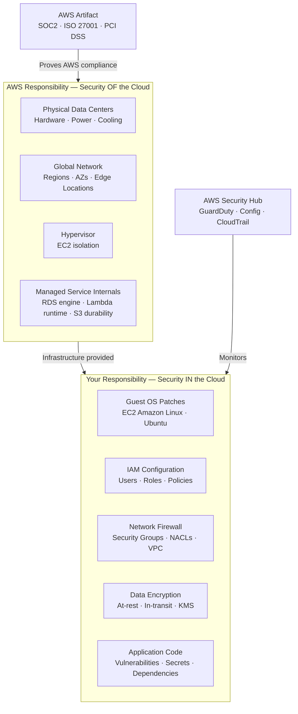

# AWS Shared Responsibility Model

## Overview — what it is and why it matters

The Shared Responsibility Model is the foundational security agreement between AWS and its customers. It defines precisely which party is accountable for which security controls across every AWS service and deployment.

Misunderstanding this model is the starting point for the majority of AWS security failures. It is not that AWS infrastructure gets breached — it is that customers misconfigure their portion of the stack: leaving S3 buckets public, granting wildcard IAM permissions, running unpatched EC2 operating systems, or exposing database ports to the internet.

---

## Simple explanation

Think of renting a flat in a managed building.

**The building owner (AWS)** is responsible for the structure itself: the walls, the electrical system, the locks on the main entrance, the security cameras in the lobby, the fire suppression system. If the building's wiring fails, that's on them.

**You (the tenant)** are responsible for what happens inside your flat: locking your front door, who you give a key to, whether you leave a window open at night, your own valuables, the software running on your computer inside the flat.

The building owner controls the infrastructure. You control what you do with it.

---

## Key concepts

### The Core Division

**AWS is responsible for security OF the cloud:**

The physical infrastructure — data centers, hardware, networking equipment, cooling, power — and the foundational layers that abstract it: the global network, the virtualization layer (hypervisor), and the internals of managed services.

**You are responsible for security IN the cloud:**

What you deploy, how you configure it, who you give access to, whether you encrypt your data, whether your application code is secure, and whether your OS is patched.

---

### Responsibility by Service Type

The boundary shifts depending on the type of AWS service you use. The more managed the service, the more AWS takes on — and the less direct control you have over (or responsibility for) the lower layers.

**IaaS — Infrastructure as a Service (EC2):**

| Layer | Responsible party |
|---|---|
| Physical data center | AWS |
| Network and hypervisor | AWS |
| Guest operating system | **You** |
| OS patches and updates | **You** |
| Application runtime | **You** |
| Application code | **You** |
| Data encryption | **You** |
| Network firewall (Security Groups) | **You** |
| IAM permissions | **You** |

EC2 has the widest customer responsibility surface. You own everything above the hypervisor.

**PaaS — Platform as a Service (Elastic Beanstalk, RDS):**

| Layer | Responsible party |
|---|---|
| Physical infrastructure | AWS |
| Hypervisor | AWS |
| Operating system (host) | AWS |
| Database engine patches | AWS (RDS) |
| Runtime environment | AWS (Beanstalk) |
| Application configuration | **You** |
| Application code | **You** |
| Data encryption | **You** (choice to enable) |
| IAM permissions | **You** |
| Network access (Security Groups) | **You** |

RDS is a good example: AWS patches the MySQL/PostgreSQL engine and the underlying OS. You are responsible for enabling encryption at rest, configuring the Security Group that controls access, managing database users, and ensuring your application doesn't expose credentials.

**SaaS — Software as a Service (Amazon WorkMail, Chime):**

| Layer | Responsible party |
|---|---|
| Everything infrastructure | AWS |
| Application platform | AWS |
| Data (your content) | **You** |
| User access management | **You** |
| Client-side security | **You** |

SaaS minimises your operational responsibility but you still own your data and who has access to it.

---

### What "Security IN the Cloud" Means in Practice

These are the specific controls that are always your responsibility, regardless of which AWS services you use:

**IAM and identity:**
- Creating users and roles with least-privilege permissions
- Enabling MFA on the root account and all IAM users with console access
- Rotating access keys
- Auditing permissions regularly
- Removing unused credentials

**Network security:**
- Configuring Security Groups to allow only required ports from required sources
- Designing VPC subnet architecture (public vs private)
- Reviewing Network ACL rules
- Never exposing database ports to `0.0.0.0/0`

**Data protection:**
- Enabling S3 server-side encryption (SSE-S3 or SSE-KMS)
- Enabling RDS encryption at rest (must be enabled at creation — cannot be added later)
- Using HTTPS (TLS) for data in transit
- Managing encryption keys via AWS KMS
- Ensuring S3 bucket policies do not grant unintended public access

**Operating system and runtime (EC2):**
- Applying OS security patches (Amazon Linux, Ubuntu, Windows Server)
- Removing unnecessary services and open ports
- Using hardened, current AMIs as the base
- Not running as root or with unnecessary process privileges

**Application security:**
- Preventing SQL injection, XSS, and other OWASP Top 10 vulnerabilities in your code
- Storing secrets in AWS Secrets Manager, not in environment variables or source code
- Validating inputs and sanitising outputs
- Keeping dependencies updated

**Monitoring and response:**
- Enabling CloudTrail (you must create a Trail — Event History alone is not sufficient)
- Setting CloudWatch alarms on security-relevant metrics
- Reviewing VPC Flow Logs for unexpected network patterns

---

### AWS Artifact

AWS Artifact is a self-service portal where AWS publishes its own compliance documentation — audit reports, certifications, and agreements that cover the AWS infrastructure layer.

**Available in AWS Artifact:**
- SOC 1, SOC 2, SOC 3 reports (Service Organization Control)
- ISO 27001, ISO 27017, ISO 27018 certifications
- PCI DSS Attestation of Compliance
- FedRAMP authorizations
- GDPR Data Processing Addendum
- HIPAA Business Associate Addendum (BAA)
- And hundreds more

**What these reports cover:**
AWS's own security controls for the infrastructure layer. They prove that AWS has passed independent third-party audits for how it operates data centers, manages physical access, secures the network, and runs its managed services.

**What these reports do NOT cover:**
Your application, your data, your IAM configuration, your Security Groups, your code, or any part of the stack you control. An AWS SOC 2 report does not make your application SOC 2 compliant. It makes the infrastructure underneath it compliant.

**When to use Artifact:**
- When a customer or enterprise procurement team asks for evidence of AWS security compliance
- When you are pursuing a compliance framework (SOC 2, ISO 27001, PCI DSS) for your own product and need to document your infrastructure dependencies
- When a regulator asks for evidence that your cloud provider meets certain standards

---

### Shared Responsibility Across Common Misconfigurations

The most impactful misconfigurations are always in the customer's zone:

| Misconfiguration | Whose zone | Consequence |
|---|---|---|
| S3 bucket set to public read | Customer | Data exposure |
| IAM user with `*:*` permissions | Customer | Full account compromise |
| EC2 with port 3306 open to `0.0.0.0/0` | Customer | Database exposed to internet |
| EC2 OS unpatched for 18 months | Customer | Known CVE exploitable |
| RDS encryption disabled | Customer | Data not encrypted at rest |
| Hardcoded AWS credentials in GitHub | Customer | Account takeover |
| No CloudTrail Trail configured | Customer | No audit evidence for incidents |
| Root account used for daily operations | Customer | Unrestricted blast radius |

Not one of these is AWS's failure. All are customer configuration decisions.

---

## Lab — Access AWS Artifact

### Goal

Access AWS Artifact, download a compliance report, and understand what the report covers and what it does not.

### Steps

1. Navigate to **AWS Artifact** (search "Artifact" in the console)
2. Click **Reports** in the left sidebar
3. Browse the available reports:
   - Click on **SOC 2** → read the description
   - Note the date range and the auditing firm
4. To download a report: click the report → review the NDA terms → click **Accept and download**
5. Open the downloaded PDF and navigate to the **Scope of Services** section
   - Observe which AWS services are covered
   - Note that your application workloads are not mentioned
6. Navigate to **Agreements** → review the available agreements (HIPAA BAA, GDPR DPA)
   - These are countersigned agreements that establish AWS's commitments for regulated workloads

**Part 2 — Identify your responsibility gaps (self-audit)**

7. Using the responsibility table above, evaluate your current AWS environment:
   - Is MFA enabled on root? On all IAM users?
   - Is CloudTrail running with a Trail (not just Event History)?
   - Are any Security Groups open to `0.0.0.0/0` on non-HTTP/S ports?
   - Are all S3 buckets with sensitive data encrypted?
   - Is EC2 OS patch management in place?
8. Document any gaps as issues to resolve — this is the starting point for a security posture review

### CLI commands

```bash
# List available compliance reports in AWS Artifact (requires Artifact permissions)
aws artifact list-reports   --query "reports[*].{Name:name,Type:type,Period:periodSummary}"   --output table

# Check if root MFA is enabled (part of your responsibility)
aws iam get-account-summary   --query "SummaryMap.AccountMFAEnabled"

# List IAM users WITHOUT MFA (your responsibility to fix)
aws iam get-credential-report || aws iam generate-credential-report
aws iam get-credential-report   --query 'Content' --output text | base64 -d |   awk -F',' 'NR>1 && $4=="false" && $9!="N/A" {print $1, "- no MFA"}'

# Check for S3 buckets with public access (your responsibility)
aws s3api list-buckets --query "Buckets[*].Name" --output text |   tr '	' '
' | while read bucket; do
    result=$(aws s3api get-public-access-block --bucket "$bucket" 2>/dev/null || echo "NO_BLOCK")
    echo "$bucket: $result"
  done

# List EC2 Security Groups with port 22 open to 0.0.0.0/0
aws ec2 describe-security-groups   --query "SecurityGroups[?IpPermissions[?ToPort==`22` && IpRanges[?CidrIp=='0.0.0.0/0']]].{Name:GroupName,ID:GroupId}"   --output table
```

---

## Architecture flow



AWS provides a compliant, secure infrastructure layer evidenced by third-party audit reports in AWS Artifact. You operate on top of that layer and own the security of everything you configure, deploy, and run. AWS Security Hub, GuardDuty, AWS Config, and CloudTrail all exist to help you fulfil your side of the model — but enabling and acting on them is your choice.

---

## Common mistakes

**"AWS is responsible for security, so I don't need to worry."** This misreads the model entirely. AWS secures the infrastructure. Your configuration of that infrastructure — who has access, what ports are open, whether data is encrypted — is your responsibility. The most common AWS security breaches involve customer misconfiguration, not AWS infrastructure failure.

**"Our application is secure because we use an SOC 2-certified cloud."** AWS's SOC 2 covers AWS's own controls. It does not cover your application's authentication logic, your IAM permissions, your Security Group rules, or your code. Passing an infrastructure vendor's audit does not extend to your product.

**"We'll patch EC2 instances eventually."** EC2 OS patches are your responsibility on a schedule you define. AWS never patches the guest OS of an EC2 instance. Known vulnerabilities in unpatched OS packages are exploitable — and the accountability for a breach via an unpatched EC2 instance sits entirely with the customer.

**"I'll make the S3 bucket public temporarily."** Temporary frequently becomes permanent. Public S3 buckets are routinely scanned by automated tools. Even a bucket made public for 20 minutes may have its contents indexed. Enable S3 Block Public Access by default; require deliberate, documented exceptions.

---

## Real-world use

A startup applying for SOC 2 Type II certification hires a compliance consultant. The consultant reviews the architecture and notes that AWS infrastructure is already covered by AWS's own SOC 2 report (available in Artifact). The startup's own certification work focuses entirely on what they control: IAM access reviews, EC2 patch management procedures, CloudTrail audit log retention, encrypted database backups, and security incident response procedures. The AWS SOC 2 report is attached as evidence of their infrastructure provider's compliance. Their own audit covers only their application and configuration layer. This is the correct application of the Shared Responsibility Model in practice.

---

## Key takeaways

- AWS secures the infrastructure (physical hardware, hypervisor, managed service internals) — you secure what runs on it
- For EC2 (IaaS), your responsibility includes OS patches, Security Groups, IAM, data encryption, and application security
- For managed services (RDS, Lambda), AWS takes on more layers — but IAM, network configuration, and data protection remain yours
- AWS Artifact publishes AWS's compliance certifications — they cover the infrastructure layer, not your application
- The most common cloud security failures are customer misconfiguration, not infrastructure breaches
- Every security practice in this series — IAM least privilege, Security Groups, encrypted S3, CloudTrail, VPC design — is your side of the model

---

## Next steps

- [ ] Run **AWS Trusted Advisor** — review the Security checks for open Security Groups, exposed IAM keys, and root MFA status
- [ ] Enable **AWS Config** — continuous compliance monitoring that flags configuration drift against defined rules
- [ ] Set up **Amazon GuardDuty** — ML-based threat detection that analyses CloudTrail, VPC Flow Logs, and DNS logs
- [ ] Review **AWS Well-Architected Framework** — Security Pillar — a comprehensive guide to implementing your side of the model
- [ ] Complete your own **shared responsibility matrix** — for each service you use, document exactly what you own