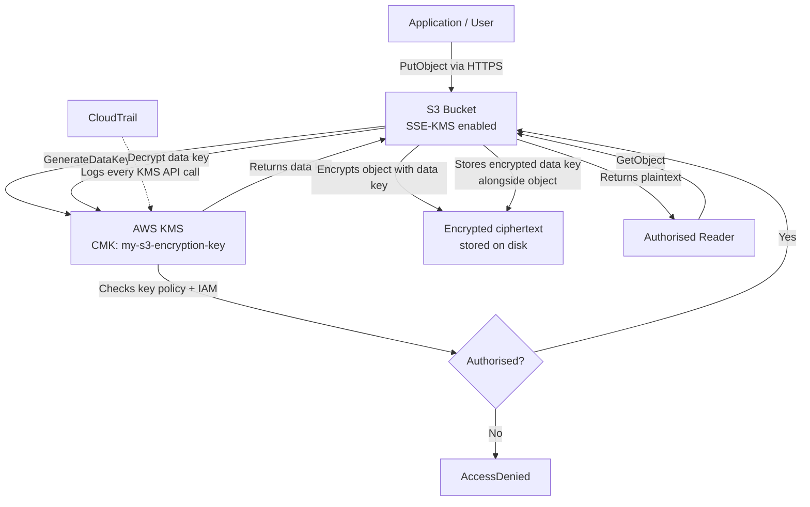

# Encryption: AWS KMS

## Overview — what it is and why it matters

AWS Key Management Service (KMS) is a managed service for creating and controlling the encryption keys used to protect your data. KMS integrates natively with most AWS services — S3, RDS, EBS, Lambda, Secrets Manager, and many others — making encryption a configuration choice rather than an implementation task.

Understanding KMS requires understanding two distinct encryption contexts: data at rest (stored on disk) and data in transit (moving over a network). Each requires different mechanisms and has different threat models.

---

## Simple explanation

Think of your data as a letter and encryption as a lockbox.

**Encryption at rest:** Before storing the letter, you lock it in a box. Even if someone steals the box (the physical disk), without the key it's useless. The key lives in KMS — a vault that never releases the key in plaintext. It only performs operations with the key on your behalf, after verifying you have permission.

**Encryption in transit:** When sending the letter by courier, you seal the envelope with tamper-evident wax. Even if someone intercepts it mid-journey, they cannot read the contents without breaking the seal — which is visible. TLS does this digitally for every byte moving over a network.

**KMS is the key vault.** It does not store your data. It stores, protects, and manages the keys that encrypt your data. The critical insight: the key and the encrypted data are always separate.

---

## Key concepts

### Encryption at Rest vs In Transit

| | Encryption at Rest | Encryption in Transit |
|---|---|---|
| Protects against | Stolen storage media, physical access, insider access to raw storage | Network interception, man-in-the-middle attacks, packet sniffing |
| Mechanism | Symmetric encryption (AES-256) | TLS 1.2 / 1.3 (asymmetric handshake + symmetric session) |
| AWS implementation | KMS keys on S3, EBS, RDS, etc. | HTTPS endpoints, SSL/TLS certificates (ACM) |
| Managed by | You enable it; KMS manages keys | AWS enforces HTTPS on most endpoints by default |
| Data is protected when | Stored on disk | Moving over a network |
| Data is NOT protected when | Being read into memory by an authorised process | At rest on disk |

Both are required for complete data protection. Encrypting data at rest but sending it over HTTP means it's protected on disk but exposed in transit — and vice versa.

---

### How KMS Encryption Works — Envelope Encryption

KMS uses a technique called **envelope encryption**. You never encrypt large data directly with the KMS key (CMK). Instead:

1. **Generate Data Key:** KMS generates a unique data key — a short-lived symmetric key used to encrypt one specific piece of data
2. **Encrypt Data:** The data key encrypts your actual data (the "plaintext" envelope)
3. **Encrypt Data Key:** The data key itself is then encrypted by the CMK in KMS and stored alongside the encrypted data
4. **Store:** The disk contains: encrypted data + the encrypted data key. The CMK never touches the disk.

**To decrypt:**
1. Send the encrypted data key to KMS
2. KMS checks your IAM permissions
3. If authorised, KMS decrypts the data key using the CMK
4. Return the plaintext data key to you
5. Use the plaintext data key to decrypt the data
6. The plaintext data key is discarded from memory immediately after use

This is why a stolen disk is useless: it contains encrypted data and an encrypted data key. Without access to KMS and the CMK, neither can be used.

---

### KMS Key Types

| Key Type | Who manages | Cost | Control level | Use case |
|---|---|---|---|---|
| AWS Owned Keys | AWS (fully opaque) | Free | None | Default for many services |
| AWS Managed Keys | AWS (e.g., `aws/s3`, `aws/rds`) | Free | View only — can't modify policy | Default S3 SSE-KMS, RDS |
| Customer Managed Keys (CMK) | You | $1/month + $0.03/10k API calls | Full — key policy, rotation, disable, delete | Compliance, cross-account, audit control |
| External Key Material (BYOK) | You (key material from HSM) | $1/month + usage | Full + your own key origin | Regulatory key ownership requirements |

**AWS Managed Keys** are the right choice for most workloads. You get the security benefits of KMS without needing to manage key policies.

**Customer Managed Keys** are the right choice when:
- You need to audit who used the key and when (KMS + CloudTrail)
- You need to grant cross-account access to encrypted resources
- You need the ability to revoke access by disabling the key
- Compliance frameworks require you to control key material
- You need custom rotation schedules or key deletion control

---

### S3 Encryption Options

S3 supports three server-side encryption options. All encrypt data before writing to disk; they differ in who manages the key:

| Option | Key managed by | Control | Use when |
|---|---|---|---|
| SSE-S3 | AWS (auto-rotated, invisible) | None | Baseline compliance, no key access needed |
| SSE-KMS | KMS (AWS Managed or CMK) | Full — via key policy | Audit trail, cross-account, revokable access |
| SSE-C | You (per-request) | Full — you store key | Maximum control, key never in AWS |
| DSSE-KMS | Two KMS keys (dual-layer) | Full | Highest compliance (NIST 800-132) |

**Default bucket encryption:** Configuring default encryption means every new object uploaded to the bucket is automatically encrypted using the specified method — even if the uploader doesn't specify encryption. Objects already in the bucket are not retroactively encrypted.

**Enforce encryption via bucket policy:**

```json
{
  "Version": "2012-10-17",
  "Statement": [
    {
      "Sid": "DenyUnencryptedObjectUploads",
      "Effect": "Deny",
      "Principal": "*",
      "Action": "s3:PutObject",
      "Resource": "arn:aws:s3:::your-bucket-name/*",
      "Condition": {
        "StringNotEquals": {
          "s3:x-amz-server-side-encryption": "aws:kms"
        }
      }
    }
  ]
}
```

This policy denies any upload that does not explicitly request KMS encryption — preventing accidental unencrypted uploads.

---

### Key Policies

A key policy is a resource-based IAM policy attached to a KMS key. It defines which principals (IAM users, roles, services, accounts) can use or manage the key.

Every CMK has a key policy. Without an explicit entry, even the AWS account root cannot use the key.

**Minimum key policy for S3 usage:**

```json
{
  "Version": "2012-10-17",
  "Statement": [
    {
      "Sid": "Enable IAM User Permissions",
      "Effect": "Allow",
      "Principal": {"AWS": "arn:aws:iam::ACCOUNT_ID:root"},
      "Action": "kms:*",
      "Resource": "*"
    },
    {
      "Sid": "Allow S3 service to use the key",
      "Effect": "Allow",
      "Principal": {"Service": "s3.amazonaws.com"},
      "Action": ["kms:GenerateDataKey", "kms:Decrypt"],
      "Resource": "*"
    },
    {
      "Sid": "Allow specific IAM role to decrypt",
      "Effect": "Allow",
      "Principal": {"AWS": "arn:aws:iam::ACCOUNT_ID:role/app-read-role"},
      "Action": ["kms:Decrypt", "kms:GenerateDataKey"],
      "Resource": "*"
    }
  ]
}
```

---

## Lab — Enable Default KMS Encryption on S3

### Goal

Create a Customer Managed Key (CMK) in KMS, enable default encryption on an S3 bucket using that key, upload an object, and verify it is encrypted. Understand the implications of key deletion.

### Steps

**Part 1 — Create a Customer Managed Key**

1. Navigate to **KMS → Customer managed keys → Create key**
2. Key type: **Symmetric** | Key usage: **Encrypt and decrypt**
3. Advanced options: Key material origin: **KMS** | Regionality: **Single-Region key**
4. Click **Next**
5. Alias: `my-s3-encryption-key` | Description: "Encrypts S3 bucket objects"
6. Click **Next** through key administrators (add your IAM user/role)
7. Key usage permissions: add the IAM role or user that will access S3 objects
8. Click **Finish** — the key is created with status **Enabled**
9. Copy the **Key ARN** (you'll need it in the next step)

**Part 2 — Enable Default Encryption on S3**

10. Navigate to your S3 bucket → **Properties** tab
11. Scroll to **Default encryption** → click **Edit**
12. Encryption type: **Server-side encryption with AWS Key Management Service keys (SSE-KMS)**
13. AWS KMS key: **Choose from your AWS KMS keys** → select `my-s3-encryption-key`
14. Bucket Key: **Enable** (reduces KMS API costs by caching the data key — recommended)
15. Click **Save changes**

**Part 3 — Upload and verify encryption**

16. Upload a test file to the bucket
17. Click on the uploaded object → **Properties** tab
18. Scroll to **Server-side encryption** — confirm: `AWS-KMS` with your key ARN shown

**Part 4 — Understand key deletion risk**

19. Navigate back to **KMS → Customer managed keys** → click your key
20. Click **Key actions → Schedule key deletion**
21. Note: the minimum waiting period is **7 days**, maximum is **30 days**
22. **Do not confirm this for production keys** — once deleted, all data encrypted with this key becomes permanently unreadable
23. Click **Cancel** — this was for observation only
24. Note the option: **Disable key** (safer alternative — suspends use without destroying key material)

### CLI commands

```bash
# Create a Customer Managed Key
aws kms create-key   --description "S3 bucket encryption key"   --key-usage ENCRYPT_DECRYPT   --key-spec SYMMETRIC_DEFAULT   --query "KeyMetadata.{KeyId:KeyId,Arn:Arn}"

# Create an alias for the key
aws kms create-alias   --alias-name alias/my-s3-encryption-key   --target-key-id YOUR_KEY_ID

# Enable automatic annual key rotation
aws kms enable-key-rotation --key-id YOUR_KEY_ID

# Set S3 bucket default encryption to SSE-KMS
aws s3api put-bucket-encryption   --bucket YOUR_BUCKET_NAME   --server-side-encryption-configuration '{
    "Rules": [{
      "ApplyServerSideEncryptionByDefault": {
        "SSEAlgorithm": "aws:kms",
        "KMSMasterKeyID": "YOUR_KEY_ARN"
      },
      "BucketKeyEnabled": true
    }]
  }'

# Verify bucket encryption is set
aws s3api get-bucket-encryption   --bucket YOUR_BUCKET_NAME   --query "ServerSideEncryptionConfiguration.Rules[0]"

# Upload a file and verify its encryption
aws s3 cp local-file.txt s3://YOUR_BUCKET_NAME/
aws s3api head-object   --bucket YOUR_BUCKET_NAME   --key local-file.txt   --query "{Encryption:ServerSideEncryption,KMSKey:SSEKMSKeyId}"

# Describe key metadata
aws kms describe-key   --key-id alias/my-s3-encryption-key   --query "KeyMetadata.{Status:KeyState,Rotation:KeySpec,Created:CreationDate}"
```

---

## Architecture flow



Every write to S3 calls KMS to generate a data key, encrypts the object, then stores the encrypted data key alongside the ciphertext. Every read calls KMS to decrypt the data key — and KMS checks the key policy and IAM permissions before complying. CloudTrail logs every KMS API call, giving a complete audit trail of who accessed which encryption keys, when, and from where.

---

## Common mistakes

**Deleting a CMK without migrating data.** KMS key deletion has a mandatory waiting period (7–30 days), but after that period the key is gone permanently. Every S3 object, EBS snapshot, or RDS instance encrypted with that key becomes unreadable forever. Before scheduling deletion, re-encrypt all data with a new key. Use **Disable** (not Delete) to temporarily suspend a key while deciding.

**Forgetting S3 Bucket Key.** By default, every S3 object upload calls KMS separately — at scale, this generates enormous KMS API costs (and hits rate limits). Enabling the S3 Bucket Key caches the data key at the bucket level, reducing KMS calls by ~99% while maintaining the same encryption strength.

**Ignoring key policy in favour of IAM alone.** KMS key access requires both the key policy to allow the principal AND an IAM policy to allow the KMS action. If the key policy does not grant access to a role, no IAM policy can override it. Both layers must allow the operation.

**Assuming default encryption protects existing objects.** Enabling default encryption on an S3 bucket encrypts only new objects uploaded after the setting is enabled. Existing objects are not retroactively encrypted. Encrypt existing objects by copying them in place: `aws s3 cp s3://bucket/key s3://bucket/key --sse aws:kms`.

**Using SSE-S3 when compliance requires auditability.** SSE-S3 uses AWS-managed keys with no CloudTrail logging for the encryption operations. SSE-KMS logs every Decrypt and GenerateDataKey call to CloudTrail, providing a complete audit trail of data access. For compliance-regulated data, always use SSE-KMS.

---

## Real-world use

A healthcare startup stores patient records in S3 and RDS. All S3 buckets use SSE-KMS with a CMK tagged `Classification: PHI`. The key policy allows only the application's IAM role and the compliance team's IAM role — no individual developers. CloudTrail logs every `kms:Decrypt` call. If a developer's credentials are compromised, they cannot access patient data because their IAM user is not in the key policy. The compliance team runs a monthly query on CloudTrail: "which IAM principals called kms:Decrypt on the PHI key, and how many times?" — a direct audit of who accessed protected health data.

---

## Key takeaways

- Encryption at rest protects data on disk — a stolen drive contains useless ciphertext without the KMS key
- Encryption in transit (TLS/HTTPS) protects data moving over a network — both are required for complete protection
- KMS uses envelope encryption — data keys encrypt data, CMKs encrypt data keys; the CMK never touches the disk
- Customer Managed Keys give you full control: key policy, rotation, audit trail, disable/delete capability
- Enable S3 Bucket Key to reduce KMS API costs by ~99% for high-volume buckets
- Deleting a CMK is irreversible — always disable first, migrate data, then delete after a confirmed waiting period

---

## Next steps

- [ ] Enable **automatic key rotation** on all CMKs — AWS rotates the key material annually while preserving decryption of old data
- [ ] Use **AWS Secrets Manager** for database passwords and API keys — it integrates with KMS and rotates secrets automatically
- [ ] Explore **EBS volume encryption** — enable default EBS encryption at the account level so every new volume is encrypted at launch
- [ ] Set up a **CloudTrail Logs Insights query** on `kms:Decrypt` events — audit who accessed encrypted data and when
- [ ] Learn **AWS Certificate Manager (ACM)** — manages TLS certificates for in-transit encryption on ALBs, CloudFront, and API Gateway