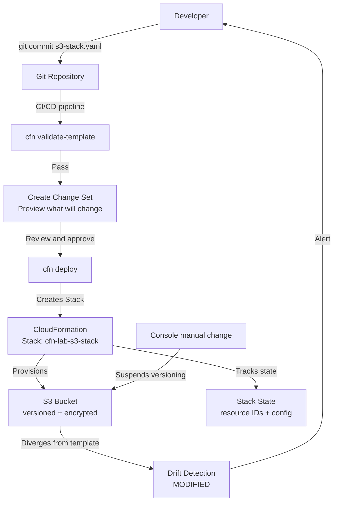

# Infrastructure as Code: AWS CloudFormation

## Overview — what it is and why it matters

AWS CloudFormation is an Infrastructure as Code (IaC) service that lets you define AWS resources in a text file (YAML or JSON) called a template, then deploy and manage those resources as a single unit called a stack. CloudFormation handles the creation, update, and deletion of resources in the correct dependency order — you describe the desired state, and CloudFormation figures out how to achieve it.

The shift from console-click infrastructure to code-defined infrastructure is one of the most important operational maturity steps in cloud engineering. It makes environments reproducible, reviewable, version-controlled, and auditable.

---

## Simple explanation

Imagine building a house.

**Manual approach:** hire individual tradespeople and verbally describe what you want. Every decision is made in the moment. If the house burns down, rebuilding it identically is nearly impossible — nobody wrote anything down.

**CloudFormation approach:** commission an architect to draw a blueprint. Every room, pipe, and wire is specified in the drawing. If the house burns down, the blueprint rebuilds it identically. If you want a second house for staging, use the same blueprint. If a contractor makes an unauthorised change, the blueprint shows the divergence.

The template is the blueprint. The stack is the built house. Drift Detection compares the house to the blueprint.

---

## Key concepts

### Templates — the definition file

A CloudFormation template is a YAML or JSON file describing the AWS resources you want to create and their configuration. Templates are declarative: you state what you want, not how to create it.

**Template structure:**

```yaml
AWSTemplateFormatVersion: '2010-09-09'

Description: >
  A brief description of what this template deploys.

Metadata:
  # Optional — used by CloudFormation Designer and Parameter Groups

Parameters:
  # Variables you pass in at deploy time (environment name, instance type, etc.)

Mappings:
  # Static lookup tables (e.g., AMI IDs per region)

Conditions:
  # Conditional logic (create resource only if environment = prod)

Resources:  # REQUIRED — the only mandatory section
  LogicalResourceId:
    Type: AWS::Service::ResourceType
    Properties:
      PropertyName: PropertyValue

Outputs:
  # Values exported from the stack (ARNs, URLs, IDs) for use in other stacks
```

Only the `Resources` section is required. Every other section is optional.

**Intrinsic functions** — the template's dynamic capabilities:

| Function | What it does | Example |
|---|---|---|
| `!Ref` | Reference a parameter or resource | `!Ref BucketName` |
| `!Sub` | String substitution | `!Sub \"arn:aws:s3:::${BucketName}/*\"` |
| `!GetAtt` | Get an attribute of a resource | `!GetAtt MyBucket.Arn` |
| `!Join` | Concatenate strings | `!Join [-, [prod, bucket]]` |
| `!If` | Conditional value | `!If [IsProd, t3.large, t3.micro]` |
| `!Select` | Pick from a list | `!Select [0, !GetAZs !Ref AWS::Region]` |
| `!ImportValue` | Import output from another stack | `!ImportValue NetworkStack-VpcId` |

---

### Stacks

A stack is a deployed instance of a template — a named collection of AWS resources that are created, updated, and deleted together. CloudFormation tracks the state of every resource in the stack.

**Stack lifecycle:**

| Operation | What happens |
|---|---|
| Create | CloudFormation provisions all resources in the template in dependency order |
| Update | CloudFormation calculates the difference between the current stack and the new template — only changes what needs to change |
| Delete | CloudFormation deletes all resources in the stack (in reverse dependency order) |
| Rollback | If a create or update fails, CloudFormation rolls back all changes to the last stable state |

**Change Sets:**
Before executing an update, you can create a Change Set — a preview of exactly which resources will be added, modified, or deleted. Reviewing a Change Set before applying prevents accidental deletions and unexpected replacements.

```bash
# Create a change set (preview before updating)
aws cloudformation create-change-set   --stack-name my-stack   --template-body file://template.yaml   --change-set-name preview-update

# Describe the change set to see what will change
aws cloudformation describe-change-set   --stack-name my-stack   --change-set-name preview-update

# Apply the change set
aws cloudformation execute-change-set   --stack-name my-stack   --change-set-name preview-update
```

**Stack termination protection:**
Enable termination protection on stacks containing critical production resources to prevent accidental deletion.

---

### Drift Detection

Drift occurs when the actual configuration of a deployed resource diverges from the configuration defined in the CloudFormation template. This happens when someone modifies a resource directly in the console, CLI, or SDK — outside CloudFormation.

**Common drift scenarios:**
- Developer manually adds an inbound rule to a Security Group in the console
- Someone changes an S3 bucket policy directly in the console
- An auto-scaling event modifies the desired capacity of an ASG
- A Lambda function's timeout or memory is adjusted outside the template

**Running drift detection:**
1. CloudFormation calls the AWS APIs to describe the current state of each resource
2. Compares the actual state to the expected state (template + last known state)
3. Reports each resource as: `IN_SYNC` or `MODIFIED` or `DELETED` or `NOT_CHECKED`

Drift detection does not automatically fix drift — it reports it. Remediation choices:
- Update the template to match the manual change (accept the change, document it)
- Redeploy the template to overwrite the manual change (enforce the template)
- Import the drifted resource back under CloudFormation management

---

## Lab — Deploy an S3 Bucket with CloudFormation

### Goal

Write a CloudFormation YAML template, deploy it as a stack, verify the S3 bucket was created with the specified properties, run drift detection, and cleanly delete the stack.

### Steps

**Part 1 — Write the template**

1. Create a file named `s3-stack.yaml` with the following content:

```yaml
AWSTemplateFormatVersion: '2010-09-09'

Description: >
  CloudFormation lab - deploys an S3 bucket with versioning and
  server-side encryption enabled.

Parameters:
  BucketNameSuffix:
    Type: String
    Description: Unique suffix appended to the bucket name
    MinLength: 3
    MaxLength: 20

  Environment:
    Type: String
    Default: dev
    AllowedValues:
      - dev
      - staging
      - prod
    Description: Deployment environment

Resources:
  LabBucket:
    Type: AWS::S3::Bucket
    Properties:
      BucketName: !Sub 'cfn-lab-${BucketNameSuffix}-${Environment}'
      VersioningConfiguration:
        Status: Enabled
      BucketEncryption:
        ServerSideEncryptionConfiguration:
          - ServerSideEncryptionByDefault:
              SSEAlgorithm: AES256
      PublicAccessBlockConfiguration:
        BlockPublicAcls: true
        BlockPublicPolicy: true
        IgnorePublicAcls: true
        RestrictPublicBuckets: true
      Tags:
        - Key: Environment
          Value: !Ref Environment
        - Key: ManagedBy
          Value: CloudFormation

Outputs:
  BucketName:
    Description: Name of the created S3 bucket
    Value: !Ref LabBucket
    Export:
      Name: !Sub '${AWS::StackName}-BucketName'

  BucketArn:
    Description: ARN of the created S3 bucket
    Value: !GetAtt LabBucket.Arn
    Export:
      Name: !Sub '${AWS::StackName}-BucketArn'
```

**Part 2 — Validate and deploy**

2. Navigate to **CloudFormation → Stacks → Create stack**
3. Prerequisite: **Template is ready**
4. Specify template: **Upload a template file** → select `s3-stack.yaml`
5. Click **Next**
6. Stack name: `cfn-lab-s3-stack`
7. Parameters: BucketNameSuffix: enter a unique value (e.g., your name); Environment: `dev`
8. Click **Next** through options → review → **Submit**
9. Watch the **Events** tab — resources appear one by one as CloudFormation creates them
10. Wait for stack status: `CREATE_COMPLETE`

**Part 3 — Verify the outputs**

11. Click the **Outputs** tab — the bucket name and ARN are shown
12. Navigate to **S3** — confirm the bucket exists with the correct name
13. Click the bucket → **Properties** — verify versioning is Enabled, encryption is SSE-S3

**Part 4 — Trigger and detect drift**

14. In the S3 console, click the bucket → **Properties** → **Versioning** → **Suspend**
15. Back in CloudFormation → select the stack → **Stack actions → Detect drift**
16. Wait for drift detection to complete (usually under 1 minute)
17. Click **View drift results** — the `LabBucket` resource shows `MODIFIED`
18. Click on the resource → see the diff: template expects `Enabled`, actual is `Suspended`

**Part 5 — Clean up**

19. First empty the S3 bucket (CloudFormation cannot delete a bucket with objects):
    - In S3: select all objects → Delete (if any were uploaded)
20. Back in CloudFormation: select the stack → **Delete** → confirm
21. Watch the Events tab — CloudFormation deletes all resources, then removes the stack

### CLI commands

```bash
# Validate the template before deploying
aws cloudformation validate-template   --template-body file://s3-stack.yaml

# Deploy (create or update) the stack using the deploy command
aws cloudformation deploy   --template-file s3-stack.yaml   --stack-name cfn-lab-s3-stack   --parameter-overrides     BucketNameSuffix=myname123     Environment=dev   --capabilities CAPABILITY_NAMED_IAM

# Describe the stack and its outputs
aws cloudformation describe-stacks   --stack-name cfn-lab-s3-stack   --query "Stacks[0].{Status:StackStatus,Outputs:Outputs}"

# Describe stack resources
aws cloudformation describe-stack-resources   --stack-name cfn-lab-s3-stack   --query "StackResources[*].{Type:ResourceType,ID:PhysicalResourceId,Status:ResourceStatus}"

# Detect stack drift
aws cloudformation detect-stack-drift   --stack-name cfn-lab-s3-stack

# Get drift results (run after drift detection completes)
aws cloudformation describe-stack-resource-drifts   --stack-name cfn-lab-s3-stack   --query "StackResourceDrifts[*].{Resource:LogicalResourceId,Status:StackResourceDriftStatus}"

# Delete the stack
aws cloudformation delete-stack   --stack-name cfn-lab-s3-stack
```

---

## Architecture flow



The template lives in Git and passes through validation and a Change Set preview before any deployment. CloudFormation provisions resources and tracks their state. Any manual change outside CloudFormation causes drift — detected automatically and surfaced back to the developer. This is the feedback loop that keeps infrastructure-as-code meaningful: the template is always the intended state, drift detection enforces that truth.

---

## Common mistakes

**Editing deployed resources in the console instead of updating the template.** This is the most common IaC anti-pattern. The next CloudFormation update will either overwrite your manual change or Drift Detection will flag the divergence. Treat the template as the single source of truth — every change goes through the template.

**Not creating a Change Set before updating a production stack.** CloudFormation updates can replace resources (creating a new resource and deleting the old one) — for example, changing certain S3 bucket properties triggers a bucket replacement, losing all objects. Always review the Change Set; look for any `Replacement: True` entries before executing.

**Forgetting `--capabilities CAPABILITY_NAMED_IAM`.** Templates that create IAM resources require an explicit acknowledgement flag. Without it, the deploy command fails with `InsufficientCapabilities`. Add `--capabilities CAPABILITY_NAMED_IAM` whenever the template includes IAM roles, users, or policies.

**Hardcoding environment-specific values.** Account IDs, region names, and bucket names should be Parameters or use pseudo-parameters (`!Sub ${AWS::AccountId}`, `!Ref AWS::Region`) — not hardcoded strings. Hardcoded values make the template non-portable and require manual editing for each environment.

**Not enabling stack termination protection on production stacks.** A single accidental `delete-stack` command destroys every resource in the stack. Enable termination protection on production stacks — it adds a required extra confirmation step before deletion.

---

## Real-world use

A fintech team manages their entire AWS environment — three VPCs, 20+ Lambda functions, six RDS databases, and all associated IAM roles — as CloudFormation stacks. The templates live in a monorepo. Every change goes through a pull request; the CI pipeline runs `cfn validate-template` and `cfn-lint` on every commit. Production deployments use Change Sets — a senior engineer reviews the diff, approves, and the pipeline deploys. Drift detection runs nightly; any drift triggers a Slack alert. The last time a database was provisioned by clicking in the console was 18 months ago. New engineers spin up a complete dev environment from scratch in under 10 minutes by running a single deploy command against the main stack template.

---

## Key takeaways

- CloudFormation templates (YAML/JSON) are the source of truth — infrastructure is defined in code, not clicks
- Stacks are deployed instances of templates — create, update, and delete resources together as a unit
- Change Sets preview exactly what will change before any update executes — always use them for production
- Drift Detection identifies manual changes that diverge from the template — treat all drift as a problem to fix
- The `Resources` section is the only mandatory template section — all others are optional
- Never manually edit resources managed by CloudFormation — every change must go through the template

---

## Next steps

- [ ] Add a **CloudFormation stack policy** to protect critical resources from accidental replacement
- [ ] Explore **Nested Stacks** — break large templates into reusable modules (VPC stack, security stack, app stack)
- [ ] Learn **AWS CDK** (Cloud Development Kit) — define CloudFormation templates using Python, TypeScript, or Java
- [ ] Set up a **CI/CD pipeline** that validates and deploys CloudFormation templates on every git push
- [ ] Study **AWS SAM** (Serverless Application Model) — a CloudFormation extension for Lambda and API Gateway deployments