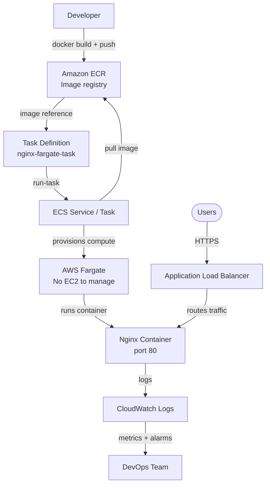

# Containers: Amazon ECS & Fargate

## Overview — what it is and why it matters

Containers are a packaging standard that bundles application code, runtime dependencies, libraries, and configuration into a single portable unit. Amazon ECS (Elastic Container Service) is AWS's managed container orchestration service — it handles running, scaling, and managing containers across a fleet. AWS Fargate is a serverless compute engine for containers that removes the need to provision or manage EC2 instances entirely.

Together, ECS and Fargate represent the dominant pattern for running containerised workloads on AWS without managing servers.

---

## Simple explanation

Think of containers as standardised shipping containers.

A **Docker image** is the blueprint: the exact contents, tools, and configuration packed into a portable, versioned unit. It runs identically on any machine that has Docker — your laptop, a colleague's machine, or an AWS data center.

**ECS** is the shipping port — it receives containers, decides which dock (compute resource) handles which container, monitors container health, and routes traffic to healthy containers.

**Fargate** is the fleet of ships that you never have to own, fuel, or maintain. You hand ECS the container and say "run this with 0.5 vCPU and 1 GB of memory." Fargate handles the rest. When the container stops, the ship returns — you stop paying.

---

## Key concepts

### Docker Images and Containers

A **Docker image** is a read-only, layered snapshot of a filesystem and runtime configuration. Built from a `Dockerfile`, it captures everything the application needs to run.

A **container** is a running instance of an image — an isolated process with its own filesystem, networking, and process space, but sharing the host OS kernel (unlike a VM, which includes a full OS).

**Key Docker concepts for ECS:**

| Concept | Description |
|---|---|
| Dockerfile | Instructions for building an image (FROM, RUN, COPY, EXPOSE, CMD) |
| Image | Built, versioned, immutable snapshot — stored in a registry |
| Container | Running instance of an image |
| Registry | Repository for images — Docker Hub (public) or ECR (AWS-native) |
| Tag | Version label on an image (e.g., `nginx:1.25`, `myapp:v2.1.0`) |

**Minimal Dockerfile for a static web app:**

```dockerfile
FROM nginx:alpine

# Copy static files into the nginx web root
COPY ./html /usr/share/nginx/html

# Expose port 80 for HTTP
EXPOSE 80

# nginx starts automatically via the base image's CMD
```

---

### Amazon ECR — Elastic Container Registry

ECR is AWS's managed Docker image registry. It stores your images privately, integrates natively with ECS and IAM, and supports vulnerability scanning.

**ECR vs Docker Hub:**

| | ECR | Docker Hub |
|---|---|---|
| Access control | IAM policies | Username/password |
| Integration | Native ECS/Fargate pull | Requires credentials |
| Network | Images pulled inside AWS — faster, no egress cost | Public internet pull |
| Vulnerability scanning | Built-in (Snyk-powered) | Paid tier |
| Cost | $0.10/GB/month storage | Free tier limited |

---

### ECS Core Components

**Cluster:** A logical grouping of tasks and services. A cluster can use Fargate, EC2, or both. One cluster per application or environment is a common pattern.

**Task Definition:** A blueprint (JSON document) describing one or more containers — the image, CPU, memory, ports, environment variables, IAM role, and logging configuration. Versioned — every update creates a new revision.

**Task:** A running instance of a Task Definition. One task can contain multiple containers (a main app container plus a sidecar logging container, for example).

**Service:** Maintains a desired number of running tasks. If a task crashes, the Service replaces it. Services integrate with ALBs for load balancing and support rolling deployments.

**Task Definition — key fields:**

```json
{
  "family": "nginx-task",
  "networkMode": "awsvpc",
  "requiresCompatibilities": ["FARGATE"],
  "cpu": "256",
  "memory": "512",
  "executionRoleArn": "arn:aws:iam::ACCOUNT:role/ecsTaskExecutionRole",
  "containerDefinitions": [
    {
      "name": "nginx",
      "image": "ACCOUNT.dkr.ecr.ap-south-1.amazonaws.com/nginx-app:latest",
      "portMappings": [
        {"containerPort": 80, "protocol": "tcp"}
      ],
      "logConfiguration": {
        "logDriver": "awslogs",
        "options": {
          "awslogs-group": "/ecs/nginx-task",
          "awslogs-region": "ap-south-1",
          "awslogs-stream-prefix": "ecs"
        }
      },
      "essential": true
    }
  ]
}
```

---

### AWS Fargate

Fargate is a serverless compute engine for ECS (and EKS). Instead of managing EC2 instances in the cluster, you define only the container requirements — Fargate provisions isolated compute, runs the container, and releases the resource when the task completes.

**Fargate vs EC2 launch type:**

| | Fargate | EC2 Launch Type |
|---|---|---|
| Server management | None — fully managed by AWS | You manage EC2 instances |
| Scaling | Per-task scaling — each task gets its own compute | Scale EC2 fleet, then tasks fill instances |
| Pricing | Per vCPU-second + per GB-second | EC2 instance-hour (even when containers are idle) |
| Visibility | No host access | Can SSH into EC2 nodes |
| Best for | Variable workloads, microservices, serverless mindset | Predictable high-density workloads, GPU, custom AMIs |

**Fargate CPU and memory combinations:**

Fargate requires CPU and memory to be specified from valid combinations:

| CPU (vCPU) | Memory options |
|---|---|
| 0.25 | 0.5 GB, 1 GB, 2 GB |
| 0.5 | 1 GB – 4 GB (1 GB increments) |
| 1 | 2 GB – 8 GB (1 GB increments) |
| 2 | 4 GB – 16 GB (1 GB increments) |
| 4 | 8 GB – 30 GB (1 GB increments) |

**Fargate pricing example:**
A task running 0.25 vCPU + 0.5 GB memory for 1 hour:
- vCPU: 0.25 × $0.04048/vCPU-hour = $0.0101
- Memory: 0.5 × $0.004445/GB-hour = $0.0022
- Total: ~$0.012/hour per task

At 10 tasks for 8 hours/day, 30 days: ~$29/month — with zero EC2 management overhead.

---

### Networking for Fargate

Fargate tasks use **awsvpc** network mode — each task gets its own Elastic Network Interface (ENI) and private IP in your VPC. This provides task-level security group control.

**Public IP assignment:** Fargate tasks in a public subnet can be assigned a public IP to pull images from ECR or Docker Hub. Without a public IP in a public subnet — or a NAT Gateway in a private subnet — the task cannot pull its image and stays in PENDING.

**Recommended network architecture:**
- Place Fargate tasks in **private subnets**
- Use a **NAT Gateway** for outbound traffic (image pulls, API calls)
- Place an **ALB** in public subnets to receive inbound traffic
- Security Group on tasks: allow inbound only from the ALB Security Group

---

## Lab — Run Nginx on Fargate via ECS Console

### Goal

Create an ECS cluster, define a Task Definition for Nginx, run it as a Fargate task, and access the Nginx default page from a browser.

### Steps

**Part 1 — Create an ECS Cluster**

1. Navigate to **ECS → Clusters → Create cluster**
2. Cluster name: `fargate-lab-cluster`
3. Infrastructure: **AWS Fargate (serverless)** — deselect EC2
4. Click **Create**

**Part 2 — Create a Task Definition**

5. Navigate to **ECS → Task definitions → Create new task definition**
6. Task definition family: `nginx-fargate-task`
7. Launch type: **AWS Fargate**
8. OS/Architecture: **Linux/X86_64**
9. CPU: **0.25 vCPU** | Memory: **0.5 GB**
10. Task execution role: **Create new role** (auto-creates ecsTaskExecutionRole)
11. Container details:
    - Name: `nginx`
    - Image URI: `public.ecr.aws/nginx/nginx:latest` (public ECR mirror — no auth needed)
    - Container port: **80**, Protocol: **TCP**
12. Logging: **Use log collection** → **Amazon CloudWatch** → auto-creates log group
13. Click **Create**

**Part 3 — Run the Task**

14. Navigate to **ECS → Clusters → fargate-lab-cluster → Tasks → Run new task**
15. Launch type: **Fargate**
16. Task definition: `nginx-fargate-task` (latest revision)
17. Cluster: `fargate-lab-cluster`
18. VPC: your VPC
19. Subnets: select a **public subnet**
20. Security group: create new — allow **Inbound TCP 80** from **0.0.0.0/0**
21. Public IP: **Turned on** (required for image pull from public ECR in a public subnet)
22. Click **Create**

**Part 4 — Verify**

23. Wait for task status: **RUNNING** (usually 30–60 seconds)
24. Click the task → copy the **Public IP** from the network section
25. Open a browser: `http://PUBLIC_IP` → Nginx welcome page loads
26. Click **Logs** tab in the task detail — CloudWatch log stream shows Nginx access logs

### CLI commands

```bash
# Create ECS cluster
aws ecs create-cluster   --cluster-name fargate-lab-cluster   --capacity-providers FARGATE   --region ap-south-1

# Register a Task Definition (save as task-def.json first)
aws ecs register-task-definition   --cli-input-json file://task-def.json

# List task definitions
aws ecs list-task-definitions   --family-prefix nginx-fargate-task   --query "taskDefinitionArns" --output table

# Run a Fargate task
aws ecs run-task   --cluster fargate-lab-cluster   --launch-type FARGATE   --task-definition nginx-fargate-task   --network-configuration "awsvpcConfiguration={
    subnets=[YOUR_SUBNET_ID],
    securityGroups=[YOUR_SG_ID],
    assignPublicIp=ENABLED
  }"

# List running tasks
aws ecs list-tasks   --cluster fargate-lab-cluster   --query "taskArns" --output table

# Describe task to get public IP
aws ecs describe-tasks   --cluster fargate-lab-cluster   --tasks YOUR_TASK_ARN   --query "tasks[0].attachments[0].details[?name=='networkInterfaceId'].value"

# Stop a task
aws ecs stop-task   --cluster fargate-lab-cluster   --task YOUR_TASK_ARN

# Delete the cluster (after stopping all tasks)
aws ecs delete-cluster --cluster fargate-lab-cluster
```

---

## Architecture flow



Developers build and push Docker images to ECR. A Task Definition references the image and defines resource requirements. ECS runs the task on Fargate — provisioning isolated compute, pulling the image, starting the container, and registering it with the load balancer. Users reach containers through the ALB. CloudWatch collects all container logs and metrics automatically. The developer never touches a server.

---

## Common mistakes

**Forgetting to assign a public IP in a public subnet.** Fargate tasks in a public subnet need a public IP to pull images from ECR or Docker Hub over the internet. Without it, the task stays in PENDING until it times out. Alternative: use a private subnet with a NAT Gateway for outbound-only internet access.

**Not creating the ecsTaskExecutionRole.** The Task Execution Role grants ECS permission to pull images from ECR, write logs to CloudWatch, and retrieve secrets from Secrets Manager. Without it, tasks fail at the image pull stage. The console creates this automatically; the CLI requires manual creation.

**Using a Security Group that blocks the container's port.** Fargate tasks use awsvpc networking — the Security Group is applied to the task's ENI, not the host. If port 80 is not open inbound on the task Security Group (from the ALB SG for services, or from `0.0.0.0/0` for direct access), the container is unreachable even when running.

**Storing secrets in environment variables directly in the Task Definition.** Task Definition JSON is visible in the AWS console and CloudTrail logs. Use Secrets Manager or SSM Parameter Store references in the Task Definition instead — the value is injected at runtime and never stored in plaintext in the definition.

**Not setting a log configuration.** Fargate containers with no log configuration produce output that is lost. Always configure `awslogs` in the Task Definition's `logConfiguration` block — otherwise debugging a failing container is nearly impossible.

---

## Real-world use

A SaaS company migrated their API from EC2 Auto Scaling to ECS Fargate. Each microservice is a separate ECS Service with its own Task Definition. A GitHub Actions pipeline builds the Docker image on every merge to main, tags it with the git SHA, pushes to ECR, and updates the Task Definition revision — ECS performs a rolling deployment with zero downtime. During peak hours, Application Auto Scaling increases the desired task count from 3 to 12; at 2am it scales back to 2. The engineering team no longer patches OS packages, manages AMIs, or sizes EC2 instances. Container infrastructure cost dropped 35% compared to the always-on EC2 fleet.

---

## Key takeaways

- A Docker image is a portable, immutable snapshot of an application and its dependencies — runs identically anywhere
- ECS orchestrates containers: scheduling, health monitoring, scaling, and load balancer integration
- Fargate removes EC2 management entirely — define container requirements, AWS runs the compute
- Task Definitions are versioned blueprints: image, CPU, memory, ports, IAM role, and logging
- Fargate tasks in public subnets need a public IP for image pulls; private subnets need a NAT Gateway
- Always configure CloudWatch logging in the Task Definition — container output is lost without it

---

## Next steps

- [ ] Create an **ECS Service** (not just a task) — maintains desired task count, integrates with ALB
- [ ] Push your own Docker image to **ECR** and run it on Fargate
- [ ] Set up **Application Auto Scaling** on the ECS Service — scale task count based on CPU or request count
- [ ] Explore **AWS Copilot** — a CLI that builds Fargate infrastructure from a single `copilot init` command
- [ ] Learn **Amazon EKS** — AWS-managed Kubernetes for teams that need Kubernetes-specific tooling