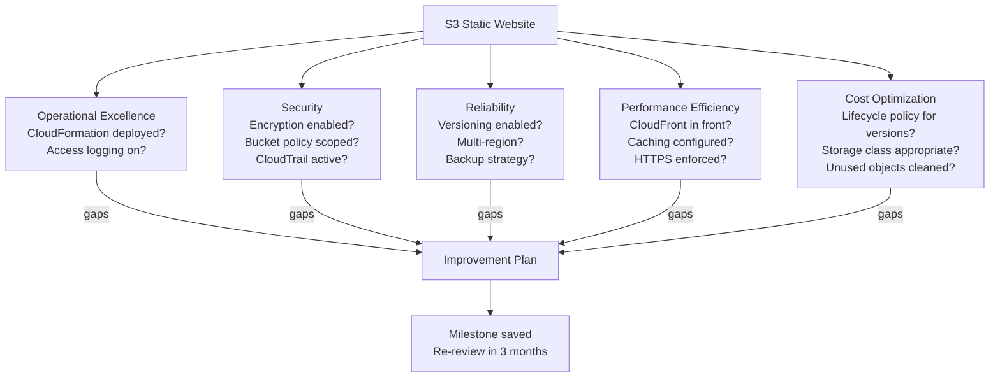

# AWS Well-Architected Framework

## Overview — what it is and why it matters

The AWS Well-Architected Framework is a set of architectural best practices for building and operating reliable, secure, efficient, cost-effective, and sustainable workloads in the cloud. It is organised into five pillars, each representing a distinct dimension of architectural quality.

The framework does not prescribe specific services. It asks questions about how you have designed and operated your system — and identifies gaps against known best practices. It is most useful as a structured review process applied to existing architectures, not as an upfront design checklist.

---

## Simple explanation

Think of the five pillars as the five inspections a building must pass before occupancy.

**Structural (Reliability):** will it stand when stressed?
**Fire safety (Security):** is it protected from threats, and can we detect them?
**Energy (Performance Efficiency):** is it using power efficiently?
**Budget (Cost Optimization):** is the construction and maintenance spend justified?
**Operations (Operational Excellence):** can the building manager run it smoothly and improve over time?

A building can pass four inspections and fail the fifth. A good architect designs for all five simultaneously. AWS's framework is that inspection process for cloud architecture.

---

## The Five Pillars

### Pillar 1 — Operational Excellence

**Definition:** The ability to support development and run workloads effectively, gain insight into their operations, and continuously improve supporting processes and procedures.

**Guiding question:** Can we make changes safely and learn from operations?

**Design principles:**
- Perform operations as code (IaC, not console clicks)
- Make frequent, small, reversible changes
- Refine operations procedures frequently
- Anticipate failure — build runbooks for known failure modes
- Learn from all operational failures — post-incident reviews

**Key AWS services:** CloudFormation, CodePipeline, CloudWatch, X-Ray, Systems Manager

**How the earlier series topics connect:**
- CloudFormation (Topic 22) enables operations as code
- CloudWatch (Topic 17) provides the observability foundation
- CloudTrail (Topic 19) creates the audit trail for operational review

**Key questions the Well-Architected Tool asks:**
- Do you use version control for infrastructure definitions?
- Do you have runbooks for common operational tasks?
- Do you perform post-incident analysis and share findings?
- Do you use CloudWatch alarms and dashboards?

---

### Pillar 2 — Security

**Definition:** The ability to protect data, systems, and assets while delivering business value through risk assessments and mitigation strategies.

**Guiding question:** Who has access to what, and can we detect threats?

**Design principles:**
- Implement a strong identity foundation (least privilege, MFA)
- Enable traceability (CloudTrail, Config, CloudWatch Logs)
- Apply security at all layers (defence in depth)
- Automate security best practices
- Protect data in transit and at rest
- Keep people away from data (use roles, not human credentials)
- Prepare for security events

**Key AWS services:** IAM, KMS, CloudTrail, GuardDuty, Security Hub, VPC, WAF, Shield

**How the earlier series topics connect:**
- IAM (Topic 3) — identity foundation and least privilege
- KMS (Topic 21) — encryption at rest and in transit
- Security Groups/NACLs (Topic 9) — network defence in depth
- CloudTrail (Topic 19) — traceability and detection
- Shared Responsibility Model (Topic 20) — knowing what you own

**Most common security violations found by the tool:**
- Root account used for daily operations
- IAM users without MFA
- S3 buckets with public access not intentionally set
- Security groups with port 22 open to 0.0.0.0/0
- Data at rest not encrypted

---

### Pillar 3 — Reliability

**Definition:** The ability of a workload to perform its intended function correctly and consistently when expected to, and to recover quickly from failures.

**Guiding question:** What happens when this component fails?

**Design principles:**
- Automatically recover from failure
- Test recovery procedures
- Scale horizontally to increase aggregate workload availability
- Stop guessing capacity — let Auto Scaling manage it
- Manage change through automation

**Key AWS services:** ELB, Auto Scaling, Route 53, RDS Multi-AZ, S3 (11-nines durability), Backup

**How the earlier series topics connect:**
- ELB + ASG (Topic 10) — automatic recovery and horizontal scaling
- Multi-AZ RDS (Topic 12) — database reliability
- S3 (Topic 6) — inherently durable object storage
- VPC with multiple AZs (Topic 8) — infrastructure distribution

**The reliability hierarchy:**
1. **Prevent** failures (redundancy, Multi-AZ, health checks)
2. **Detect** failures quickly (CloudWatch alarms, ELB health checks)
3. **Respond** automatically (ASG replacement, RDS failover)
4. **Recover** with defined procedures (backups, runbooks, DR plans)

**Reliability targets — common metrics:**
- **RTO (Recovery Time Objective):** maximum acceptable downtime after a failure
- **RPO (Recovery Point Objective):** maximum acceptable data loss (time)

---

### Pillar 4 — Performance Efficiency

**Definition:** The ability to use computing resources efficiently to meet system requirements, and to maintain that efficiency as demand changes and technologies evolve.

**Guiding question:** Are we using the right tool at the right size?

**Design principles:**
- Democratise advanced technologies (use managed services instead of building)
- Go global in minutes (use AWS regions and edge locations)
- Use serverless architectures where appropriate
- Experiment more often (test different configurations easily)
- Consider mechanical sympathy (understand how services work)

**Key AWS services:** Lambda, Fargate, ElastiCache, CloudFront, RDS read replicas, right-sizing tools

**How the earlier series topics connect:**
- Lambda (Topic 11) — serverless eliminates over-provisioned compute
- CloudFront (Topic 16) — edge caching for global performance
- EC2 instance selection (Topic 4) — right-sizing compute

**Right-sizing approach:**
1. Start with a reasonable guess (t3.micro for dev, m6i.large for prod API)
2. Monitor CPU, memory, and network utilisation for 2 weeks
3. If average CPU < 20%, consider a smaller instance type
4. If CPU spikes > 85% regularly, consider a larger type or horizontal scaling
5. Repeat quarterly

---

### Pillar 5 — Cost Optimization

**Definition:** The ability to run systems to deliver business value at the lowest price point.

**Guiding question:** Are we paying for what we actually use?

**Design principles:**
- Implement cloud financial management
- Adopt a consumption model (pay only for what you use)
- Measure overall efficiency
- Stop spending money on undifferentiated heavy lifting (use managed services)
- Analyse and attribute expenditure (tagging, Cost Explorer)

**Key AWS services:** Cost Explorer, Budgets, Trusted Advisor, Savings Plans, Reserved Instances, Spot Instances

**How the earlier series topics connect:**
- Billing & Cost Management (Topic 18) — budgets, alarms, Cost Explorer
- S3 storage classes (Topic 6) — lifecycle policies reduce storage cost
- Lambda pricing model (Topic 11) — pay per invocation vs 24/7 EC2

**Common cost leaks found in reviews:**
- NAT Gateways running 24/7 for dev environments
- EC2 instances stopped but EBS volumes billing
- Unattached Elastic IPs billing hourly
- CloudWatch Logs with no retention policy accumulating indefinitely
- RDS instances over-sized for actual query load

---

## The Well-Architected Tool

The Well-Architected Tool is a free AWS console service that guides you through a structured review of a workload against the five pillars. It asks yes/no/not applicable questions for each pillar and surfaces high-risk issues with specific improvement recommendations.

**How it works:**

1. Define a workload (name, description, environment, regions)
2. Select which pillars to review
3. Answer questions for each pillar
4. Review the identified high-risk issues (HRIs) and medium-risk issues (MRIs)
5. Create improvement plans with notes and owners
6. Schedule a milestone to re-review after improvements

**Question format example (Security pillar):**

- SEC 1: How do you securely operate your workload?
- SEC 2: How do you manage identities for people and machines?
- SEC 3: How do you manage permissions for people and machines?
- ...

Each question has multiple best practice answers. The tool identifies which best practices you have not implemented and explains the risk.

---

## Lab — Well-Architected Tool Review of S3 Static Website

### Goal

Run the S3 static website (Topic 7) through the Well-Architected Tool to identify gaps against the five pillars. Document findings and create an improvement plan.

### Steps

**Part 1 — Define the workload**

1. Navigate to **AWS Well-Architected Tool → Workloads → Define workload**
2. Workload name: `S3 Static Website`
3. Description: `Static portfolio site hosted on S3, served via CloudFront`
4. Review owner: your name
5. Environment: **Pre-production** (for this lab — it is a learning workload)
6. AWS regions: select your primary region
7. Click **Define workload**

**Part 2 — Start the review**

8. Click **Start review**
9. Select all five pillars
10. Work through each pillar's questions — for each:
    - Read the question carefully
    - Select all applicable best practices you have implemented
    - Leave unchecked any you have NOT implemented
    - Use the notes field to record plans or explanations

**Part 3 — Expected findings for a basic S3 site**

Answer the following questions honestly and observe the risks raised:

| Pillar | Question area | Likely gap |
|---|---|---|
| Security | Identity and access | Is bucket policy scoped to minimum needed? |
| Security | Data protection | Is S3 server-side encryption enabled? |
| Reliability | Backup | Is S3 versioning enabled? |
| Reliability | Change management | Is the site deployed via IaC (CloudFormation)? |
| Operational Excellence | Observability | Is S3 access logging enabled? |
| Performance Efficiency | Content delivery | Is CloudFront in front of S3? |
| Cost Optimization | Usage review | Is there a lifecycle policy for old versions? |

**Part 4 — Review the risk report**

11. After completing the review, click **Well-Architected lenses** tab
12. Review the **High risk issues** — each links to a specific improvement recommendation
13. Click **Save milestone** to capture the current state as a baseline
14. Create improvement plan notes for each high-risk item

### CLI commands

```bash
# List workloads defined in Well-Architected Tool
aws wellarchitected list-workloads   --query "WorkloadSummaries[*].{Name:WorkloadName,ID:WorkloadId,Environment:Environment}"   --output table

# List lenses available (includes the Well-Architected Framework lens)
aws wellarchitected list-lenses   --query "LensSummaries[*].{Name:LensName,Alias:LensAlias}"   --output table

# Get answers for a specific pillar (requires workload ID and lens ARN)
aws wellarchitected list-answers   --workload-id YOUR_WORKLOAD_ID   --lens-alias wellarchitected   --pillar-id security   --query "AnswerSummaries[*].{Question:QuestionTitle,Risk:Risk}"   --output table

# Get the risk counts for a workload
aws wellarchitected get-workload   --workload-id YOUR_WORKLOAD_ID   --query "Workload.RiskCounts"
```

---

## Architecture flow — evaluating the S3 site against all 5 pillars



The Well-Architected Tool applies all five pillars to the same workload simultaneously. Each pillar produces a list of identified gaps. The improvement plan aggregates all gaps, assigns owners and timelines, and a milestone captures the state for tracking progress over time.

---

## Common mistakes

**Treating the framework as a one-time exercise.** Architecture evolves. Services change. Team size changes. The Well-Architected Framework is designed for periodic reviews — at least annually, and before major changes. One review followed by no follow-up provides little value.

**Marking all questions as "yes" to avoid findings.** The tool's value comes from honest answers. A clean report with no findings means either excellent architecture or dishonest self-assessment. The findings are the improvement opportunities — they are not a score to optimise.

**Reviewing only one pillar.** Teams often focus on Security (because of compliance) and ignore Cost Optimization or Operational Excellence. All five pillars interact: a Reliability improvement (Multi-AZ RDS) has a Cost Optimization implication. Review all five together.

**Not assigning owners to improvement plan items.** A list of identified gaps without owners and timelines is just documentation of problems. Each finding in the improvement plan needs a named owner and a target date.

---

## Real-world use

A startup preparing for enterprise customer security reviews uses the Well-Architected Tool to produce a formal architecture review report. The Security pillar review identifies: MFA not enforced on all IAM users, two S3 buckets without default encryption, and no GuardDuty enabled. Each finding becomes a tracked ticket. The team resolves all high-risk issues within two sprints. The exported report is shared with the enterprise customer's procurement team as evidence of security posture review — alongside the AWS Artifact compliance reports. Together they demonstrate that both the infrastructure layer (AWS's responsibility) and the application layer (the startup's responsibility) have been formally reviewed.

---

## Key takeaways

- The Well-Architected Framework has five pillars: Operational Excellence, Security, Reliability, Performance Efficiency, Cost Optimization
- Each pillar has design principles, best practices, and a guiding review question
- The Well-Architected Tool provides a structured question-based review — free, in the AWS console
- Most security breaches trace to Security pillar gaps; most surprise bills to Cost pillar neglect; most outages to Reliability gaps
- The framework evaluates how you use existing services — it does not prescribe new ones
- Reviews should be periodic (at least annually) and improvements should be tracked with owners and timelines

---

## Next steps

- [ ] Complete a full Well-Architected review of the scalable web architecture from Topic 14
- [ ] Enable **AWS Trusted Advisor** — automated checks across five categories aligned to the framework
- [ ] Set up **AWS Config** with managed rules — continuous compliance monitoring for security and reliability
- [ ] Enable **Amazon GuardDuty** — covers multiple Security pillar best practices automatically
- [ ] Read the **AWS Well-Architected Framework whitepaper** — the definitive reference for each pillar's best practices