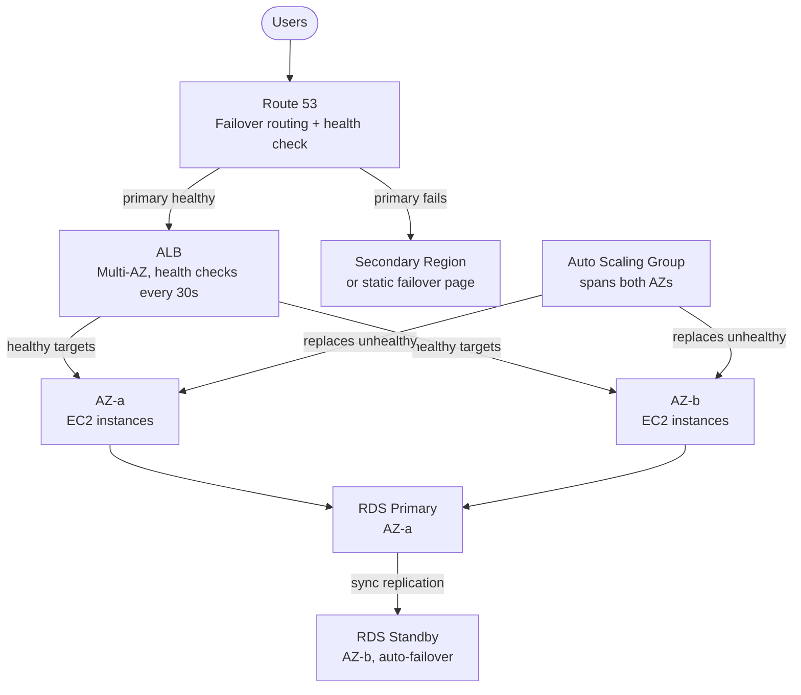

# Reliability & High Availability on AWS

## Overview — what it is and why it matters

Reliability in cloud architecture means a system continues to function correctly even when individual components fail. High availability means the system remains reachable and responsive to users during those failures — without requiring manual intervention. These are distinct goals: a system can be reliable (it eventually recovers) without being highly available (it was down for 20 minutes while it recovered).

AWS provides the building blocks for both, but they must be deliberately assembled. An EC2 instance in a single Availability Zone with no load balancer is neither reliable nor highly available. The same application deployed across two AZs behind an ALB with an ASG and a Multi-AZ RDS instance can survive an entire datacentre failure with zero user-visible downtime.

---

## Simple explanation

High availability is like having a backup generator, a spare tyre, and a standby pilot all ready at once — not because you expect everything to fail simultaneously, but because each failure mode is independent and inevitable over time.

A single server is a single promise: if it holds, users are happy; if it breaks, everyone waits. Multi-AZ is a distributed promise across physically isolated locations. Health checks are the circuit breakers that stop traffic flowing to broken components automatically. Auto Scaling is the elastic capacity that prevents a working system from being overwhelmed into unavailability.

The goal is not zero failures. It is zero user-visible failures.

---

## Key concepts

### Availability Zones and Multi-AZ Deployments

An AWS Region contains multiple Availability Zones — physically separate datacentres within the same metropolitan area, connected by high-bandwidth, low-latency private fibre. Each AZ has independent power, cooling, and networking. A failure in one AZ (hardware fault, power disruption, network issue) does not affect others.

Multi-AZ deployment means spreading every component of the stack across at least two AZs so that a single AZ failure does not take down the application.

**Multi-AZ requirements by service:**

| Service | How to enable Multi-AZ | What happens on AZ failure |
|---|---|---|
| EC2 + ALB | Deploy instances in 2+ AZs, register all with ALB | ALB stops routing to failed AZ; remaining instances serve all traffic |
| Auto Scaling Group | Set subnets across 2+ AZs in ASG VPC zone config | ASG replaces instances in failed AZ using surviving AZs |
| RDS | Enable Multi-AZ at creation or modify instance | Automatic failover to standby in ~60–120 seconds; endpoint unchanged |
| ElastiCache | Enable Multi-AZ with automatic failover | Read replica promoted to primary; DNS updated automatically |
| S3 | Always Multi-AZ by default | 11 nines of durability; no configuration needed |
| DynamoDB | Always Multi-AZ by default | Transparent; no configuration needed |

**RTO and RPO:**
- **RTO (Recovery Time Objective)** — how long the system can be down. Multi-AZ RDS targets RTO of ~2 minutes for AZ-level failures.
- **RPO (Recovery Point Objective)** — how much data can be lost. Multi-AZ RDS uses synchronous replication: RPO = 0 (no committed data is lost on failover).

---

### Health Checks — Three Layers

Health checks are the mechanism by which failure is detected and traffic is rerouted automatically. Three independent health check systems operate at different layers of a typical AWS architecture.

**Layer 1 — ALB Target Health Checks**

The ALB periodically sends HTTP/HTTPS requests to each registered target. If a target fails to respond with a success status (2xx/3xx) for a configured number of consecutive checks, it is marked Unhealthy and removed from rotation. Traffic stops flowing to it within one check interval of the failure.

| Setting | Default | Recommended |
|---|---|---|
| Protocol | HTTP | HTTPS in production |
| Path | / | A dedicated health endpoint (e.g. /health) |
| Interval | 30s | 10s for faster detection |
| Healthy threshold | 5 | 2 for faster recovery |
| Unhealthy threshold | 2 | 2 (default is appropriate) |
| Timeout | 5s | 5s |

> Use a dedicated health endpoint that checks actual application readiness — not just HTTP 200 from the web server. A response from /health that verifies database connectivity catches application-layer failures that a generic / check misses.

**Layer 2 — ASG + ELB Health Check Integration**

By default, ASG uses EC2 health checks — the hypervisor-level check that only detects if the instance has stopped running. Enabling ELB health checks on the ASG means the ALB's application-layer verdict feeds into the ASG's replacement decision.

```bash
# Enable ELB health checks on an existing ASG
aws autoscaling update-auto-scaling-group \
  --auto-scaling-group-name web-asg \
  --health-check-type ELB \
  --health-check-grace-period 120
```

With ELB health checks enabled: if the ALB marks an instance Unhealthy (application not responding), the ASG terminates it and launches a replacement from the Launch Template. No human required. Typical end-to-end replacement time: 2–5 minutes.

**Layer 3 — Route 53 Health Checks and Failover Routing**

Route 53 health checks operate at the DNS layer — monitoring the ALB endpoint (or any IP/domain) from multiple AWS regions. If the primary endpoint fails its health check, Route 53 Failover routing automatically returns the secondary record, directing all new DNS queries to the backup region or endpoint.

```bash
# Create a Route 53 health check on the primary ALB
aws route53 create-health-check \
  --caller-reference $(date +%s) \
  --health-check-config '{
    "Type": "HTTPS",
    "FullyQualifiedDomainName": "myapp.com",
    "ResourcePath": "/health",
    "RequestInterval": 30,
    "FailureThreshold": 3
  }'
```

Route 53 health checks are region-agnostic failover — they catch entire-region outages that neither ALB nor ASG health checks can address, since both operate within a single region.

---

### Auto Scaling — Capacity as a Health Dimension

A system that is technically running but overloaded is not highly available in any user-meaningful sense. Auto Scaling ensures that capacity expands to meet demand before response times degrade to the point of effective unavailability.

**Target Tracking Scaling** — the standard choice:
```bash
# Apply Target Tracking: keep average CPU at 50%
aws autoscaling put-scaling-policy \
  --auto-scaling-group-name web-asg \
  --policy-name cpu-target-50 \
  --policy-type TargetTrackingScaling \
  --target-tracking-configuration '{
    "PredefinedMetricSpecification": {
      "PredefinedMetricType": "ASGAverageCPUUtilization"
    },
    "TargetValue": 50.0
  }'
```

**Cooldown periods** — prevent scale-in from terminating instances too quickly after a scale-out event. Default: 300 seconds. Reduce to 60–120 seconds for applications with fast startup times.

**Instance warm-up** — time allocated for a new instance to initialise before its metrics contribute to scaling decisions. Prevents premature additional scale-out triggered by a newly launched instance's initial CPU spike.

---

### Single Points of Failure (SPOF) — Identification Checklist

A SPOF is any component whose failure alone causes the entire system to become unavailable. Systematically reviewing an architecture against this checklist surfaces most SPOFs:

| Component | SPOF condition | Fix |
|---|---|---|
| EC2 compute | All instances in one AZ, or fewer than 2 instances | Multi-AZ ASG, minimum capacity >= 2 |
| Load balancer | Single ALB with no health checks | Enable ELB health checks; ALB is inherently Multi-AZ |
| Database | RDS Single-AZ | Enable Multi-AZ; promotes standby on failure automatically |
| DNS | Single A record with no health check | Route 53 Failover routing with health check on primary |
| NAT Gateway | One NAT Gateway per VPC | Deploy one NAT Gateway per AZ in use |
| Secrets | Hardcoded credentials in environment variables | Secrets Manager with automatic rotation |
| Deployment | Manual deploys via SSH | CI/CD pipeline; no SSH dependency |
| Logging | Logs only on EC2 instance disk | CloudWatch Logs agent; logs survive instance termination |

---

## Lab — SPOF Review of Project Architecture

### Goal

Review the web application architecture built across earlier topics. Systematically identify every single point of failure. Remediate the most critical ones and verify the architecture can survive an AZ failure without downtime.

### Steps

**Part 1 — Audit the Existing Architecture**

1. Open the AWS console and navigate to **EC2 → Instances**
2. Check which AZs the running instances occupy — are they spread across 2+?
3. Navigate to **EC2 → Load Balancers** → select your ALB → check **Availability Zones** tab — is it registered in both AZs?
4. Navigate to **EC2 → Target Groups** → select your target group → check **Health checks** tab — is the health check type ELB (not EC2)?
5. Navigate to **RDS → Databases** → select your instance → check **Configuration** — is Multi-AZ enabled?
6. Navigate to **Route 53 → Health checks** — are any health checks configured for your ALB?

Record each finding in the SPOF checklist above.

**Part 2 — Enable ELB Health Checks on the ASG**

7. Navigate to **EC2 → Auto Scaling Groups** → your ASG → **Edit**
8. Under **Health checks**, change type from EC2 to **ELB**
9. Set health check grace period to **120 seconds**
10. Save

**Part 3 — Enable RDS Multi-AZ**

11. Navigate to **RDS → Databases** → your instance → **Modify**
12. Under **Availability and durability**, select **Create a standby instance**
13. Apply: **During the next scheduled maintenance window** (or immediately for lab)
14. Wait for status to return to **Available** — Multi-AZ column now shows **Yes**

**Part 4 — Simulate AZ Failure (Self-Healing Test)**

15. Navigate to **EC2 → Instances** — note which instances are in AZ-a
16. Terminate all instances in AZ-a simultaneously
17. Open the application URL in a browser and refresh continuously
18. Observe: ALB routes all traffic to AZ-b instances immediately (health check removes AZ-a targets)
19. Watch ASG Activity tab — replacements launch in AZ-a within ~2 minutes
20. Confirm the application remained reachable throughout

### CLI commands

```bash
# Check which AZs all running instances are in
aws ec2 describe-instances \
  --filters Name=instance-state-name,Values=running \
  --query "Reservations[*].Instances[*].{ID:InstanceId,AZ:Placement.AvailabilityZone,State:State.Name}"

# Verify ALB is registered in multiple AZs
aws elbv2 describe-load-balancers \
  --query "LoadBalancers[*].{Name:LoadBalancerName,AZs:AvailabilityZones[*].ZoneName}"

# Check health check type on the ASG
aws autoscaling describe-auto-scaling-groups \
  --auto-scaling-group-names web-asg \
  --query "AutoScalingGroups[0].{HealthCheckType:HealthCheckType,Min:MinSize,Desired:DesiredCapacity,Max:MaxSize,AZs:AvailabilityZones}"

# Enable ELB health checks on the ASG
aws autoscaling update-auto-scaling-group \
  --auto-scaling-group-name web-asg \
  --health-check-type ELB \
  --health-check-grace-period 120

# Check RDS Multi-AZ status
aws rds describe-db-instances \
  --query "DBInstances[*].{ID:DBInstanceIdentifier,MultiAZ:MultiAZ,Status:DBInstanceStatus,AZ:AvailabilityZone}"

# Force an RDS Multi-AZ failover (test only — causes ~60s interruption)
aws rds reboot-db-instance \
  --db-instance-identifier my-rds-db \
  --force-failover
```

---

## Architecture flow



Users hit Route 53, which checks ALB health before returning the primary record. The ALB distributes traffic across healthy instances in both AZs, skipping any that fail HTTP health checks. The ASG monitors instance health via the ALB's assessment and replaces any failed instance automatically, maintaining desired capacity across both AZs. RDS replicates synchronously to a standby in the second AZ; failover is automatic with no data loss and no endpoint change. Route 53 handles the one failure scenario nothing else covers: an entire region going dark.

---

## Common mistakes

**Setting ASG minimum to 1.** A minimum of 1 means a single instance failure can temporarily drop the running count to zero before a replacement launches. Always set minimum to at least 2, distributed across at least 2 AZs.

**Using EC2 health checks instead of ELB health checks on the ASG.** EC2 health checks only detect hypervisor-level failures (the instance stopped). ELB health checks detect application-layer failures (the app crashed but the instance is still running). A web server process that has crashed passes EC2 health checks indefinitely but fails ELB health checks within 60 seconds. Always enable ELB health checks on any ASG behind a load balancer.

**Deploying one NAT Gateway for multiple AZs.** A NAT Gateway lives in one AZ. If that AZ fails, all instances in other AZs lose outbound internet access (software updates, external API calls). Deploy one NAT Gateway per AZ and route each AZ's private subnet to its own NAT Gateway.

**Testing HA only in theory, never in practice.** An architecture that is never tested under failure conditions is not a known-reliable architecture — it's an untested hypothesis. Run regular simulated AZ failures (terminate all instances in one AZ, force an RDS failover) to verify the system recovers within the expected RTO. Use AWS Fault Injection Simulator for structured chaos engineering.

**Confusing high availability with backups.** Multi-AZ RDS provides high availability (failover keeps the database running) but is not a substitute for backups (point-in-time restore for accidental data deletion). Both are required. Multi-AZ protects against infrastructure failure; backups protect against data loss.

---

## Real-world use

An e-commerce platform processes orders during a peak sale event. At 14:23, a hardware fault in AZ-a causes three EC2 instances to fail simultaneously. The ALB detects unhealthy targets within 30 seconds and routes all traffic to the four healthy instances in AZ-b. The ASG detects the failures via ELB health checks and begins launching three replacement instances in AZ-a. The RDS primary, also in AZ-a, becomes unreachable; RDS promotes the Multi-AZ standby in AZ-b within 90 seconds with zero data loss. Total user-visible impact: a brief increase in response time during the 90-second RDS failover window. No error pages. No lost orders. No on-call page. The architecture absorbed a datacentre-level failure and self-healed.

---

## Key takeaways

- Multi-AZ removes geographic single points of failure; every stateful component (EC2, RDS, NAT Gateway) needs at least two AZ placements
- Health checks at three layers (ALB, ASG, Route 53) catch different failure types; all three must be active for end-to-end automatic recovery
- Always enable ELB health checks on the ASG — EC2 health checks miss application-layer failures entirely
- Auto Scaling handles capacity failures that health checks cannot; an overloaded system is an unavailable system
- Test the architecture by deliberately causing failures — an untested recovery mechanism is not a recovery mechanism
- High availability and backups are complementary, not alternatives: HA keeps the system running; backups recover data that was deleted or corrupted

---

## Next steps

- [ ] Set up **AWS Fault Injection Simulator** — run structured AZ failure, CPU spike, and network latency experiments against the live architecture
- [ ] Configure **CloudWatch Composite Alarms** — combine CPU, error rate, and latency alarms into a single application-health signal
- [ ] Explore **AWS Resilience Hub** — analyses the architecture against target RTO/RPO and surfaces gaps with remediation recommendations
- [ ] Study **Multi-Region Active-Active** — deploy the same stack in two regions with Route 53 Latency routing for region-level fault tolerance
- [ ] Review the **AWS Well-Architected Reliability Pillar** — the complete framework for building reliable workloads on AWS