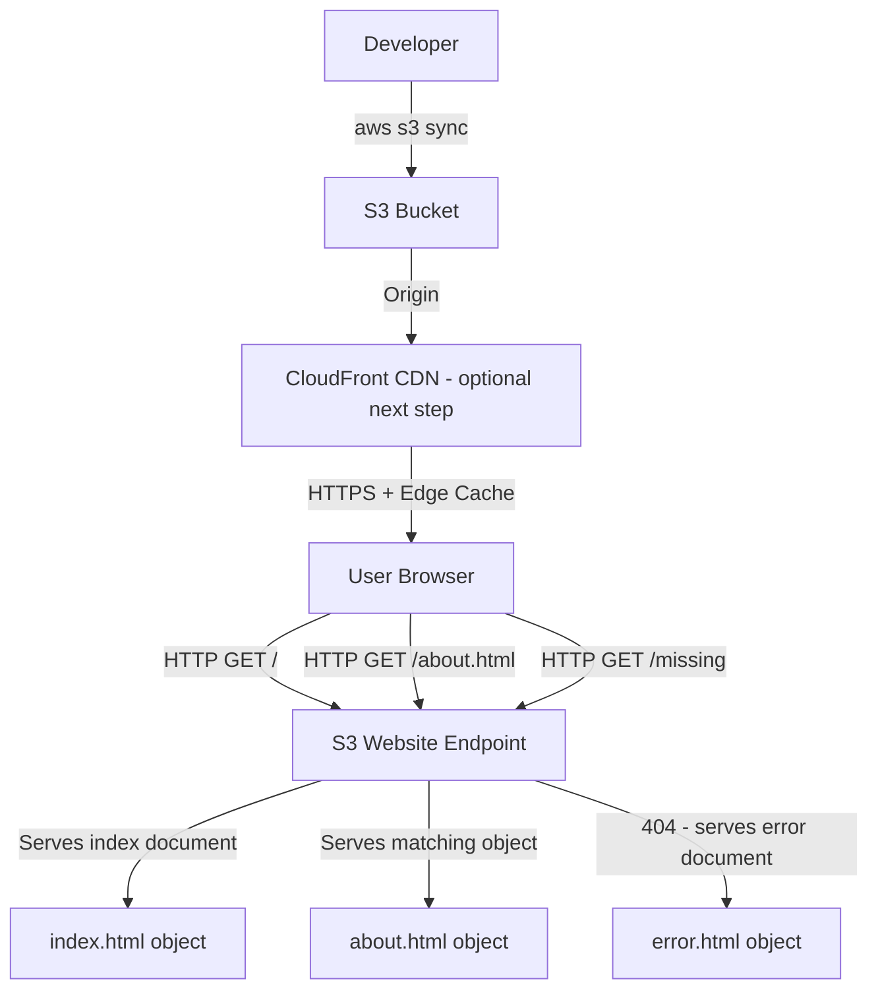

# Host a Static Website on S3

## Overview — what it is and why it matters

S3 Static Website Hosting lets you serve a full website — HTML, CSS, JavaScript, images — directly from an S3 bucket over HTTP, with no web server, no EC2 instance, and no runtime to manage.

It is the cheapest way to host a static site on AWS and a foundational pattern used in production: the static hosting layer of nearly every JAMstack architecture on AWS uses S3 (often fronted by CloudFront).

---

## Simple explanation

A normal web server (Apache, Nginx on EC2) receives a request and decides what to return. S3 Static Hosting removes the server entirely — the bucket itself responds to HTTP requests and returns the matching object (file).

Request for `/index.html` → S3 returns the `index.html` object.
Request for `/about.html` → S3 returns the `about.html` object.
Request for `/images/photo.jpg` → S3 returns the image object.

No compute running. No process listening. Just object retrieval over HTTP.

---

## Key concepts

### Bucket Policy — JSON permissions document

A bucket policy is a JSON document attached to a bucket that defines who can perform which actions on which objects. Unlike IAM policies (which are attached to identities), bucket policies are attached to the resource itself.

For static website hosting, one specific policy is required: allow anyone (the public internet) to `GetObject` from your bucket.

**Full public-read bucket policy:**

```json
{
  "Version": "2012-10-17",
  "Statement": [
    {
      "Sid": "PublicReadGetObject",
      "Effect": "Allow",
      "Principal": "*",
      "Action": "s3:GetObject",
      "Resource": "arn:aws:s3:::YOUR-BUCKET-NAME/*"
    }
  ]
}
```

**Breaking down each field:**

| Field | Value | Meaning |
|---|---|---|
| Effect | Allow | Permit this action (not deny) |
| Principal | * | Anyone — authenticated or anonymous |
| Action | s3:GetObject | Download/read objects only (not upload, delete, or list) |
| Resource | arn:aws:s3:::BUCKET/* | Every object inside this bucket (the /* is required) |

> `s3:GetObject` on `/*` grants read access to individual objects but does NOT grant `s3:ListBucket` — users cannot list what's in the bucket, only fetch files they know the path to.

**Important prerequisite:** AWS blocks public access at the account and bucket level by default. You must disable "Block all public access" on the bucket before a public bucket policy will take effect.

---

### Static Website Hosting Endpoint

When static website hosting is enabled, AWS generates a dedicated HTTP endpoint for the bucket. This endpoint is different from the standard S3 REST API URL.

| URL type | Format | Behaviour |
|---|---|---|
| REST API endpoint | `https://BUCKET.s3.REGION.amazonaws.com/index.html` | Returns object or 403/404 from S3 directly |
| Website endpoint | `http://BUCKET.s3-website-REGION.amazonaws.com` | Serves index document, handles error document, supports redirects |

**Key differences the website endpoint adds:**
- Serves the **index document** (e.g. `index.html`) when the root URL is requested — without this, `/` returns a 403
- Serves the **error document** (e.g. `error.html`) on 404s instead of the default XML error
- Supports **routing rules** and redirects configured in the console
- Required for **custom domain** mapping via Route 53

> The website endpoint is HTTP only. For HTTPS, place CloudFront in front of the S3 bucket — CloudFront terminates TLS, caches content at edge locations, and the S3 bucket remains the origin.

---

### index.html and error.html

The index document is the file S3 returns when a request maps to a "directory" (a key prefix ending in `/`). Without it, navigating to your root domain returns XML errors.

The error document is served for any 4xx error (object not found). Without it, S3 returns an XML error response instead of a human-readable page.

Minimum viable structure for a static site:

```
bucket-root/
├── index.html        ← homepage, served at /
├── error.html        ← 404 page
├── about.html        ← served at /about.html
├── css/
│   └── style.css     ← key: css/style.css
└── images/
    └── photo.jpg     ← key: images/photo.jpg (case-sensitive)
```

> S3 object keys are **case-sensitive**. `Images/Photo.jpg` and `images/photo.jpg` are two different objects. HTML references must match exactly — a common cause of broken images and missing CSS after upload.

---

## Lab — Enable Static Hosting, Upload index.html, Set Bucket Policy

### Goal

Deploy a live, publicly accessible static website on S3 — reachable from any browser via the S3 website endpoint URL.

### Steps

**Part 1 — Create and configure the bucket**

1. Navigate to **S3 → Create bucket**
2. Bucket name: `yourname-portfolio-site` (globally unique)
3. Region: your nearest region (e.g. `ap-south-1`)
4. **Block Public Access settings:** uncheck **"Block all public access"** → confirm the warning checkbox
5. Leave all other settings as default → **Create bucket**

**Part 2 — Enable Static Website Hosting**

6. Click your bucket → **Properties** tab → scroll to **Static website hosting**
7. Click **Edit** → select **Enable**
8. Hosting type: **Host a static website**
9. Index document: `index.html`
10. Error document: `error.html`
11. Click **Save changes**
12. Back in Properties, scroll to Static website hosting — copy the **Bucket website endpoint** URL

**Part 3 — Create and upload files**

13. Create `index.html` locally:

```html
<!DOCTYPE html>
<html lang="en">
<head>
  <meta charset="UTF-8">
  <title>My Portfolio</title>
  <style>
    body { font-family: sans-serif; max-width: 600px; margin: 80px auto; padding: 0 1rem; }
    h1 { color: #2563eb; }
  </style>
</head>
<body>
  <h1>Hi, I'm [Your Name]</h1>
  <p>AWS DevOps Engineer in training. Building on S3.</p>
</body>
</html>
```

14. Create `error.html` locally:

```html
<!DOCTYPE html>
<html lang="en">
<head><meta charset="UTF-8"><title>Page Not Found</title></head>
<body>
  <h1>404 — Page not found</h1>
  <p><a href="/">Back to home</a></p>
</body>
</html>
```

15. In S3 Console: **Upload → Add files** → select both files → **Upload**

**Part 4 — Set the Bucket Policy**

16. Click **Permissions** tab → scroll to **Bucket policy** → **Edit**
17. Paste this policy (replace `YOUR-BUCKET-NAME`):

```json
{
  "Version": "2012-10-17",
  "Statement": [
    {
      "Sid": "PublicReadGetObject",
      "Effect": "Allow",
      "Principal": "*",
      "Action": "s3:GetObject",
      "Resource": "arn:aws:s3:::YOUR-BUCKET-NAME/*"
    }
  ]
}
```

18. Click **Save changes**

**Part 5 — Verify**

19. Open the **Bucket website endpoint** URL copied in step 12
20. The portfolio page should load in the browser
21. Navigate to a non-existent path (e.g. `/nothing`) — the error.html page should appear

### CLI commands

```bash
# Create bucket
aws s3api create-bucket   --bucket YOUR-BUCKET-NAME   --region ap-south-1   --create-bucket-configuration LocationConstraint=ap-south-1

# Disable Block Public Access
aws s3api put-public-access-block   --bucket YOUR-BUCKET-NAME   --public-access-block-configuration   "BlockPublicAcls=false,IgnorePublicAcls=false,BlockPublicPolicy=false,RestrictPublicBuckets=false"

# Enable static website hosting
aws s3api put-bucket-website   --bucket YOUR-BUCKET-NAME   --website-configuration   '{"IndexDocument":{"Suffix":"index.html"},"ErrorDocument":{"Key":"error.html"}}'

# Upload all files from local folder
aws s3 sync ./site/ s3://YOUR-BUCKET-NAME/   --acl public-read

# Apply the bucket policy (save policy JSON to bucket-policy.json first)
aws s3api put-bucket-policy   --bucket YOUR-BUCKET-NAME   --policy file://bucket-policy.json

# Get the website endpoint
aws s3api get-bucket-website --bucket YOUR-BUCKET-NAME

# Check what's in the bucket
aws s3 ls s3://YOUR-BUCKET-NAME --recursive --human-readable
```

---

## Architecture flow



The S3 website endpoint receives HTTP requests and maps URL paths to object keys. The index document handles root requests; the error document handles 404s. Developers deploy by syncing local files to the bucket — no server restart, no deployment pipeline needed for a basic setup. CloudFront sits optionally in front to add HTTPS, global caching, and a custom domain.

---

## Common mistakes

**Forgetting to disable Block Public Access before applying the bucket policy.** This is a two-step unlock: first turn off Block Public Access on the bucket, then apply the public policy. Applying the policy alone while Block Public Access is on silently fails — the site still returns 403.

**Using the REST API endpoint instead of the website endpoint.** `https://bucket.s3.region.amazonaws.com` returns the object directly with S3 error responses. `http://bucket.s3-website-region.amazonaws.com` enables index document routing and custom error pages. They are not interchangeable.

**Case-sensitive file paths.** HTML, CSS, and JavaScript references to assets must exactly match the S3 object key casing. `" fails if the object key is `images/hero.jpg`. Standardise all filenames to lowercase before uploading.

**Uploading a folder structure and expecting directory URLs to work.** Navigating to `/about/` only works if there is an object at key `about/index.html` and index document routing resolves it. Test all paths after deploying.

**Not setting a custom error document.** Without `error.html` configured, 404 responses return an XML document — a jarring experience for site visitors and a red flag in any portfolio review.

---

## Real-world use

A developer's portfolio hosted on S3 with a custom domain via Route 53 and CloudFront for HTTPS costs under $1/month for typical traffic. The same pattern scales: major media companies use S3 + CloudFront to serve millions of static asset requests per day — CSS, fonts, images, JavaScript bundles — offloading everything that doesn't require server-side rendering from their compute infrastructure.

Startup landing pages, documentation sites (like AWS's own docs), and React/Vue/Next.js static exports all commonly use this architecture.

---

## Key takeaways

- S3 static hosting serves HTML/CSS/JS/images over HTTP with no server — the bucket is the web server
- Two separate steps unlock public access: disable Block Public Access, then apply the bucket policy
- The website endpoint and the REST API endpoint are different URLs with different behaviour — use the website endpoint for hosting
- `s3:GetObject` on `/*` grants read access to objects without exposing the bucket listing
- S3 object keys are case-sensitive — standardise all filenames to lowercase
- Add CloudFront in front for HTTPS, a custom domain, and global edge caching

---

## Next steps

- [ ] Connect a **custom domain** via Route 53 — map `www.yourdomain.com` to the S3 website endpoint
- [ ] Add **CloudFront** in front for HTTPS and global distribution
- [ ] Set up **S3 Versioning** so you can roll back a bad deployment
- [ ] Automate deployments with **GitHub Actions** — push to main, site updates automatically
- [ ] Explore **AWS Amplify Hosting** — managed CI/CD + CDN for more complex static frameworks (React, Next.js)